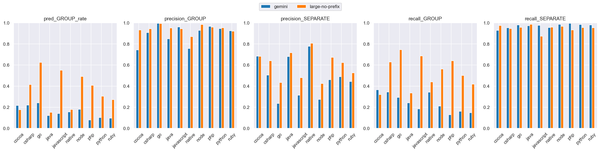
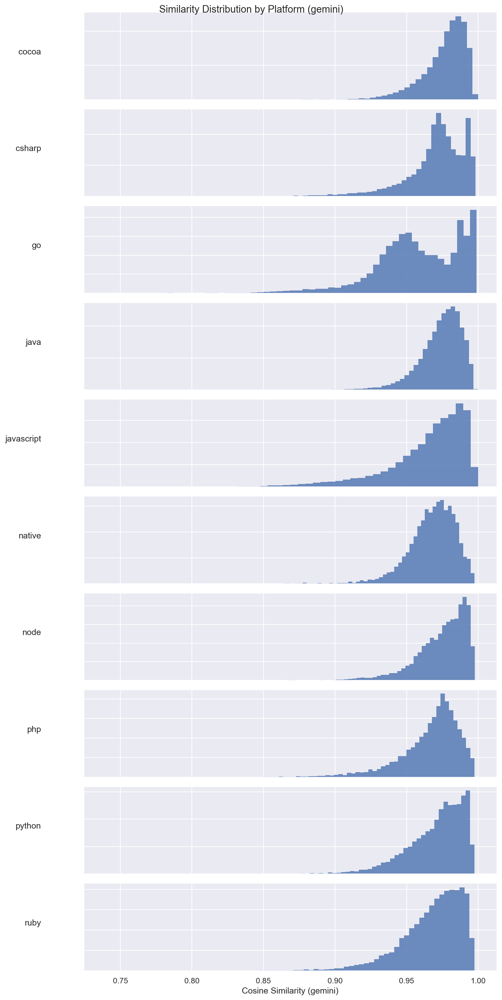
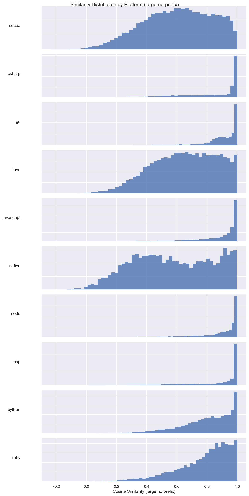
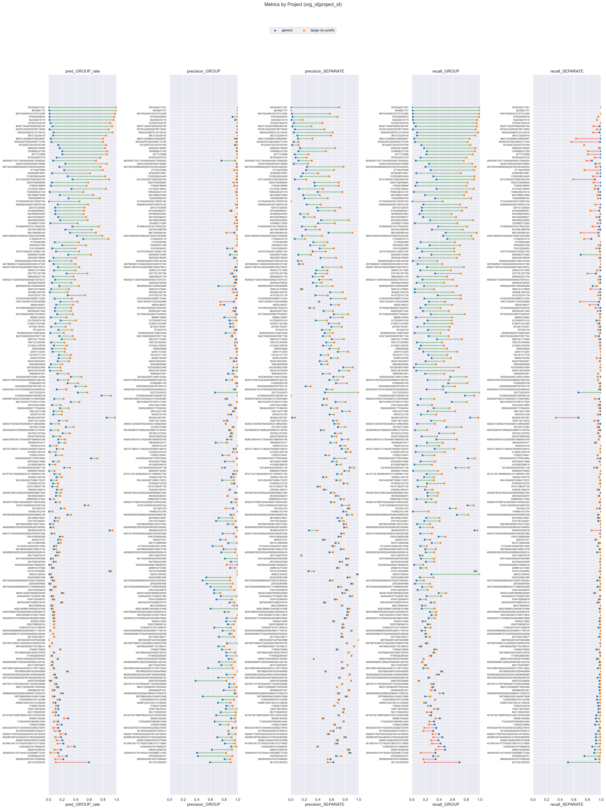

# gemini (dim=3072) vs large-no-prefix (dim=64), dataset: test_full2

Command to repro:

```bash
python eval/compare.py \
    --name_model1 gemini \
    --name_model2 large-no-prefix \
    --gcs_model1 gs://grouping-data/runs/gemini-embedding-2/similarities/test_full2 \
    --gcs_model2 gs://grouping-data/runs/2026-04-10-12-39-45-large-no-prefix/similarities/test_full2 \
    --threshold_model1 0.99 \
    --threshold_model2 0.90 \
    --dim_model1 3072 \
    --dim_model2 64 \
    --overwrite
```

### Column definitions

- **model**: The name of the model being evaluated.
- **pred_GROUP_rate**: The fraction of pairs this model groups together—lower means more separate issues are created. It's smaller than prod b/c the test dataset contains far more borderline cases; it's missing pairs that are very close.  This bias also means precision_GROUP is lower than what it'd be in prod.
- **precision_GROUP**: When the model groups a pair, how often is it correct? Higher = less over-grouping.
- **precision_SEPARATE**: When the model separates a pair, how often is it correct?
- **recall_GROUP**: Of all pairs that should be grouped, what fraction does the model correctly group? Higher = less under-grouping.
- **recall_SEPARATE**: Of all pairs that should be separate, what fraction does the model correctly separate?

## Aggregate results


### Overall metrics

| model           | pred_GROUP_rate | precision_GROUP | precision_SEPARATE | recall_GROUP | recall_SEPARATE |
|-----------------|-----------------|-----------------|--------------------|--------------|-----------------|
| gemini          | 0.14            | 0.91            | 0.42               | 0.2          | 0.97            |
| large-no-prefix | 0.44            | 0.97            | 0.64               | 0.68         | 0.97            |

### Project-averaged metrics (210 projects)

| model           | pred_GROUP_rate | precision_GROUP | precision_SEPARATE | recall_GROUP | recall_SEPARATE |
|-----------------|-----------------|-----------------|--------------------|--------------|-----------------|
| gemini          | 0.14            | 0.88            | 0.52               | 0.23         | 0.97            |
| large-no-prefix | 0.33            | 0.95            | 0.64               | 0.52         | 0.95            |

### Conditional probabilities

P(large-no-prefix GROUP | gemini GROUP)    = 0.7882

P(large-no-prefix GROUP | gemini SEPARATE) = 0.3799

P(large-no-prefix GROUP | gemini GROUP, distance < 0.005) = 0.9104  (n=9861)

### Thresholds

```json
{
  "gemini": 0.99,
  "large-no-prefix": 0.9
}
```

### Distance distribution

| statistic  | value    |
|------------|----------|
| count      | 235298.0 |
| null_count | 0.0      |
| mean       | 0.040396 |
| std        | 0.030303 |
| min        | 0.000514 |
| 25%        | 0.015989 |
| 50%        | 0.033667 |
| 75%        | 0.060711 |
| max        | 0.245969 |

GROUP rate: 62.56%

### Platform stats

| platform   | n_pairs | n_projects | label_GROUP_rate | proportion |
|------------|---------|------------|------------------|------------|
| cocoa      | 35279   | 66         | 0.36             | 0.15       |
| csharp     | 25468   | 27         | 0.66             | 0.11       |
| go         | 23302   | 14         | 0.91             | 0.1        |
| java       | 25776   | 70         | 0.37             | 0.11       |
| javascript | 62545   | 82         | 0.78             | 0.27       |
| native     | 8834    | 49         | 0.27             | 0.04       |
| node       | 11573   | 20         | 0.82             | 0.05       |
| php        | 12019   | 14         | 0.72             | 0.05       |
| python     | 17559   | 15         | 0.54             | 0.07       |
| ruby       | 12943   | 15         | 0.61             | 0.06       |

### Short stacktraces (query_tokens <= p10 = 34 tokens, 24059 pairs)

label GROUP rate: 81.67%
| model           | pred_GROUP_rate | precision_GROUP | precision_SEPARATE | recall_GROUP | recall_SEPARATE |
|-----------------|-----------------|-----------------|--------------------|--------------|-----------------|
| gemini          | 0.03            | 0.92            | 0.19               | 0.04         | 0.98            |
| large-no-prefix | 0.52            | 0.98            | 0.36               | 0.63         | 0.95            |

### Long stacktraces (query_tokens >= p90 = 931 tokens, 23577 pairs)

label GROUP rate: 70.76%
| model           | pred_GROUP_rate | precision_GROUP | precision_SEPARATE | recall_GROUP | recall_SEPARATE |
|-----------------|-----------------|-----------------|--------------------|--------------|-----------------|
| gemini          | 0.25            | 0.98            | 0.38               | 0.35         | 0.99            |
| large-no-prefix | 0.56            | 0.98            | 0.64               | 0.78         | 0.96            |

## Threshold sweep


### Threshold sweep for large-no-prefix

| threshold | pred_GROUP_rate | precision_GROUP | precision_SEPARATE | recall_GROUP | recall_SEPARATE |
|-----------|-----------------|-----------------|--------------------|--------------|-----------------|
| 0.8       | 0.59            | 0.91            | 0.78               | 0.86         | 0.86            |
| 0.85      | 0.52            | 0.94            | 0.72               | 0.79         | 0.92            |
| 0.87      | 0.49            | 0.96            | 0.69               | 0.75         | 0.94            |
| 0.9       | 0.44            | 0.97            | 0.64               | 0.68         | 0.97            |

## Platform-level results


### Metrics by platform, avg over projects (gemini, threshold=0.99)

| platform   | n_pairs | n_projects | label_GROUP_rate | min_threshold | pred_GROUP_rate | precision_GROUP | precision_SEPARATE | recall_GROUP | recall_SEPARATE |
|------------|---------|------------|------------------|---------------|-----------------|-----------------|--------------------|--------------|-----------------|
| cocoa      | 35279   | 66         | 0.365            | 0.99          | 0.216           | 0.742           | 0.684              | 0.366        | 0.928           |
| csharp     | 25468   | 27         | 0.662            | 0.99          | 0.221           | 0.908           | 0.505              | 0.345        | 0.953           |
| go         | 23302   | 14         | 0.91             | 0.99          | 0.241           | 0.995           | 0.235              | 0.293        | 0.979           |
| java       | 25776   | 70         | 0.368            | 0.99          | 0.12            | 0.848           | 0.679              | 0.242        | 0.972           |
| javascript | 62545   | 82         | 0.781            | 0.99          | 0.141           | 0.961           | 0.314              | 0.184        | 0.977           |
| native     | 8834    | 49         | 0.272            | 0.99          | 0.155           | 0.756           | 0.777              | 0.343        | 0.954           |
| node       | 11573   | 20         | 0.825            | 0.99          | 0.179           | 0.928           | 0.273              | 0.21         | 0.986           |
| php        | 12019   | 14         | 0.722            | 0.99          | 0.079           | 0.966           | 0.462              | 0.129        | 0.994           |
| python     | 17559   | 15         | 0.535            | 0.99          | 0.102           | 0.945           | 0.489              | 0.162        | 0.983           |
| ruby       | 12943   | 15         | 0.61             | 0.99          | 0.096           | 0.924           | 0.444              | 0.148        | 0.979           |

### Metrics by platform, avg over projects (large-no-prefix, threshold=0.9)

| platform   | n_pairs | n_projects | label_GROUP_rate | min_threshold | pred_GROUP_rate | precision_GROUP | precision_SEPARATE | recall_GROUP | recall_SEPARATE |
|------------|---------|------------|------------------|---------------|-----------------|-----------------|--------------------|--------------|-----------------|
| cocoa      | 35279   | 66         | 0.365            | 0.9           | 0.177           | 0.931           | 0.682              | 0.319        | 0.975           |
| csharp     | 25468   | 27         | 0.662            | 0.9           | 0.415           | 0.943           | 0.64               | 0.629        | 0.944           |
| go         | 23302   | 14         | 0.91             | 0.9           | 0.625           | 0.993           | 0.435              | 0.744        | 0.956           |
| java       | 25776   | 70         | 0.368            | 0.9           | 0.153           | 0.951           | 0.716              | 0.335        | 0.985           |
| javascript | 62545   | 82         | 0.781            | 0.9           | 0.551           | 0.943           | 0.48               | 0.685        | 0.872           |
| native     | 8834    | 49         | 0.272            | 0.9           | 0.178           | 0.869           | 0.806              | 0.44         | 0.959           |
| node       | 11573   | 20         | 0.825            | 0.9           | 0.491           | 0.983           | 0.425              | 0.561        | 0.967           |
| php        | 12019   | 14         | 0.722            | 0.9           | 0.408           | 0.959           | 0.673              | 0.641        | 0.931           |
| python     | 17559   | 15         | 0.535            | 0.9           | 0.305           | 0.952           | 0.622              | 0.501        | 0.955           |
| ruby       | 12943   | 15         | 0.61             | 0.9           | 0.273           | 0.92            | 0.526              | 0.418        | 0.952           |

### Min threshold for >= 95% avg project precision_GROUP by platform (gemini)

| platform   | n_pairs | n_projects | label_GROUP_rate | min_threshold | pred_GROUP_rate | precision_GROUP | precision_SEPARATE | recall_GROUP | recall_SEPARATE |
|------------|---------|------------|------------------|---------------|-----------------|-----------------|--------------------|--------------|-----------------|
| cocoa      | 35279   | 66         | 0.365            | null          | null            | null            | null               | null         | null            |
| csharp     | 25468   | 27         | 0.662            | null          | null            | null            | null               | null         | null            |
| go         | 23302   | 14         | 0.91             | 0.98          | 0.426           | 0.963           | 0.284              | 0.501        | 0.864           |
| java       | 25776   | 70         | 0.368            | null          | null            | null            | null               | null         | null            |
| javascript | 62545   | 82         | 0.781            | 0.99          | 0.141           | 0.961           | 0.314              | 0.184        | 0.977           |
| native     | 8834    | 49         | 0.272            | null          | null            | null            | null               | null         | null            |
| node       | 11573   | 20         | 0.825            | null          | null            | null            | null               | null         | null            |
| php        | 12019   | 14         | 0.722            | 0.99          | 0.079           | 0.966           | 0.462              | 0.129        | 0.994           |
| python     | 17559   | 15         | 0.535            | null          | null            | null            | null               | null         | null            |
| ruby       | 12943   | 15         | 0.61             | null          | null            | null            | null               | null         | null            |

### Min threshold for >= 95% avg project precision_GROUP by platform (large-no-prefix)

| platform   | n_pairs | n_projects | label_GROUP_rate | min_threshold | pred_GROUP_rate | precision_GROUP | precision_SEPARATE | recall_GROUP | recall_SEPARATE |
|------------|---------|------------|------------------|---------------|-----------------|-----------------|--------------------|--------------|-----------------|
| cocoa      | 35279   | 66         | 0.365            | 0.94          | 0.12            | 0.955           | 0.643              | 0.202        | 0.985           |
| csharp     | 25468   | 27         | 0.662            | 0.91          | 0.397           | 0.955           | 0.627              | 0.604        | 0.955           |
| go         | 23302   | 14         | 0.91             | 0.77          | 0.788           | 0.95            | 0.555              | 0.903        | 0.709           |
| java       | 25776   | 70         | 0.368            | 0.9           | 0.153           | 0.951           | 0.716              | 0.335        | 0.985           |
| javascript | 62545   | 82         | 0.781            | 0.93          | 0.465           | 0.951           | 0.426              | 0.58         | 0.933           |
| native     | 8834    | 49         | 0.272            | 0.95          | 0.131           | 0.959           | 0.785              | 0.32         | 0.994           |
| node       | 11573   | 20         | 0.825            | 0.87          | 0.624           | 0.967           | 0.512              | 0.698        | 0.931           |
| php        | 12019   | 14         | 0.722            | 0.9           | 0.408           | 0.959           | 0.673              | 0.641        | 0.931           |
| python     | 17559   | 15         | 0.535            | 0.9           | 0.305           | 0.952           | 0.622              | 0.501        | 0.955           |
| ruby       | 12943   | 15         | 0.61             | 0.95          | 0.155           | 0.956           | 0.473              | 0.247        | 0.993           |

<details>
<summary>Metrics by platform</summary>


</details>


<details>
<summary>Similarity distribution (gemini)</summary>


</details>


<details>
<summary>Similarity distribution (large-no-prefix)</summary>


</details>


## Project-level results

**Project win rate for large-no-prefix**: 91/210 (43%) projects where both precision_GROUP and recall_GROUP are higher


<details>
<summary>Dumbbell by project</summary>


</details>


### >= 15% group rate increase (stratified by platform)

| org_id           | project_id       | platform   | n_pairs | label_GROUP_rate | gemini_GROUP_rate | gemini_prec | gemini_rec | large-no-prefix_GROUP_rate | large-no-prefix_prec | large-no-prefix_rec | group_rate_increase |
|------------------|------------------|------------|---------|------------------|-------------------|-------------|------------|----------------------------|----------------------|---------------------|---------------------|
| 335354           | 6271291          | csharp     | 5539    | 1.0              | 0.0               | 1.0         | 0.0        | 1.0                        | 1.0                  | 1.0                 | 1.0                 |
| 36448            | 81737            | go         | 1248    | 1.0              | 0.01              | 1.0         | 0.01       | 1.0                        | 1.0                  | 1.0                 | 0.99                |
| 494745           | 4508122107412480 | csharp     | 2923    | 0.99             | 0.01              | 1.0         | 0.01       | 0.98                       | 1.0                  | 0.99                | 0.96                |
| 87425            | 5839818          | javascript | 2733    | 0.97             | 0.01              | 0.92        | 0.01       | 0.96                       | 1.0                  | 0.99                | 0.95                |
| 93220            | 6276779          | javascript | 3649    | 0.99             | 0.01              | 0.96        | 0.01       | 0.95                       | 1.0                  | 0.96                | 0.94                |
| 157624           | 1824476          | node       | 1494    | 0.96             | 0.03              | 1.0         | 0.03       | 0.91                       | 1.0                  | 0.95                | 0.88                |
| 463977           | 4508760825462784 | javascript | 4758    | 0.98             | 0.06              | 0.99        | 0.06       | 0.93                       | 1.0                  | 0.95                | 0.88                |
| 937001           | 4506358788718592 | go         | 1358    | 0.94             | 0.01              | 1.0         | 0.01       | 0.88                       | 1.0                  | 0.94                | 0.87                |
| 18005            | 4508876123734016 | php        | 5687    | 0.96             | 0.07              | 0.99        | 0.08       | 0.94                       | 0.99                 | 0.98                | 0.87                |
| 332401           | 4504003594158080 | go         | 1633    | 0.96             | 0.24              | 0.99        | 0.25       | 0.85                       | 1.0                  | 0.89                | 0.61                |
| 4507923249889280 | 4507923253428304 | go         | 1837    | 0.8              | 0.16              | 1.0         | 0.2        | 0.76                       | 0.98                 | 0.93                | 0.6                 |
| 1122625          | 6534409          | node       | 2825    | 0.89             | 0.28              | 1.0         | 0.31       | 0.83                       | 0.98                 | 0.92                | 0.55                |
| 212792           | 5738603          | node       | 902     | 0.92             | 0.34              | 0.99        | 0.36       | 0.84                       | 0.99                 | 0.91                | 0.51                |
| 1198943          | 6321418          | native     | 467     | 0.61             | 0.02              | 1.0         | 0.03       | 0.51                       | 0.97                 | 0.8                 | 0.49                |
| 448768           | 5430655          | php        | 1634    | 0.63             | 0.17              | 0.99        | 0.27       | 0.58                       | 0.98                 | 0.9                 | 0.41                |
| 956749           | 5906164          | python     | 960     | 0.61             | 0.32              | 0.95        | 0.5        | 0.69                       | 0.83                 | 0.95                | 0.38                |
| 131610           | 290653           | php        | 971     | 0.59             | 0.05              | 0.84        | 0.08       | 0.39                       | 0.93                 | 0.62                | 0.34                |
| 433797           | 4504451302621184 | ruby       | 2078    | 0.71             | 0.11              | 0.96        | 0.15       | 0.45                       | 0.99                 | 0.62                | 0.34                |
| 4505071687041024 | 4508807082278912 | java       | 416     | 0.59             | 0.14              | 0.96        | 0.22       | 0.45                       | 1.0                  | 0.77                | 0.32                |
| 248451           | 1511685          | python     | 1990    | 0.65             | 0.08              | 0.99        | 0.12       | 0.4                        | 0.95                 | 0.57                | 0.32                |
| 4505624712839168 | 4505958273974272 | ruby       | 1831    | 0.62             | 0.1               | 0.98        | 0.15       | 0.39                       | 0.96                 | 0.6                 | 0.29                |
| 304550           | 5790930          | csharp     | 998     | 0.69             | 0.05              | 0.96        | 0.07       | 0.33                       | 0.98                 | 0.47                | 0.28                |
| 482609           | 4508210482905088 | python     | 88      | 0.64             | 0.16              | 0.71        | 0.18       | 0.44                       | 0.95                 | 0.66                | 0.28                |
| 166814           | 1278840          | ruby       | 1026    | 0.86             | 0.04              | 0.97        | 0.04       | 0.3                        | 0.93                 | 0.32                | 0.26                |
| 194313           | 4506110352293888 | cocoa      | 202     | 0.65             | 0.17              | 0.94        | 0.25       | 0.43                       | 0.74                 | 0.49                | 0.25                |
| 18924            | 180537           | native     | 1739    | 0.46             | 0.11              | 0.8         | 0.2        | 0.36                       | 0.74                 | 0.59                | 0.25                |
| 512760           | 5974150          | java       | 458     | 0.68             | 0.18              | 0.88        | 0.23       | 0.4                        | 0.98                 | 0.58                | 0.22                |
| 83388            | 4505567339675648 | native     | 1130    | 0.51             | 0.02              | 0.82        | 0.04       | 0.22                       | 0.96                 | 0.42                | 0.2                 |
| 350427           | 6553847          | java       | 2982    | 0.62             | 0.13              | 0.94        | 0.2        | 0.3                        | 0.98                 | 0.47                | 0.17                |
| 51936            | 5853758          | csharp     | 2044    | 0.52             | 0.28              | 0.99        | 0.53       | 0.43                       | 0.97                 | 0.81                | 0.16                |

### >= 10% group rate decrease

| org_id           | project_id       | platform | n_pairs | label_GROUP_rate | gemini_GROUP_rate | gemini_prec | gemini_rec | large-no-prefix_GROUP_rate | large-no-prefix_prec | large-no-prefix_rec | group_rate_decrease |
|------------------|------------------|----------|---------|------------------|-------------------|-------------|------------|----------------------------|----------------------|---------------------|---------------------|
| 261143           | 1825025          | csharp   | 377     | 0.5              | 0.59              | 0.59        | 0.7        | 0.1                        | 0.9                  | 0.18                | 0.49                |
| 268080           | 4508763519385600 | cocoa    | 3101    | 0.5              | 0.22              | 0.8         | 0.35       | 0.1                        | 0.89                 | 0.17                | 0.12                |
| 478359           | 5520791          | cocoa    | 843     | 0.36             | 0.27              | 0.41        | 0.31       | 0.15                       | 0.92                 | 0.39                | 0.12                |
| 4509481641181184 | 4510052886773760 | cocoa    | 1378    | 0.16             | 0.14              | 0.4         | 0.35       | 0.03                       | 0.83                 | 0.13                | 0.12                |
