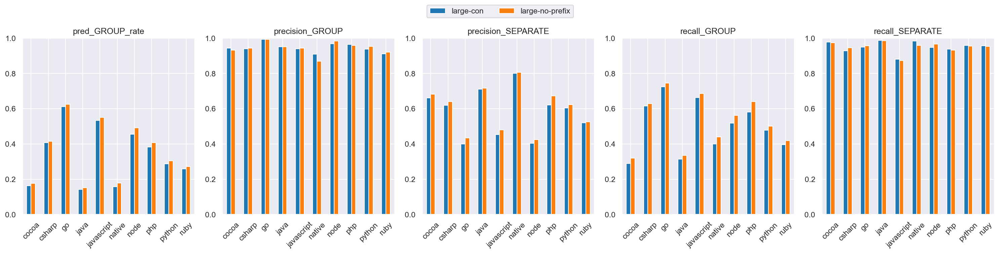
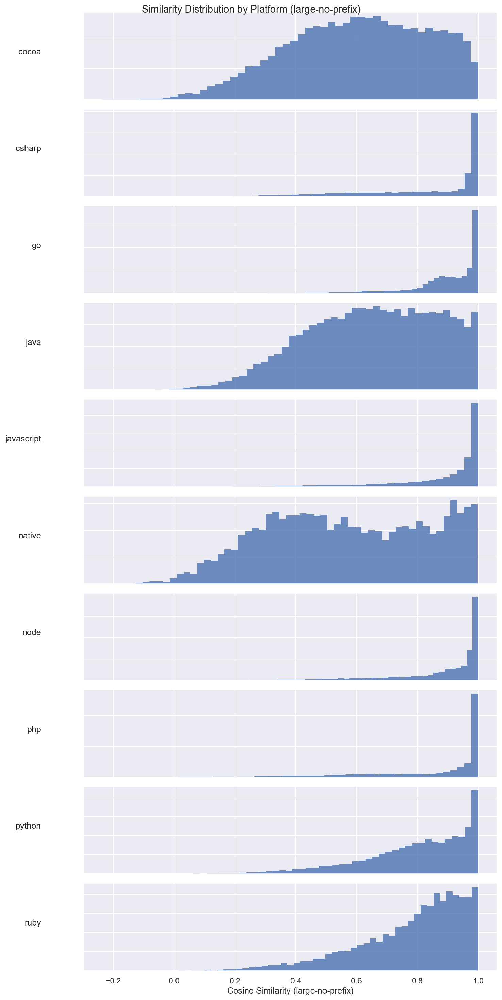
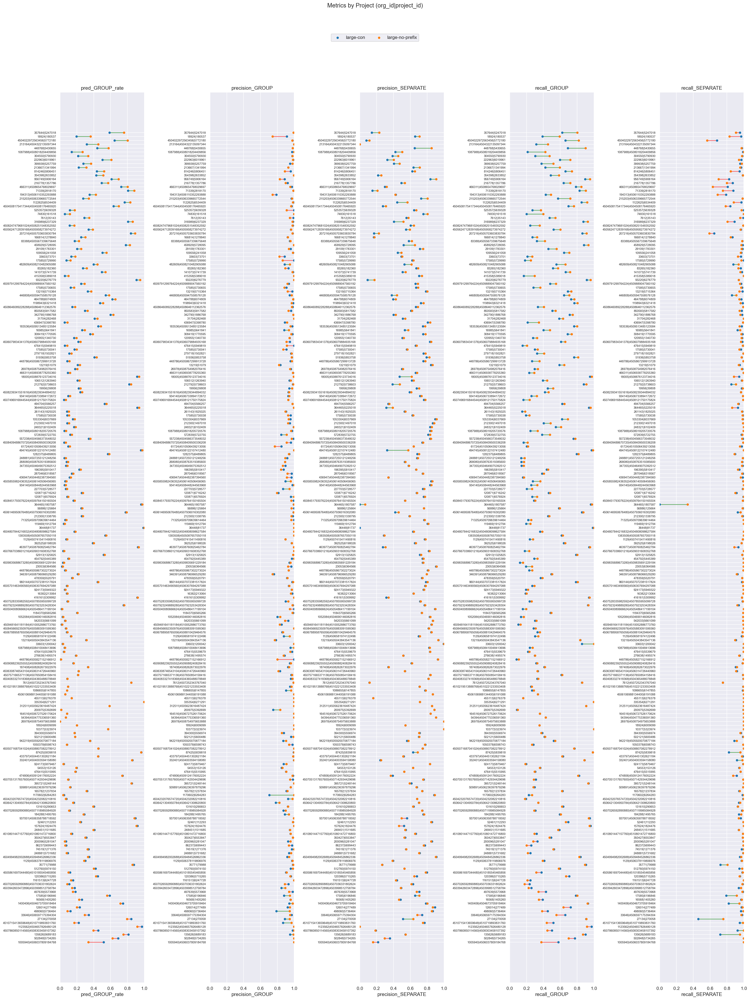

# large-con (dim=64) vs large-no-prefix (dim=64), dataset: test_full2

Command to repro:

```bash
python eval/compare.py \
    --name_model1 large-con \
    --name_model2 large-no-prefix \
    --gcs_model1 gs://grouping-data/runs/2026-04-07-11-56-28-large-con/similarities/test_full2 \
    --gcs_model2 gs://grouping-data/runs/2026-04-10-12-39-45-large-no-prefix/similarities/test_full2 \
    --threshold_model1 0.90 \
    --threshold_model2 0.90 \
    --dim_model1 64 \
    --dim_model2 64
```

### Column definitions

- **model**: The name of the model being evaluated.
- **pred_GROUP_rate**: The fraction of pairs this model groups together—lower means more separate issues are created. It's smaller than prod b/c the test dataset contains far more borderline cases; it's missing pairs that are very close.  This bias also means precision_GROUP is lower than what it'd be in prod.
- **precision_GROUP**: When the model groups a pair, how often is it correct? Higher = less over-grouping.
- **precision_SEPARATE**: When the model separates a pair, how often is it correct?
- **recall_GROUP**: Of all pairs that should be grouped, what fraction does the model correctly group? Higher = less under-grouping.
- **recall_SEPARATE**: Of all pairs that should be separate, what fraction does the model correctly separate?

## Aggregate results


### Overall metrics

| model           | pred_GROUP_rate | precision_GROUP | precision_SEPARATE | recall_GROUP | recall_SEPARATE |
|-----------------|-----------------|-----------------|--------------------|--------------|-----------------|
| large-con       | 0.41            | 0.97            | 0.62               | 0.64         | 0.97            |
| large-no-prefix | 0.44            | 0.97            | 0.64               | 0.68         | 0.97            |

### Project-averaged metrics (210 projects)

| model           | pred_GROUP_rate | precision_GROUP | precision_SEPARATE | recall_GROUP | recall_SEPARATE |
|-----------------|-----------------|-----------------|--------------------|--------------|-----------------|
| large-con       | 0.32            | 0.95            | 0.62               | 0.49         | 0.96            |
| large-no-prefix | 0.33            | 0.95            | 0.64               | 0.52         | 0.95            |

### Conditional probabilities

P(large-no-prefix GROUP | large-con GROUP)    = 0.9490

P(large-no-prefix GROUP | large-con SEPARATE) = 0.0777

P(large-no-prefix GROUP | large-con GROUP, distance < 0.005) = 0.9853  (n=14895)

### Thresholds

```json
{
  "large-con": 0.9,
  "large-no-prefix": 0.9
}
```

### Distance distribution

| statistic  | value    |
|------------|----------|
| count      | 235298.0 |
| null_count | 0.0      |
| mean       | 0.040396 |
| std        | 0.030303 |
| min        | 0.000514 |
| 25%        | 0.015989 |
| 50%        | 0.033667 |
| 75%        | 0.060711 |
| max        | 0.245969 |

GROUP rate: 62.56%

### Platform stats

| platform   | n_pairs | n_projects | label_GROUP_rate | proportion |
|------------|---------|------------|------------------|------------|
| cocoa      | 35279   | 66         | 0.36             | 0.15       |
| csharp     | 25468   | 27         | 0.66             | 0.11       |
| go         | 23302   | 14         | 0.91             | 0.1        |
| java       | 25776   | 70         | 0.37             | 0.11       |
| javascript | 62545   | 82         | 0.78             | 0.27       |
| native     | 8834    | 49         | 0.27             | 0.04       |
| node       | 11573   | 20         | 0.82             | 0.05       |
| php        | 12019   | 14         | 0.72             | 0.05       |
| python     | 17559   | 15         | 0.54             | 0.07       |
| ruby       | 12943   | 15         | 0.61             | 0.06       |

### Short stacktraces (query_tokens <= p10 = 34 tokens, 24059 pairs)

label GROUP rate: 81.67%
| model           | pred_GROUP_rate | precision_GROUP | precision_SEPARATE | recall_GROUP | recall_SEPARATE |
|-----------------|-----------------|-----------------|--------------------|--------------|-----------------|
| large-con       | 0.45            | 0.98            | 0.31               | 0.54         | 0.94            |
| large-no-prefix | 0.52            | 0.98            | 0.36               | 0.63         | 0.95            |

### Long stacktraces (query_tokens >= p90 = 931 tokens, 23577 pairs)

label GROUP rate: 70.76%
| model           | pred_GROUP_rate | precision_GROUP | precision_SEPARATE | recall_GROUP | recall_SEPARATE |
|-----------------|-----------------|-----------------|--------------------|--------------|-----------------|
| large-con       | 0.52            | 0.98            | 0.58               | 0.72         | 0.97            |
| large-no-prefix | 0.56            | 0.98            | 0.64               | 0.78         | 0.96            |

## Threshold sweep


### Threshold sweep for large-no-prefix

| threshold | pred_GROUP_rate | precision_GROUP | precision_SEPARATE | recall_GROUP | recall_SEPARATE |
|-----------|-----------------|-----------------|--------------------|--------------|-----------------|
| 0.8       | 0.59            | 0.91            | 0.78               | 0.86         | 0.86            |
| 0.85      | 0.52            | 0.94            | 0.72               | 0.79         | 0.92            |
| 0.87      | 0.49            | 0.96            | 0.69               | 0.75         | 0.94            |
| 0.9       | 0.44            | 0.97            | 0.64               | 0.68         | 0.97            |

## Platform-level results


### Metrics by platform, avg over projects (large-con, threshold=0.9)

| platform   | n_pairs | n_projects | label_GROUP_rate | min_threshold | pred_GROUP_rate | precision_GROUP | precision_SEPARATE | recall_GROUP | recall_SEPARATE |
|------------|---------|------------|------------------|---------------|-----------------|-----------------|--------------------|--------------|-----------------|
| cocoa      | 35279   | 66         | 0.365            | 0.9           | 0.163           | 0.944           | 0.661              | 0.29         | 0.977           |
| csharp     | 25468   | 27         | 0.662            | 0.9           | 0.408           | 0.939           | 0.618              | 0.615        | 0.927           |
| go         | 23302   | 14         | 0.91             | 0.9           | 0.61            | 0.993           | 0.4                | 0.723        | 0.95            |
| java       | 25776   | 70         | 0.368            | 0.9           | 0.141           | 0.951           | 0.71               | 0.313        | 0.987           |
| javascript | 62545   | 82         | 0.781            | 0.9           | 0.534           | 0.939           | 0.453              | 0.662        | 0.88            |
| native     | 8834    | 49         | 0.272            | 0.9           | 0.158           | 0.908           | 0.801              | 0.399        | 0.983           |
| node       | 11573   | 20         | 0.825            | 0.9           | 0.456           | 0.968           | 0.404              | 0.517        | 0.946           |
| php        | 12019   | 14         | 0.722            | 0.9           | 0.382           | 0.964           | 0.622              | 0.58         | 0.937           |
| python     | 17559   | 15         | 0.535            | 0.9           | 0.288           | 0.938           | 0.604              | 0.478        | 0.959           |
| ruby       | 12943   | 15         | 0.61             | 0.9           | 0.259           | 0.912           | 0.519              | 0.396        | 0.957           |

### Metrics by platform, avg over projects (large-no-prefix, threshold=0.9)

| platform   | n_pairs | n_projects | label_GROUP_rate | min_threshold | pred_GROUP_rate | precision_GROUP | precision_SEPARATE | recall_GROUP | recall_SEPARATE |
|------------|---------|------------|------------------|---------------|-----------------|-----------------|--------------------|--------------|-----------------|
| cocoa      | 35279   | 66         | 0.365            | 0.9           | 0.177           | 0.931           | 0.682              | 0.319        | 0.975           |
| csharp     | 25468   | 27         | 0.662            | 0.9           | 0.415           | 0.943           | 0.64               | 0.629        | 0.944           |
| go         | 23302   | 14         | 0.91             | 0.9           | 0.625           | 0.993           | 0.435              | 0.744        | 0.956           |
| java       | 25776   | 70         | 0.368            | 0.9           | 0.153           | 0.951           | 0.716              | 0.335        | 0.985           |
| javascript | 62545   | 82         | 0.781            | 0.9           | 0.551           | 0.943           | 0.48               | 0.685        | 0.872           |
| native     | 8834    | 49         | 0.272            | 0.9           | 0.178           | 0.869           | 0.806              | 0.44         | 0.959           |
| node       | 11573   | 20         | 0.825            | 0.9           | 0.491           | 0.983           | 0.425              | 0.561        | 0.967           |
| php        | 12019   | 14         | 0.722            | 0.9           | 0.408           | 0.959           | 0.673              | 0.641        | 0.931           |
| python     | 17559   | 15         | 0.535            | 0.9           | 0.305           | 0.952           | 0.622              | 0.501        | 0.955           |
| ruby       | 12943   | 15         | 0.61             | 0.9           | 0.273           | 0.92            | 0.526              | 0.418        | 0.952           |

### Min threshold for >= 95% avg project precision_GROUP by platform (large-con)

| platform   | n_pairs | n_projects | label_GROUP_rate | min_threshold | pred_GROUP_rate | precision_GROUP | precision_SEPARATE | recall_GROUP | recall_SEPARATE |
|------------|---------|------------|------------------|---------------|-----------------|-----------------|--------------------|--------------|-----------------|
| cocoa      | 35279   | 66         | 0.365            | 0.92          | 0.142           | 0.957           | 0.651              | 0.245        | 0.982           |
| csharp     | 25468   | 27         | 0.662            | 0.92          | 0.38            | 0.952           | 0.6                | 0.572        | 0.955           |
| go         | 23302   | 14         | 0.91             | 0.78          | 0.779           | 0.952           | 0.559              | 0.891        | 0.675           |
| java       | 25776   | 70         | 0.368            | 0.9           | 0.141           | 0.951           | 0.71               | 0.313        | 0.987           |
| javascript | 62545   | 82         | 0.781            | 0.95          | 0.377           | 0.957           | 0.388              | 0.47         | 0.969           |
| native     | 8834    | 49         | 0.272            | 0.97          | 0.063           | 1.0             | 0.731              | 0.169        | 1.0             |
| node       | 11573   | 20         | 0.825            | 0.86          | 0.611           | 0.951           | 0.499              | 0.673        | 0.88            |
| php        | 12019   | 14         | 0.722            | 0.89          | 0.4             | 0.957           | 0.637              | 0.615        | 0.932           |
| python     | 17559   | 15         | 0.535            | 0.92          | 0.242           | 0.951           | 0.575              | 0.408        | 0.974           |
| ruby       | 12943   | 15         | 0.61             | 0.94          | 0.171           | 0.956           | 0.482              | 0.272        | 0.991           |

### Min threshold for >= 95% avg project precision_GROUP by platform (large-no-prefix)

| platform   | n_pairs | n_projects | label_GROUP_rate | min_threshold | pred_GROUP_rate | precision_GROUP | precision_SEPARATE | recall_GROUP | recall_SEPARATE |
|------------|---------|------------|------------------|---------------|-----------------|-----------------|--------------------|--------------|-----------------|
| cocoa      | 35279   | 66         | 0.365            | 0.94          | 0.12            | 0.955           | 0.643              | 0.202        | 0.985           |
| csharp     | 25468   | 27         | 0.662            | 0.91          | 0.397           | 0.955           | 0.627              | 0.604        | 0.955           |
| go         | 23302   | 14         | 0.91             | 0.77          | 0.788           | 0.95            | 0.555              | 0.903        | 0.709           |
| java       | 25776   | 70         | 0.368            | 0.9           | 0.153           | 0.951           | 0.716              | 0.335        | 0.985           |
| javascript | 62545   | 82         | 0.781            | 0.93          | 0.465           | 0.951           | 0.426              | 0.58         | 0.933           |
| native     | 8834    | 49         | 0.272            | 0.95          | 0.131           | 0.959           | 0.785              | 0.32         | 0.994           |
| node       | 11573   | 20         | 0.825            | 0.87          | 0.624           | 0.967           | 0.512              | 0.698        | 0.931           |
| php        | 12019   | 14         | 0.722            | 0.9           | 0.408           | 0.959           | 0.673              | 0.641        | 0.931           |
| python     | 17559   | 15         | 0.535            | 0.9           | 0.305           | 0.952           | 0.622              | 0.501        | 0.955           |
| ruby       | 12943   | 15         | 0.61             | 0.95          | 0.155           | 0.956           | 0.473              | 0.247        | 0.993           |

<details>
<summary>Metrics by platform</summary>


</details>


<details>
<summary>Similarity distribution (large-con)</summary>


</details>


<details>
<summary>Similarity distribution (large-no-prefix)</summary>


</details>


## Project-level results


<details>
<summary>Dumbbell by project</summary>


</details>


### >= 15% group rate increase (stratified by platform)

| org_id           | project_id | platform   | n_pairs | label_GROUP_rate | large-con_GROUP_rate | large-con_prec | large-con_rec | large-no-prefix_GROUP_rate | large-no-prefix_prec | large-no-prefix_rec | group_rate_increase |
|------------------|------------|------------|---------|------------------|----------------------|----------------|---------------|----------------------------|----------------------|---------------------|---------------------|
| 357644           | 5247018    | javascript | 702     | 0.94             | 0.59                 | 1.0            | 0.62          | 0.76                       | 0.99                 | 0.8                 | 0.17                |
| 18924            | 180537     | native     | 1739    | 0.46             | 0.19                 | 0.91           | 0.39          | 0.36                       | 0.74                 | 0.59                | 0.17                |
| 4504022972563456 | 5772180    | javascript | 1743    | 0.96             | 0.65                 | 0.98           | 0.66          | 0.8                        | 0.98                 | 0.82                | 0.16                |

### >= 10% group rate decrease

| org_id  | project_id       | platform | n_pairs | label_GROUP_rate | large-con_GROUP_rate | large-con_prec | large-con_rec | large-no-prefix_GROUP_rate | large-no-prefix_prec | large-no-prefix_rec | group_rate_decrease |
|---------|------------------|----------|---------|------------------|----------------------|----------------|---------------|----------------------------|----------------------|---------------------|---------------------|
| 1005940 | 4506037809184768 | php      | 289     | 0.9              | 0.52                 | 1.0            | 0.58          | 0.34                       | 1.0                  | 0.37                | 0.18                |
