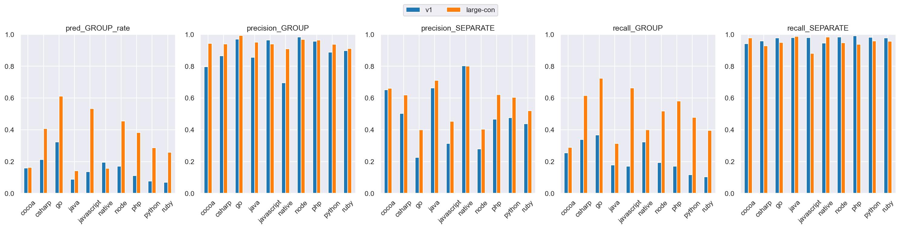
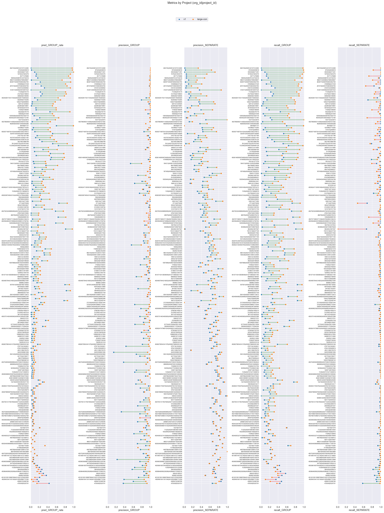

# v1 (dim=768) vs large-con (dim=64), dataset: test_full2

Command to repro:

```bash
python eval/compare.py \
    --name_model1 \
    v1 \
    --name_model2 \
    large-con \
    --gcs_model1 \
    gs://grouping-data/runs/issue_grouping_v1/similarities/test_full2 \
    --gcs_model2 \
    gs://grouping-data/runs/2026-04-07-11-56-28-large-con/similarities/test_full2 \
    --threshold_model1 \
    0.99 \
    --threshold_model2 \
    0.90 \
    --dim_model2 \
    64 \
    --overwrite \
    --upload_sheets
```

### Column definitions

- **model**: The name of the model being evaluated.
- **pred_GROUP_rate**: The fraction of pairs this model groups together—lower means more separate issues are created. It's smaller than prod b/c the test dataset contains far more borderline cases; it's missing pairs that are very close.
- **precision_GROUP**: When the model groups a pair, how often is it correct? Higher = less over-grouping.
- **precision_SEPARATE**: When the model separates a pair, how often is it correct?
- **recall_GROUP**: Of all pairs that should be grouped, what fraction does the model correctly group? Higher = less under-grouping.
- **recall_SEPARATE**: Of all pairs that should be separate, what fraction does the model correctly separate?

## Aggregate results


### Overall metrics

| model     | pred_GROUP_rate | precision_GROUP | precision_SEPARATE | recall_GROUP | recall_SEPARATE |
|-----------|-----------------|-----------------|--------------------|--------------|-----------------|
| v1        | 0.16            | 0.94            | 0.43               | 0.24         | 0.97            |
| large-con | 0.41            | 0.97            | 0.62               | 0.64         | 0.97            |

### Project-averaged metrics (210 projects)

| model     | pred_GROUP_rate | precision_GROUP | precision_SEPARATE | recall_GROUP | recall_SEPARATE |
|-----------|-----------------|-----------------|--------------------|--------------|-----------------|
| v1        | 0.14            | 0.88            | 0.51               | 0.21         | 0.97            |
| large-con | 0.32            | 0.95            | 0.62               | 0.49         | 0.96            |

### Conditional probabilities

P(large-con GROUP | v1 GROUP)    = 0.8464

P(large-con GROUP | v1 SEPARATE) = 0.3254

P(large-con GROUP | v1 GROUP, distance < 0.005) = 0.9094  (n=16378)

### Thresholds

```json
{
  "v1": 0.99,
  "large-con": 0.9
}
```

### Distance distribution

| statistic  | value    |
|------------|----------|
| count      | 235298.0 |
| null_count | 0.0      |
| mean       | 0.040396 |
| std        | 0.030303 |
| min        | 0.000514 |
| 25%        | 0.015989 |
| 50%        | 0.033667 |
| 75%        | 0.060711 |
| max        | 0.245969 |

GROUP rate: 62.56%

### Platform stats

| platform   | n_pairs | n_projects | label_GROUP_rate | proportion |
|------------|---------|------------|------------------|------------|
| cocoa      | 35279   | 66         | 0.36             | 0.15       |
| csharp     | 25468   | 27         | 0.66             | 0.11       |
| go         | 23302   | 14         | 0.91             | 0.1        |
| java       | 25776   | 70         | 0.37             | 0.11       |
| javascript | 62545   | 82         | 0.78             | 0.27       |
| native     | 8834    | 49         | 0.27             | 0.04       |
| node       | 11573   | 20         | 0.82             | 0.05       |
| php        | 12019   | 14         | 0.72             | 0.05       |
| python     | 17559   | 15         | 0.54             | 0.07       |
| ruby       | 12943   | 15         | 0.61             | 0.06       |

### Short stacktraces (query_tokens <= p10 = 34 tokens, 24059 pairs)

label GROUP rate: 81.67%
| model     | pred_GROUP_rate | precision_GROUP | precision_SEPARATE | recall_GROUP | recall_SEPARATE |
|-----------|-----------------|-----------------|--------------------|--------------|-----------------|
| v1        | 0.17            | 0.97            | 0.21               | 0.2          | 0.98            |
| large-con | 0.45            | 0.98            | 0.31               | 0.54         | 0.94            |

### Long stacktraces (query_tokens >= p90 = 931 tokens, 23577 pairs)

label GROUP rate: 70.76%
| model     | pred_GROUP_rate | precision_GROUP | precision_SEPARATE | recall_GROUP | recall_SEPARATE |
|-----------|-----------------|-----------------|--------------------|--------------|-----------------|
| v1        | 0.19            | 0.98            | 0.36               | 0.26         | 0.98            |
| large-con | 0.52            | 0.98            | 0.58               | 0.72         | 0.97            |

## Threshold sweep


### Threshold sweep for large-con

| threshold | pred_GROUP_rate | precision_GROUP | precision_SEPARATE | recall_GROUP | recall_SEPARATE |
|-----------|-----------------|-----------------|--------------------|--------------|-----------------|
| 0.8       | 0.57            | 0.91            | 0.76               | 0.84         | 0.87            |
| 0.85      | 0.5             | 0.95            | 0.69               | 0.75         | 0.93            |
| 0.87      | 0.46            | 0.96            | 0.66               | 0.71         | 0.95            |
| 0.9       | 0.41            | 0.97            | 0.62               | 0.64         | 0.97            |

## Platform-level results


### Metrics by platform, avg over projects (v1, threshold=0.99)

| platform   | n_pairs | n_projects | label_GROUP_rate | min_threshold | pred_GROUP_rate | precision_GROUP | precision_SEPARATE | recall_GROUP | recall_SEPARATE |
|------------|---------|------------|------------------|---------------|-----------------|-----------------|--------------------|--------------|-----------------|
| cocoa      | 35279   | 66         | 0.365            | 0.99          | 0.159           | 0.796           | 0.652              | 0.255        | 0.942           |
| csharp     | 25468   | 27         | 0.662            | 0.99          | 0.213           | 0.864           | 0.502              | 0.338        | 0.959           |
| go         | 23302   | 14         | 0.91             | 0.99          | 0.324           | 0.97            | 0.226              | 0.368        | 0.977           |
| java       | 25776   | 70         | 0.368            | 0.99          | 0.089           | 0.856           | 0.663              | 0.178        | 0.98            |
| javascript | 62545   | 82         | 0.781            | 0.99          | 0.137           | 0.964           | 0.314              | 0.171        | 0.979           |
| native     | 8834    | 49         | 0.272            | 0.99          | 0.195           | 0.695           | 0.802              | 0.324        | 0.945           |
| node       | 11573   | 20         | 0.825            | 0.99          | 0.17            | 0.983           | 0.28               | 0.194        | 0.984           |
| php        | 12019   | 14         | 0.722            | 0.99          | 0.112           | 0.957           | 0.467              | 0.171        | 0.99            |
| python     | 17559   | 15         | 0.535            | 0.99          | 0.077           | 0.887           | 0.475              | 0.117        | 0.981           |
| ruby       | 12943   | 15         | 0.61             | 0.99          | 0.069           | 0.897           | 0.437              | 0.105        | 0.978           |

### Metrics by platform, avg over projects (large-con, threshold=0.9)

| platform   | n_pairs | n_projects | label_GROUP_rate | min_threshold | pred_GROUP_rate | precision_GROUP | precision_SEPARATE | recall_GROUP | recall_SEPARATE |
|------------|---------|------------|------------------|---------------|-----------------|-----------------|--------------------|--------------|-----------------|
| cocoa      | 35279   | 66         | 0.365            | 0.9           | 0.163           | 0.944           | 0.661              | 0.29         | 0.977           |
| csharp     | 25468   | 27         | 0.662            | 0.9           | 0.408           | 0.939           | 0.618              | 0.615        | 0.927           |
| go         | 23302   | 14         | 0.91             | 0.9           | 0.61            | 0.993           | 0.4                | 0.723        | 0.95            |
| java       | 25776   | 70         | 0.368            | 0.9           | 0.141           | 0.951           | 0.71               | 0.313        | 0.987           |
| javascript | 62545   | 82         | 0.781            | 0.9           | 0.534           | 0.939           | 0.453              | 0.662        | 0.88            |
| native     | 8834    | 49         | 0.272            | 0.9           | 0.158           | 0.908           | 0.801              | 0.399        | 0.983           |
| node       | 11573   | 20         | 0.825            | 0.9           | 0.456           | 0.968           | 0.404              | 0.517        | 0.946           |
| php        | 12019   | 14         | 0.722            | 0.9           | 0.382           | 0.964           | 0.622              | 0.58         | 0.937           |
| python     | 17559   | 15         | 0.535            | 0.9           | 0.288           | 0.938           | 0.604              | 0.478        | 0.959           |
| ruby       | 12943   | 15         | 0.61             | 0.9           | 0.259           | 0.912           | 0.519              | 0.396        | 0.957           |

### Min threshold for >= 95% avg project precision_GROUP by platform (v1)

| platform   | n_pairs | n_projects | label_GROUP_rate | min_threshold | pred_GROUP_rate | precision_GROUP | precision_SEPARATE | recall_GROUP | recall_SEPARATE |
|------------|---------|------------|------------------|---------------|-----------------|-----------------|--------------------|--------------|-----------------|
| cocoa      | 35279   | 66         | 0.365            | null          | null            | null            | null               | null         | null            |
| csharp     | 25468   | 27         | 0.662            | null          | null            | null            | null               | null         | null            |
| go         | 23302   | 14         | 0.91             | 0.98          | 0.653           | 0.994           | 0.249              | 0.713        | 0.957           |
| java       | 25776   | 70         | 0.368            | null          | null            | null            | null               | null         | null            |
| javascript | 62545   | 82         | 0.781            | 0.99          | 0.173           | 0.98            | 0.26               | 0.217        | 0.984           |
| native     | 8834    | 49         | 0.272            | null          | null            | null            | null               | null         | null            |
| node       | 11573   | 20         | 0.825            | 0.98          | 0.429           | 0.986           | 0.297              | 0.513        | 0.965           |
| php        | 12019   | 14         | 0.722            | 0.99          | 0.133           | 0.973           | 0.317              | 0.179        | 0.987           |
| python     | 17559   | 15         | 0.535            | null          | null            | null            | null               | null         | null            |
| ruby       | 12943   | 15         | 0.61             | null          | null            | null            | null               | null         | null            |

### Min threshold for >= 95% avg project precision_GROUP by platform (large-con)

| platform   | n_pairs | n_projects | label_GROUP_rate | min_threshold | pred_GROUP_rate | precision_GROUP | precision_SEPARATE | recall_GROUP | recall_SEPARATE |
|------------|---------|------------|------------------|---------------|-----------------|-----------------|--------------------|--------------|-----------------|
| cocoa      | 35279   | 66         | 0.365            | 0.92          | 0.071           | 0.969           | 0.682              | 0.188        | 0.997           |
| csharp     | 25468   | 27         | 0.662            | 0.92          | 0.534           | 0.982           | 0.704              | 0.792        | 0.972           |
| go         | 23302   | 14         | 0.91             | 0.78          | 0.859           | 0.981           | 0.525              | 0.926        | 0.821           |
| java       | 25776   | 70         | 0.368            | 0.9           | 0.126           | 0.932           | 0.713              | 0.319        | 0.986           |
| javascript | 62545   | 82         | 0.781            | 0.95          | 0.473           | 0.995           | 0.411              | 0.603        | 0.988           |
| native     | 8834    | 49         | 0.272            | 0.97          | 0.027           | 1.0             | 0.748              | 0.099        | 1.0             |
| node       | 11573   | 20         | 0.825            | 0.86          | 0.684           | 0.978           | 0.507              | 0.811        | 0.913           |
| php        | 12019   | 14         | 0.722            | 0.89          | 0.603           | 0.987           | 0.681              | 0.825        | 0.971           |
| python     | 17559   | 15         | 0.535            | 0.92          | 0.278           | 0.957           | 0.627              | 0.497        | 0.974           |
| ruby       | 12943   | 15         | 0.61             | 0.94          | 0.171           | 0.965           | 0.463              | 0.27         | 0.985           |

<details>
<summary>Metrics by platform</summary>


</details>


<details>
<summary>Similarity distribution (v1)</summary>


</details>


<details>
<summary>Similarity distribution (large-con)</summary>


</details>


## Project-level results


<details>
<summary>Dumbbell by project</summary>


</details>


### >= 15% group rate increase (stratified by platform)

| org_id           | project_id       | platform   | n_pairs | label_GROUP_rate | v1_GROUP_rate | v1_prec | v1_rec | large-con_GROUP_rate | large-con_prec | large-con_rec | group_rate_increase |
|------------------|------------------|------------|---------|------------------|---------------|---------|--------|----------------------|----------------|---------------|---------------------|
| 494745           | 4508122107412480 | csharp     | 2923    | 0.99             | 0.0           | 1.0     | 0.0    | 0.96                 | 1.0            | 0.97          | 0.96                |
| 87425            | 5839818          | javascript | 2733    | 0.97             | 0.02          | 1.0     | 0.02   | 0.97                 | 1.0            | 0.99          | 0.95                |
| 335354           | 6271291          | csharp     | 5539    | 1.0              | 0.09          | 1.0     | 0.09   | 1.0                  | 1.0            | 1.0           | 0.91                |
| 157624           | 1824476          | node       | 1494    | 0.96             | 0.13          | 1.0     | 0.13   | 0.92                 | 1.0            | 0.96          | 0.79                |
| 35771            | 79988            | javascript | 790     | 0.95             | 0.12          | 1.0     | 0.13   | 0.88                 | 0.99           | 0.9           | 0.75                |
| 18005            | 4508876123734016 | php        | 5687    | 0.96             | 0.16          | 0.99    | 0.17   | 0.92                 | 1.0            | 0.95          | 0.75                |
| 466311           | 4508654768029697 | javascript | 2020    | 0.9              | 0.01          | 1.0     | 0.01   | 0.73                 | 0.97           | 0.79          | 0.71                |
| 463977           | 4508760825462784 | javascript | 4758    | 0.98             | 0.22          | 1.0     | 0.22   | 0.92                 | 1.0            | 0.94          | 0.71                |
| 416161           | 5309992          | go         | 1786    | 0.97             | 0.32          | 1.0     | 0.33   | 0.92                 | 1.0            | 0.94          | 0.6                 |
| 312511           | 4505623616487424 | go         | 17      | 0.65             | 0.0           | NaN     | 0.0    | 0.59                 | 1.0            | 0.91          | 0.59                |
| 212792           | 5738603          | node       | 902     | 0.92             | 0.26          | 1.0     | 0.29   | 0.82                 | 0.99           | 0.88          | 0.56                |
| 1383508          | 4505087657050118 | go         | 500     | 0.87             | 0.08          | 1.0     | 0.09   | 0.54                 | 1.0            | 0.62          | 0.46                |
| 10377            | 5323974          | java       | 7       | 0.57             | 0.14          | 1.0     | 0.25   | 0.57                 | 1.0            | 1.0           | 0.43                |
| 482609           | 4508210482905088 | python     | 88      | 0.64             | 0.0           | NaN     | 0.0    | 0.4                  | 0.89           | 0.55          | 0.4                 |
| 131610           | 290653           | php        | 971     | 0.59             | 0.03          | 0.94    | 0.05   | 0.4                  | 0.93           | 0.63          | 0.37                |
| 4505071687041024 | 4508807082278912 | java       | 416     | 0.59             | 0.09          | 0.85    | 0.13   | 0.46                 | 1.0            | 0.77          | 0.36                |
| 433797           | 4504451302621184 | ruby       | 2078    | 0.71             | 0.11          | 0.97    | 0.15   | 0.45                 | 0.99           | 0.63          | 0.34                |
| 248451           | 1511685          | python     | 1990    | 0.65             | 0.08          | 0.92    | 0.11   | 0.41                 | 0.95           | 0.59          | 0.33                |
| 956749           | 5906164          | python     | 960     | 0.61             | 0.28          | 0.88    | 0.41   | 0.61                 | 0.89           | 0.9           | 0.33                |
| 1122625          | 6534409          | node       | 2825    | 0.89             | 0.45          | 1.0     | 0.51   | 0.77                 | 1.0            | 0.85          | 0.31                |
| 74519            | 1271376          | ruby       | 218     | 0.63             | 0.06          | 1.0     | 0.09   | 0.34                 | 0.97           | 0.53          | 0.28                |
| 194313           | 4506110352293888 | cocoa      | 202     | 0.65             | 0.07          | 0.53    | 0.06   | 0.35                 | 0.79           | 0.43          | 0.28                |
| 1005940          | 4506037809184768 | php        | 289     | 0.9              | 0.29          | 1.0     | 0.32   | 0.52                 | 1.0            | 0.58          | 0.23                |
| 16985            | 5641841          | java       | 160     | 0.57             | 0.03          | 0.8     | 0.04   | 0.26                 | 0.88           | 0.4           | 0.23                |
| 166814           | 1278840          | ruby       | 1026    | 0.86             | 0.03          | 0.63    | 0.02   | 0.25                 | 0.92           | 0.27          | 0.22                |
| 1129             | 4506378119806976 | cocoa      | 1494    | 0.72             | 0.09          | 0.92    | 0.11   | 0.3                  | 0.98           | 0.41          | 0.21                |
| 26978            | 4508754982076416 | cocoa      | 715     | 0.58             | 0.0           | 1.0     | 0.0    | 0.18                 | 0.96           | 0.3           | 0.18                |
| 1400406          | 4504673705918464 | csharp     | 460     | 0.76             | 0.58          | 1.0     | 0.77   | 0.75                 | 0.94           | 0.93          | 0.17                |
| 83388            | 4505567339675648 | native     | 1130    | 0.51             | 0.02          | 1.0     | 0.03   | 0.17                 | 0.95           | 0.32          | 0.16                |
| 364465           | 1807587          | csharp     | 686     | 1.0              | 0.81          | 1.0     | 0.81   | 0.96                 | 1.0            | 0.96          | 0.16                |

### >= 10% group rate decrease

| org_id           | project_id       | platform | n_pairs | label_GROUP_rate | v1_GROUP_rate | v1_prec | v1_rec | large-con_GROUP_rate | large-con_prec | large-con_rec | group_rate_decrease |
|------------------|------------------|----------|---------|------------------|---------------|---------|--------|----------------------|----------------|---------------|---------------------|
| 478359           | 5520791          | cocoa    | 843     | 0.36             | 0.43          | 0.36    | 0.44   | 0.14                 | 0.92           | 0.37          | 0.28                |
| 436947           | 5398780          | cocoa    | 2608    | 0.23             | 0.18          | 0.6     | 0.48   | 0.05                 | 0.89           | 0.21          | 0.13                |
| 4509481641181184 | 4510052886773760 | cocoa    | 1378    | 0.16             | 0.15          | 0.38    | 0.35   | 0.02                 | 0.85           | 0.1           | 0.13                |
| 4510219513888768 | 4510221233553408 | cocoa    | 3409    | 0.35             | 0.2           | 0.72    | 0.42   | 0.09                 | 0.95           | 0.25          | 0.11                |
| 16568            | 1405260          | ruby     | 533     | 0.63             | 0.36          | 0.85    | 0.49   | 0.26                 | 0.96           | 0.39          | 0.1                 |

[Pairs of stacktraces for v1 vs large-con — group rate increase >= 15%](https://docs.google.com/spreadsheets/d/1tK9oZvXyhK0pyu_nQGM2O3cDyN7KIbvc6nhn89NbcRE)

[Pairs of stacktraces for v1 vs large-con — group rate decrease >= 10%](https://docs.google.com/spreadsheets/d/1lmDNCGKsBtKINX6xHn_YygL6nqDO7jYoNPGUCgmHTlU)

- Sheets suffixed w/ `|new` contain pairs that the current, prod model groups together, but the new model separates (creating new issues).
- Sheets suffixed w/ `|merged` contain pairs that prod separates, but the new model would group together (merging issues).
- If you click the button in the top right corner of the table, you'll see what the LLM thought about the pair and the model's similarity scores
