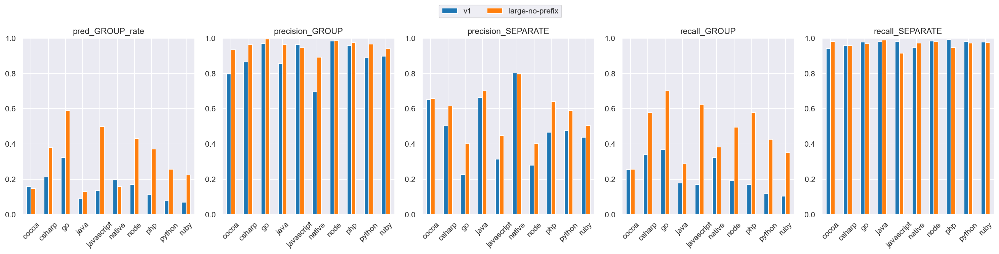
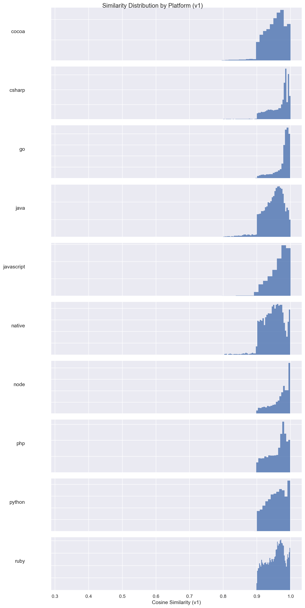
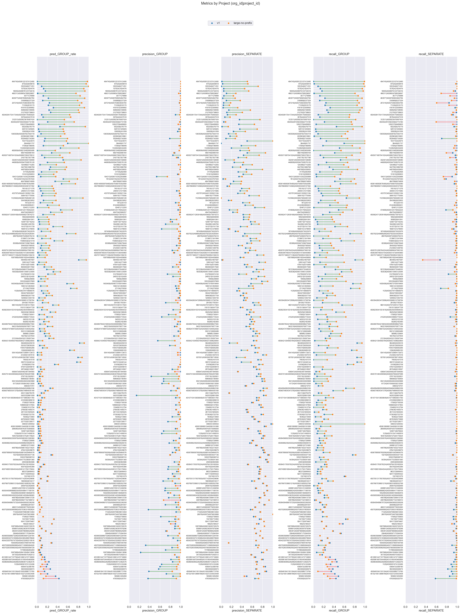

# v1 (dim=768) vs large-no-prefix (dim=64), dataset: test_full2

Command to repro:

```bash
python eval/compare.py \
    --name_model1 v1 \
    --name_model2 large-no-prefix \
    --gcs_model1 gs://grouping-data/runs/issue_grouping_v1/similarities/test_full2 \
    --gcs_model2 gs://grouping-data/runs/2026-04-10-12-39-45-large-no-prefix/similarities/test_full2 \
    --threshold_model1 0.99 \
    --threshold_model2 0.92 \
    --dim_model2 64 \
    --overwrite
```

### Column definitions

- **model**: The name of the model being evaluated.
- **pred_GROUP_rate**: The fraction of pairs this model groups together—lower means more separate issues are created. It's smaller than prod b/c the test dataset contains far more borderline cases; it's missing pairs that are very close.  This bias also means precision_GROUP is lower than what it'd be in prod.
- **precision_GROUP**: When the model groups a pair, how often is it correct? Higher = less over-grouping.
- **precision_SEPARATE**: When the model separates a pair, how often is it correct?
- **recall_GROUP**: Of all pairs that should be grouped, what fraction does the model correctly group? Higher = less under-grouping.
- **recall_SEPARATE**: Of all pairs that should be separate, what fraction does the model correctly separate?

## Aggregate results


### Overall metrics

| model           | pred_GROUP_rate | precision_GROUP | precision_SEPARATE | recall_GROUP | recall_SEPARATE |
|-----------------|-----------------|-----------------|--------------------|--------------|-----------------|
| v1              | 0.16            | 0.94            | 0.43               | 0.24         | 0.97            |
| large-no-prefix | 0.4             | 0.98            | 0.61               | 0.62         | 0.98            |

### Project-averaged metrics (210 projects)

| model           | pred_GROUP_rate | precision_GROUP | precision_SEPARATE | recall_GROUP | recall_SEPARATE |
|-----------------|-----------------|-----------------|--------------------|--------------|-----------------|
| v1              | 0.14            | 0.88            | 0.51               | 0.21         | 0.97            |
| large-no-prefix | 0.3             | 0.96            | 0.61               | 0.46         | 0.97            |

### Conditional probabilities

P(large-no-prefix GROUP | v1 GROUP)    = 0.8330

P(large-no-prefix GROUP | v1 SEPARATE) = 0.3115

P(large-no-prefix GROUP | v1 GROUP, distance < 0.005) = 0.8995  (n=16378)

### Thresholds

```json
{
  "v1": 0.99,
  "large-no-prefix": 0.92
}
```

### Distance distribution

| statistic  | value    |
|------------|----------|
| count      | 235298.0 |
| null_count | 0.0      |
| mean       | 0.040396 |
| std        | 0.030303 |
| min        | 0.000514 |
| 25%        | 0.015989 |
| 50%        | 0.033667 |
| 75%        | 0.060711 |
| max        | 0.245969 |

GROUP rate: 62.56%

### Platform stats

| platform   | n_pairs | n_projects | label_GROUP_rate | proportion |
|------------|---------|------------|------------------|------------|
| cocoa      | 35279   | 66         | 0.36             | 0.15       |
| csharp     | 25468   | 27         | 0.66             | 0.11       |
| go         | 23302   | 14         | 0.91             | 0.1        |
| java       | 25776   | 70         | 0.37             | 0.11       |
| javascript | 62545   | 82         | 0.78             | 0.27       |
| native     | 8834    | 49         | 0.27             | 0.04       |
| node       | 11573   | 20         | 0.82             | 0.05       |
| php        | 12019   | 14         | 0.72             | 0.05       |
| python     | 17559   | 15         | 0.54             | 0.07       |
| ruby       | 12943   | 15         | 0.61             | 0.06       |

### Short stacktraces (query_tokens <= p10 = 34 tokens, 24059 pairs)

label GROUP rate: 81.67%
| model           | pred_GROUP_rate | precision_GROUP | precision_SEPARATE | recall_GROUP | recall_SEPARATE |
|-----------------|-----------------|-----------------|--------------------|--------------|-----------------|
| v1              | 0.17            | 0.97            | 0.21               | 0.2          | 0.98            |
| large-no-prefix | 0.45            | 0.99            | 0.32               | 0.55         | 0.97            |

### Long stacktraces (query_tokens >= p90 = 931 tokens, 23577 pairs)

label GROUP rate: 70.76%
| model           | pred_GROUP_rate | precision_GROUP | precision_SEPARATE | recall_GROUP | recall_SEPARATE |
|-----------------|-----------------|-----------------|--------------------|--------------|-----------------|
| v1              | 0.19            | 0.98            | 0.36               | 0.26         | 0.98            |
| large-no-prefix | 0.52            | 0.99            | 0.59               | 0.72         | 0.97            |

## Threshold sweep


### Threshold sweep for large-no-prefix

| threshold | pred_GROUP_rate | precision_GROUP | precision_SEPARATE | recall_GROUP | recall_SEPARATE |
|-----------|-----------------|-----------------|--------------------|--------------|-----------------|
| 0.8       | 0.59            | 0.91            | 0.78               | 0.86         | 0.86            |
| 0.85      | 0.52            | 0.94            | 0.72               | 0.79         | 0.92            |
| 0.87      | 0.49            | 0.96            | 0.69               | 0.75         | 0.94            |
| 0.9       | 0.44            | 0.97            | 0.64               | 0.68         | 0.97            |

## Platform-level results


### Metrics by platform, avg over projects (v1, threshold=0.99)

| platform   | n_pairs | n_projects | label_GROUP_rate | min_threshold | pred_GROUP_rate | precision_GROUP | precision_SEPARATE | recall_GROUP | recall_SEPARATE |
|------------|---------|------------|------------------|---------------|-----------------|-----------------|--------------------|--------------|-----------------|
| cocoa      | 35279   | 66         | 0.365            | 0.99          | 0.159           | 0.796           | 0.652              | 0.255        | 0.942           |
| csharp     | 25468   | 27         | 0.662            | 0.99          | 0.213           | 0.864           | 0.502              | 0.338        | 0.959           |
| go         | 23302   | 14         | 0.91             | 0.99          | 0.324           | 0.97            | 0.226              | 0.368        | 0.977           |
| java       | 25776   | 70         | 0.368            | 0.99          | 0.089           | 0.856           | 0.663              | 0.178        | 0.98            |
| javascript | 62545   | 82         | 0.781            | 0.99          | 0.137           | 0.964           | 0.314              | 0.171        | 0.979           |
| native     | 8834    | 49         | 0.272            | 0.99          | 0.195           | 0.695           | 0.802              | 0.324        | 0.945           |
| node       | 11573   | 20         | 0.825            | 0.99          | 0.17            | 0.983           | 0.28               | 0.194        | 0.984           |
| php        | 12019   | 14         | 0.722            | 0.99          | 0.112           | 0.957           | 0.467              | 0.171        | 0.99            |
| python     | 17559   | 15         | 0.535            | 0.99          | 0.077           | 0.887           | 0.475              | 0.117        | 0.981           |
| ruby       | 12943   | 15         | 0.61             | 0.99          | 0.069           | 0.897           | 0.437              | 0.105        | 0.978           |

### Metrics by platform, avg over projects (large-no-prefix, threshold=0.92)

| platform   | n_pairs | n_projects | label_GROUP_rate | min_threshold | pred_GROUP_rate | precision_GROUP | precision_SEPARATE | recall_GROUP | recall_SEPARATE |
|------------|---------|------------|------------------|---------------|-----------------|-----------------|--------------------|--------------|-----------------|
| cocoa      | 35279   | 66         | 0.365            | 0.92          | 0.148           | 0.934           | 0.658              | 0.257        | 0.981           |
| csharp     | 25468   | 27         | 0.662            | 0.92          | 0.381           | 0.962           | 0.615              | 0.579        | 0.958           |
| go         | 23302   | 14         | 0.91             | 0.92          | 0.59            | 0.995           | 0.404              | 0.7          | 0.971           |
| java       | 25776   | 70         | 0.368            | 0.92          | 0.131           | 0.962           | 0.702              | 0.286        | 0.99            |
| javascript | 62545   | 82         | 0.781            | 0.92          | 0.499           | 0.944           | 0.447              | 0.624        | 0.915           |
| native     | 8834    | 49         | 0.272            | 0.92          | 0.159           | 0.892           | 0.796              | 0.383        | 0.972           |
| node       | 11573   | 20         | 0.825            | 0.92          | 0.43            | 0.986           | 0.402              | 0.494        | 0.98            |
| php        | 12019   | 14         | 0.722            | 0.92          | 0.372           | 0.973           | 0.641              | 0.579        | 0.948           |
| python     | 17559   | 15         | 0.535            | 0.92          | 0.256           | 0.966           | 0.589              | 0.426        | 0.972           |
| ruby       | 12943   | 15         | 0.61             | 0.92          | 0.225           | 0.939           | 0.505              | 0.353        | 0.975           |

### Min threshold for >= 95% avg project precision_GROUP by platform (v1)

| platform   | n_pairs | n_projects | label_GROUP_rate | min_threshold | pred_GROUP_rate | precision_GROUP | precision_SEPARATE | recall_GROUP | recall_SEPARATE |
|------------|---------|------------|------------------|---------------|-----------------|-----------------|--------------------|--------------|-----------------|
| cocoa      | 35279   | 66         | 0.365            | null          | null            | null            | null               | null         | null            |
| csharp     | 25468   | 27         | 0.662            | null          | null            | null            | null               | null         | null            |
| go         | 23302   | 14         | 0.91             | 0.98          | 0.482           | 0.967           | 0.257              | 0.548        | 0.964           |
| java       | 25776   | 70         | 0.368            | null          | null            | null            | null               | null         | null            |
| javascript | 62545   | 82         | 0.781            | 0.99          | 0.137           | 0.964           | 0.314              | 0.171        | 0.979           |
| native     | 8834    | 49         | 0.272            | null          | null            | null            | null               | null         | null            |
| node       | 11573   | 20         | 0.825            | 0.98          | 0.245           | 0.977           | 0.312              | 0.334        | 0.977           |
| php        | 12019   | 14         | 0.722            | 0.99          | 0.112           | 0.957           | 0.467              | 0.171        | 0.99            |
| python     | 17559   | 15         | 0.535            | null          | null            | null            | null               | null         | null            |
| ruby       | 12943   | 15         | 0.61             | null          | null            | null            | null               | null         | null            |

### Min threshold for >= 95% avg project precision_GROUP by platform (large-no-prefix)

| platform   | n_pairs | n_projects | label_GROUP_rate | min_threshold | pred_GROUP_rate | precision_GROUP | precision_SEPARATE | recall_GROUP | recall_SEPARATE |
|------------|---------|------------|------------------|---------------|-----------------|-----------------|--------------------|--------------|-----------------|
| cocoa      | 35279   | 66         | 0.365            | 0.94          | 0.12            | 0.955           | 0.643              | 0.202        | 0.985           |
| csharp     | 25468   | 27         | 0.662            | 0.91          | 0.397           | 0.955           | 0.627              | 0.604        | 0.955           |
| go         | 23302   | 14         | 0.91             | 0.77          | 0.788           | 0.95            | 0.555              | 0.903        | 0.709           |
| java       | 25776   | 70         | 0.368            | 0.9           | 0.153           | 0.951           | 0.716              | 0.335        | 0.985           |
| javascript | 62545   | 82         | 0.781            | 0.93          | 0.465           | 0.951           | 0.426              | 0.58         | 0.933           |
| native     | 8834    | 49         | 0.272            | 0.95          | 0.131           | 0.959           | 0.785              | 0.32         | 0.994           |
| node       | 11573   | 20         | 0.825            | 0.87          | 0.624           | 0.967           | 0.512              | 0.698        | 0.931           |
| php        | 12019   | 14         | 0.722            | 0.9           | 0.408           | 0.959           | 0.673              | 0.641        | 0.931           |
| python     | 17559   | 15         | 0.535            | 0.9           | 0.305           | 0.952           | 0.622              | 0.501        | 0.955           |
| ruby       | 12943   | 15         | 0.61             | 0.95          | 0.155           | 0.956           | 0.473              | 0.247        | 0.993           |

<details>
<summary>Metrics by platform</summary>


</details>


<details>
<summary>Similarity distribution (v1)</summary>


</details>


<details>
<summary>Similarity distribution (large-no-prefix)</summary>


</details>


## Project-level results


<details>
<summary>Dumbbell by project</summary>


</details>


### >= 15% group rate increase (stratified by platform)

| org_id           | project_id       | platform   | n_pairs | label_GROUP_rate | v1_GROUP_rate | v1_prec | v1_rec | large-no-prefix_GROUP_rate | large-no-prefix_prec | large-no-prefix_rec | group_rate_increase |
|------------------|------------------|------------|---------|------------------|---------------|---------|--------|----------------------------|----------------------|---------------------|---------------------|
| 494745           | 4508122107412480 | csharp     | 2923    | 0.99             | 0.0           | 1.0     | 0.0    | 0.97                       | 1.0                  | 0.99                | 0.97                |
| 87425            | 5839818          | javascript | 2733    | 0.97             | 0.02          | 1.0     | 0.02   | 0.95                       | 1.0                  | 0.97                | 0.93                |
| 335354           | 6271291          | csharp     | 5539    | 1.0              | 0.09          | 1.0     | 0.09   | 1.0                        | 1.0                  | 1.0                 | 0.91                |
| 157624           | 1824476          | node       | 1494    | 0.96             | 0.13          | 1.0     | 0.13   | 0.91                       | 1.0                  | 0.95                | 0.78                |
| 18005            | 4508876123734016 | php        | 5687    | 0.96             | 0.16          | 0.99    | 0.17   | 0.93                       | 1.0                  | 0.96                | 0.76                |
| 466311           | 4508654768029697 | javascript | 2020    | 0.9              | 0.01          | 1.0     | 0.01   | 0.75                       | 0.96                 | 0.8                 | 0.74                |
| 35771            | 79988            | javascript | 790     | 0.95             | 0.12          | 1.0     | 0.13   | 0.83                       | 0.99                 | 0.87                | 0.71                |
| 463977           | 4508760825462784 | javascript | 4758    | 0.98             | 0.22          | 1.0     | 0.22   | 0.92                       | 1.0                  | 0.94                | 0.7                 |
| 416161           | 5309992          | go         | 1786    | 0.97             | 0.32          | 1.0     | 0.33   | 0.92                       | 1.0                  | 0.94                | 0.6                 |
| 212792           | 5738603          | node       | 902     | 0.92             | 0.26          | 1.0     | 0.29   | 0.81                       | 0.99                 | 0.88                | 0.55                |
| 312511           | 4505623616487424 | go         | 17      | 0.65             | 0.0           | NaN     | 0.0    | 0.53                       | 1.0                  | 0.82                | 0.53                |
| 1383508          | 4505087657050118 | go         | 500     | 0.87             | 0.08          | 1.0     | 0.09   | 0.54                       | 1.0                  | 0.62                | 0.46                |
| 10377            | 5323974          | java       | 7       | 0.57             | 0.14          | 1.0     | 0.25   | 0.57                       | 1.0                  | 1.0                 | 0.43                |
| 1122625          | 6534409          | node       | 2825    | 0.89             | 0.45          | 1.0     | 0.51   | 0.81                       | 0.99                 | 0.9                 | 0.36                |
| 482609           | 4508210482905088 | python     | 88      | 0.64             | 0.0           | NaN     | 0.0    | 0.35                       | 0.97                 | 0.54                | 0.35                |
| 956749           | 5906164          | python     | 960     | 0.61             | 0.28          | 0.88    | 0.41   | 0.64                       | 0.87                 | 0.91                | 0.35                |
| 4505071687041024 | 4508807082278912 | java       | 416     | 0.59             | 0.09          | 0.85    | 0.13   | 0.44                       | 1.0                  | 0.75                | 0.35                |
| 448768           | 5430655          | php        | 1634    | 0.63             | 0.24          | 0.98    | 0.38   | 0.54                       | 0.99                 | 0.85                | 0.3                 |
| 131610           | 290653           | php        | 971     | 0.59             | 0.03          | 0.94    | 0.05   | 0.32                       | 0.96                 | 0.53                | 0.29                |
| 194313           | 4506110352293888 | cocoa      | 202     | 0.65             | 0.07          | 0.53    | 0.06   | 0.36                       | 0.74                 | 0.41                | 0.29                |
| 74519            | 1271376          | ruby       | 218     | 0.63             | 0.06          | 1.0     | 0.09   | 0.32                       | 1.0                  | 0.5                 | 0.26                |
| 248451           | 1511685          | python     | 1990    | 0.65             | 0.08          | 0.92    | 0.11   | 0.33                       | 0.97                 | 0.49                | 0.26                |
| 433797           | 4504451302621184 | ruby       | 2078    | 0.71             | 0.11          | 0.97    | 0.15   | 0.37                       | 0.99                 | 0.51                | 0.26                |
| 354398           | 2633852          | node       | 2578    | 0.88             | 0.13          | 1.0     | 0.14   | 0.37                       | 1.0                  | 0.42                | 0.24                |
| 4505624712839168 | 4505958273974272 | ruby       | 1831    | 0.62             | 0.12          | 0.98    | 0.18   | 0.33                       | 0.98                 | 0.52                | 0.21                |
| 16985            | 5641841          | java       | 160     | 0.57             | 0.03          | 0.8     | 0.04   | 0.23                       | 0.92                 | 0.37                | 0.2                 |
| 26978            | 4508754982076416 | cocoa      | 715     | 0.58             | 0.0           | 1.0     | 0.0    | 0.17                       | 0.97                 | 0.29                | 0.17                |
| 1198943          | 6321418          | native     | 467     | 0.61             | 0.33          | 0.99    | 0.54   | 0.5                        | 0.98                 | 0.79                | 0.16                |
| 83388            | 4505567339675648 | native     | 1130    | 0.51             | 0.02          | 1.0     | 0.03   | 0.18                       | 0.96                 | 0.33                | 0.16                |
| 304550           | 5790930          | csharp     | 998     | 0.69             | 0.09          | 0.92    | 0.11   | 0.25                       | 0.98                 | 0.35                | 0.16                |

### >= 10% group rate decrease

| org_id           | project_id       | platform | n_pairs | label_GROUP_rate | v1_GROUP_rate | v1_prec | v1_rec | large-no-prefix_GROUP_rate | large-no-prefix_prec | large-no-prefix_rec | group_rate_decrease |
|------------------|------------------|----------|---------|------------------|---------------|---------|--------|----------------------------|----------------------|---------------------|---------------------|
| 478359           | 5520791          | cocoa    | 843     | 0.36             | 0.43          | 0.36    | 0.44   | 0.12                       | 0.91                 | 0.32                | 0.3                 |
| 16568            | 1405260          | ruby     | 533     | 0.63             | 0.36          | 0.85    | 0.49   | 0.17                       | 0.99                 | 0.27                | 0.19                |
| 4510219513888768 | 4510221233553408 | cocoa    | 3409    | 0.35             | 0.2           | 0.72    | 0.42   | 0.07                       | 0.99                 | 0.2                 | 0.13                |
| 4509481641181184 | 4510052886773760 | cocoa    | 1378    | 0.16             | 0.15          | 0.38    | 0.35   | 0.02                       | 0.83                 | 0.09                | 0.13                |
| 394300           | 5556974          | csharp   | 996     | 0.39             | 0.26          | 0.57    | 0.38   | 0.13                       | 0.92                 | 0.3                 | 0.13                |
| 436947           | 5398780          | cocoa    | 2608    | 0.23             | 0.18          | 0.6     | 0.48   | 0.07                       | 0.92                 | 0.27                | 0.12                |
| 1129             | 4506581974122496 | java     | 568     | 0.38             | 0.2           | 0.63    | 0.33   | 0.1                        | 0.95                 | 0.25                | 0.1                 |
