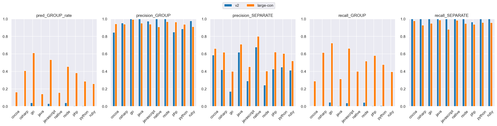
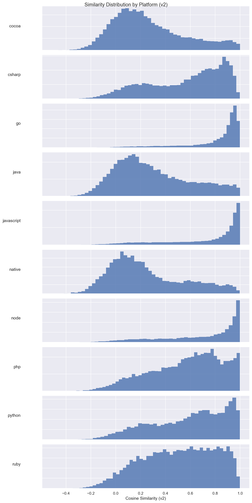
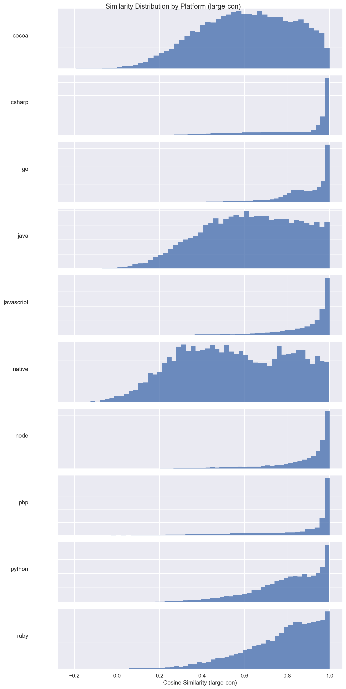
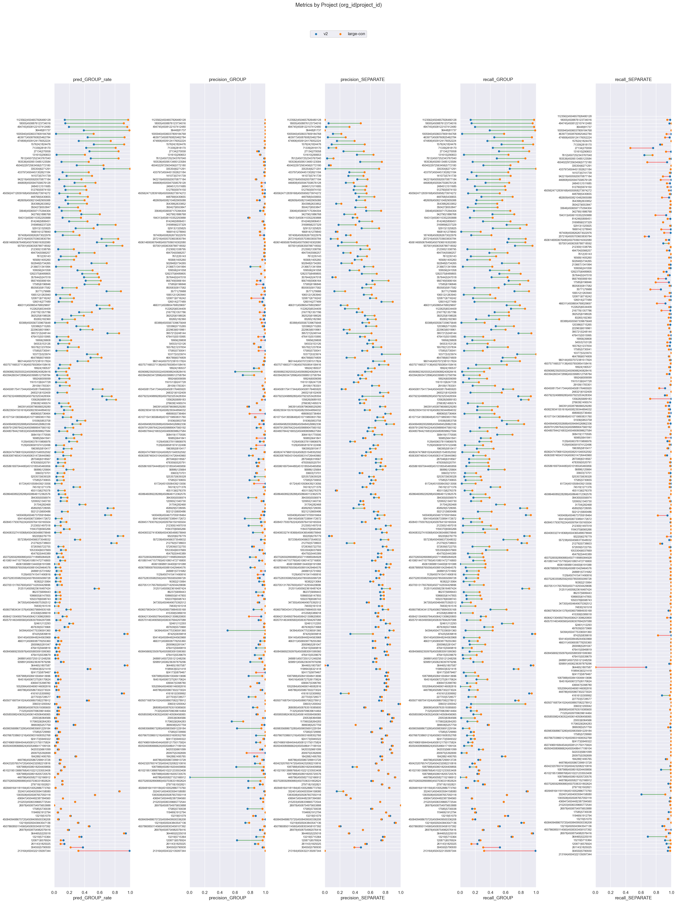

# v2 (dim=64) vs large-con (dim=64), dataset: test_full2

Command to repro:

```bash
python eval/compare.py \
    --name_model1 v2 \
    --name_model2 large-con \
    --gcs_model1 gs://grouping-data/runs/issue_grouping_v2/similarities/test_full2 \
    --gcs_model2 gs://grouping-data/runs/2026-04-07-11-56-28-large-con/similarities/test_full2 \
    --threshold_model1 0.99 \
    --threshold_model2 0.90 \
    --dim_model1 64 \
    --dim_model2 64 \
    --overwrite
```

### Column definitions

- **model**: The name of the model being evaluated.
- **pred_GROUP_rate**: The fraction of pairs this model groups together—lower means more separate issues are created. It's smaller than prod b/c the test dataset contains far more borderline cases; it's missing pairs that are very close.  This bias also means precision_GROUP is lower than what it'd be in prod.
- **precision_GROUP**: When the model groups a pair, how often is it correct? Higher = less over-grouping.
- **precision_SEPARATE**: When the model separates a pair, how often is it correct?
- **recall_GROUP**: Of all pairs that should be grouped, what fraction does the model correctly group? Higher = less under-grouping.
- **recall_SEPARATE**: Of all pairs that should be separate, what fraction does the model correctly separate?

## Aggregate results


### Overall metrics

| model     | pred_GROUP_rate | precision_GROUP | precision_SEPARATE | recall_GROUP | recall_SEPARATE |
|-----------|-----------------|-----------------|--------------------|--------------|-----------------|
| v2        | 0.02            | 0.99            | 0.38               | 0.03         | 1.0             |
| large-con | 0.41            | 0.97            | 0.62               | 0.64         | 0.97            |

### Project-averaged metrics (210 projects)

| model     | pred_GROUP_rate | precision_GROUP | precision_SEPARATE | recall_GROUP | recall_SEPARATE |
|-----------|-----------------|-----------------|--------------------|--------------|-----------------|
| v2        | 0.02            | 0.96            | 0.47               | 0.02         | 1.0             |
| large-con | 0.32            | 0.95            | 0.62               | 0.49         | 0.96            |

### Conditional probabilities

P(large-con GROUP | v2 GROUP)    = 0.9930

P(large-con GROUP | v2 SEPARATE) = 0.3977

P(large-con GROUP | v2 GROUP, distance < 0.005) = 0.9992  (n=1270)

### Thresholds

```json
{
  "v2": 0.99,
  "large-con": 0.9
}
```

### Distance distribution

| statistic  | value    |
|------------|----------|
| count      | 235298.0 |
| null_count | 0.0      |
| mean       | 0.040396 |
| std        | 0.030303 |
| min        | 0.000514 |
| 25%        | 0.015989 |
| 50%        | 0.033667 |
| 75%        | 0.060711 |
| max        | 0.245969 |

GROUP rate: 62.56%

### Platform stats

| platform   | n_pairs | n_projects | label_GROUP_rate | proportion |
|------------|---------|------------|------------------|------------|
| cocoa      | 35279   | 66         | 0.36             | 0.15       |
| csharp     | 25468   | 27         | 0.66             | 0.11       |
| go         | 23302   | 14         | 0.91             | 0.1        |
| java       | 25776   | 70         | 0.37             | 0.11       |
| javascript | 62545   | 82         | 0.78             | 0.27       |
| native     | 8834    | 49         | 0.27             | 0.04       |
| node       | 11573   | 20         | 0.82             | 0.05       |
| php        | 12019   | 14         | 0.72             | 0.05       |
| python     | 17559   | 15         | 0.54             | 0.07       |
| ruby       | 12943   | 15         | 0.61             | 0.06       |

### Short stacktraces (query_tokens <= p10 = 34 tokens, 24059 pairs)

label GROUP rate: 81.67%
| model     | pred_GROUP_rate | precision_GROUP | precision_SEPARATE | recall_GROUP | recall_SEPARATE |
|-----------|-----------------|-----------------|--------------------|--------------|-----------------|
| v2        | 0.01            | 0.99            | 0.18               | 0.01         | 1.0             |
| large-con | 0.45            | 0.98            | 0.31               | 0.54         | 0.94            |

### Long stacktraces (query_tokens >= p90 = 931 tokens, 23577 pairs)

label GROUP rate: 70.76%
| model     | pred_GROUP_rate | precision_GROUP | precision_SEPARATE | recall_GROUP | recall_SEPARATE |
|-----------|-----------------|-----------------|--------------------|--------------|-----------------|
| v2        | 0.01            | 1.0             | 0.29               | 0.01         | 1.0             |
| large-con | 0.52            | 0.98            | 0.58               | 0.72         | 0.97            |

## Threshold sweep


### Threshold sweep for large-con

| threshold | pred_GROUP_rate | precision_GROUP | precision_SEPARATE | recall_GROUP | recall_SEPARATE |
|-----------|-----------------|-----------------|--------------------|--------------|-----------------|
| 0.8       | 0.57            | 0.91            | 0.76               | 0.84         | 0.87            |
| 0.85      | 0.5             | 0.95            | 0.69               | 0.75         | 0.93            |
| 0.87      | 0.46            | 0.96            | 0.66               | 0.71         | 0.95            |
| 0.9       | 0.41            | 0.97            | 0.62               | 0.64         | 0.97            |

## Platform-level results


### Metrics by platform, avg over projects (v2, threshold=0.99)

| platform   | n_pairs | n_projects | label_GROUP_rate | min_threshold | pred_GROUP_rate | precision_GROUP | precision_SEPARATE | recall_GROUP | recall_SEPARATE |
|------------|---------|------------|------------------|---------------|-----------------|-----------------|--------------------|--------------|-----------------|
| cocoa      | 35279   | 66         | 0.365            | 0.99          | 0.002           | 0.846           | 0.586              | 0.004        | 1.0             |
| csharp     | 25468   | 27         | 0.662            | 0.99          | 0.003           | 0.952           | 0.419              | 0.005        | 1.0             |
| go         | 23302   | 14         | 0.91             | 0.99          | 0.042           | 1.0             | 0.171              | 0.046        | 1.0             |
| java       | 25776   | 70         | 0.368            | 0.99          | 0.003           | 1.0             | 0.62               | 0.007        | 1.0             |
| javascript | 62545   | 82         | 0.781            | 0.99          | 0.031           | 0.973           | 0.291              | 0.04         | 0.998           |
| native     | 8834    | 49         | 0.272            | 0.99          | 0.001           | 1.0             | 0.677              | 0.002        | 1.0             |
| node       | 11573   | 20         | 0.825            | 0.99          | 0.04            | 1.0             | 0.243              | 0.045        | 1.0             |
| php        | 12019   | 14         | 0.722            | 0.99          | 0.007           | 0.85            | 0.426              | 0.006        | 0.964           |
| python     | 17559   | 15         | 0.535            | 0.99          | 0.006           | 0.887           | 0.449              | 0.009        | 0.998           |
| ruby       | 12943   | 15         | 0.61             | 0.99          | 0.001           | 0.978           | 0.413              | 0.004        | 1.0             |

### Metrics by platform, avg over projects (large-con, threshold=0.9)

| platform   | n_pairs | n_projects | label_GROUP_rate | min_threshold | pred_GROUP_rate | precision_GROUP | precision_SEPARATE | recall_GROUP | recall_SEPARATE |
|------------|---------|------------|------------------|---------------|-----------------|-----------------|--------------------|--------------|-----------------|
| cocoa      | 35279   | 66         | 0.365            | 0.9           | 0.163           | 0.944           | 0.661              | 0.29         | 0.977           |
| csharp     | 25468   | 27         | 0.662            | 0.9           | 0.408           | 0.939           | 0.618              | 0.615        | 0.927           |
| go         | 23302   | 14         | 0.91             | 0.9           | 0.61            | 0.993           | 0.4                | 0.723        | 0.95            |
| java       | 25776   | 70         | 0.368            | 0.9           | 0.141           | 0.951           | 0.71               | 0.313        | 0.987           |
| javascript | 62545   | 82         | 0.781            | 0.9           | 0.534           | 0.939           | 0.453              | 0.662        | 0.88            |
| native     | 8834    | 49         | 0.272            | 0.9           | 0.158           | 0.908           | 0.801              | 0.399        | 0.983           |
| node       | 11573   | 20         | 0.825            | 0.9           | 0.456           | 0.968           | 0.404              | 0.517        | 0.946           |
| php        | 12019   | 14         | 0.722            | 0.9           | 0.382           | 0.964           | 0.622              | 0.58         | 0.937           |
| python     | 17559   | 15         | 0.535            | 0.9           | 0.288           | 0.938           | 0.604              | 0.478        | 0.959           |
| ruby       | 12943   | 15         | 0.61             | 0.9           | 0.259           | 0.912           | 0.519              | 0.396        | 0.957           |

### Min threshold for >= 95% avg project precision_GROUP by platform (v2)

| platform   | n_pairs | n_projects | label_GROUP_rate | min_threshold | pred_GROUP_rate | precision_GROUP | precision_SEPARATE | recall_GROUP | recall_SEPARATE |
|------------|---------|------------|------------------|---------------|-----------------|-----------------|--------------------|--------------|-----------------|
| cocoa      | 35279   | 66         | 0.365            | null          | null            | null            | null               | null         | null            |
| csharp     | 25468   | 27         | 0.662            | 0.94          | 0.044           | 0.947           | 0.351              | 0.063        | 0.993           |
| go         | 23302   | 14         | 0.91             | 0.59          | 0.863           | 0.976           | 0.509              | 0.926        | 0.772           |
| java       | 25776   | 70         | 0.368            | 0.86          | 0.058           | 0.934           | 0.667              | 0.148        | 0.994           |
| javascript | 62545   | 82         | 0.781            | 0.96          | 0.266           | 0.99            | 0.295              | 0.337        | 0.987           |
| native     | 8834    | 49         | 0.272            | 0.99          | 0.0             | 1.0             | 0.728              | 0.001        | 1.0             |
| node       | 11573   | 20         | 0.825            | 0.95          | 0.258           | 0.998           | 0.236              | 0.312        | 0.997           |
| php        | 12019   | 14         | 0.722            | null          | null            | null            | null               | null         | null            |
| python     | 17559   | 15         | 0.535            | 0.9           | 0.167           | 0.943           | 0.547              | 0.295        | 0.98            |
| ruby       | 12943   | 15         | 0.61             | 0.94          | 0.036           | 0.95            | 0.402              | 0.055        | 0.995           |

### Min threshold for >= 95% avg project precision_GROUP by platform (large-con)

| platform   | n_pairs | n_projects | label_GROUP_rate | min_threshold | pred_GROUP_rate | precision_GROUP | precision_SEPARATE | recall_GROUP | recall_SEPARATE |
|------------|---------|------------|------------------|---------------|-----------------|-----------------|--------------------|--------------|-----------------|
| cocoa      | 35279   | 66         | 0.365            | 0.92          | 0.071           | 0.969           | 0.682              | 0.188        | 0.997           |
| csharp     | 25468   | 27         | 0.662            | 0.92          | 0.534           | 0.982           | 0.704              | 0.792        | 0.972           |
| go         | 23302   | 14         | 0.91             | 0.78          | 0.859           | 0.981           | 0.525              | 0.926        | 0.821           |
| java       | 25776   | 70         | 0.368            | 0.9           | 0.126           | 0.932           | 0.713              | 0.319        | 0.986           |
| javascript | 62545   | 82         | 0.781            | 0.95          | 0.473           | 0.995           | 0.411              | 0.603        | 0.988           |
| native     | 8834    | 49         | 0.272            | 0.97          | 0.027           | 1.0             | 0.748              | 0.099        | 1.0             |
| node       | 11573   | 20         | 0.825            | 0.86          | 0.684           | 0.978           | 0.507              | 0.811        | 0.913           |
| php        | 12019   | 14         | 0.722            | 0.89          | 0.603           | 0.987           | 0.681              | 0.825        | 0.971           |
| python     | 17559   | 15         | 0.535            | 0.92          | 0.278           | 0.957           | 0.627              | 0.497        | 0.974           |
| ruby       | 12943   | 15         | 0.61             | 0.94          | 0.171           | 0.965           | 0.463              | 0.27         | 0.985           |

<details>
<summary>Metrics by platform</summary>


</details>


<details>
<summary>Similarity distribution (v2)</summary>


</details>


<details>
<summary>Similarity distribution (large-con)</summary>


</details>


## Project-level results


<details>
<summary>Dumbbell by project</summary>


</details>


### >= 15% group rate increase (stratified by platform)

| org_id           | project_id       | platform   | n_pairs | label_GROUP_rate | v2_GROUP_rate | v2_prec | v2_rec | large-con_GROUP_rate | large-con_prec | large-con_rec | group_rate_increase |
|------------------|------------------|------------|---------|------------------|---------------|---------|--------|----------------------|----------------|---------------|---------------------|
| 335354           | 6271291          | csharp     | 5539    | 1.0              | 0.0           | NaN     | 0.0    | 1.0                  | 1.0            | 1.0           | 1.0                 |
| 36448            | 81737            | go         | 1248    | 1.0              | 0.0           | 1.0     | 0.0    | 0.99                 | 1.0            | 0.99          | 0.99                |
| 1123562          | 4504657826480128 | javascript | 36      | 1.0              | 0.0           | NaN     | 0.0    | 0.97                 | 1.0            | 0.97          | 0.97                |
| 364465           | 1807587          | csharp     | 686     | 1.0              | 0.0           | NaN     | 0.0    | 0.96                 | 1.0            | 0.96          | 0.96                |
| 494745           | 4508122107412480 | csharp     | 2923    | 0.99             | 0.0           | NaN     | 0.0    | 0.96                 | 1.0            | 0.97          | 0.96                |
| 463977           | 4508760825462784 | javascript | 4758    | 0.98             | 0.0           | 1.0     | 0.0    | 0.92                 | 1.0            | 0.94          | 0.92                |
| 18005            | 4508876123734016 | php        | 5687    | 0.96             | 0.01          | 0.99    | 0.01   | 0.92                 | 1.0            | 0.95          | 0.9                 |
| 937001           | 4506358788718592 | go         | 1358    | 0.94             | 0.0           | 1.0     | 0.0    | 0.89                 | 1.0            | 0.95          | 0.89                |
| 157624           | 1824476          | node       | 1494    | 0.96             | 0.05          | 1.0     | 0.05   | 0.92                 | 1.0            | 0.96          | 0.87                |
| 332401           | 4504003594158080 | go         | 1633    | 0.96             | 0.01          | 1.0     | 0.01   | 0.86                 | 1.0            | 0.89          | 0.85                |
| 71339            | 2818170          | javascript | 3647    | 0.97             | 0.01          | 1.0     | 0.01   | 0.81                 | 0.99           | 0.83          | 0.8                 |
| 474806           | 4509124176052224 | node       | 1083    | 0.89             | 0.0           | 1.0     | 0.0    | 0.74                 | 0.99           | 0.82          | 0.74                |
| 135626           | 5689183          | node       | 629     | 0.86             | 0.09          | 1.0     | 0.11   | 0.81                 | 0.95           | 0.9           | 0.72                |
| 10377            | 5323974          | java       | 7       | 0.57             | 0.0           | NaN     | 0.0    | 0.57                 | 1.0            | 1.0           | 0.57                |
| 956749           | 5906164          | python     | 960     | 0.61             | 0.05          | 0.98    | 0.08   | 0.61                 | 0.89           | 0.9           | 0.56                |
| 1005940          | 4506037809184768 | php        | 289     | 0.9              | 0.0           | NaN     | 0.0    | 0.52                 | 1.0            | 0.58          | 0.52                |
| 141073           | 5741739          | python     | 2380    | 0.74             | 0.0           | 1.0     | 0.0    | 0.5                  | 0.99           | 0.66          | 0.49                |
| 1198943          | 6321418          | native     | 467     | 0.61             | 0.01          | 1.0     | 0.02   | 0.48                 | 0.99           | 0.77          | 0.46                |
| 183536           | 4509513485123584 | php        | 95      | 0.58             | 0.0           | NaN     | 0.0    | 0.45                 | 0.98           | 0.76          | 0.45                |
| 433797           | 4504451302621184 | ruby       | 2078    | 0.71             | 0.0           | 0.89    | 0.01   | 0.45                 | 0.99           | 0.63          | 0.45                |
| 512760           | 5974150          | java       | 458     | 0.68             | 0.0           | 1.0     | 0.01   | 0.42                 | 0.96           | 0.6           | 0.42                |
| 248451           | 1511685          | python     | 1990    | 0.65             | 0.01          | 1.0     | 0.01   | 0.41                 | 0.95           | 0.59          | 0.4                 |
| 942219           | 4505920070877184 | ruby       | 1909    | 0.59             | 0.0           | 1.0     | 0.0    | 0.36                 | 0.87           | 0.52          | 0.36                |
| 194313           | 4506110352293888 | cocoa      | 202     | 0.65             | 0.0           | NaN     | 0.0    | 0.35                 | 0.79           | 0.43          | 0.35                |
| 4505071687041024 | 4508807082278912 | java       | 416     | 0.59             | 0.11          | 1.0     | 0.19   | 0.46                 | 1.0            | 0.77          | 0.34                |
| 4505624712839168 | 4505958273974272 | ruby       | 1831    | 0.62             | 0.0           | 1.0     | 0.0    | 0.34                 | 0.96           | 0.52          | 0.34                |
| 1129             | 4506378119806976 | cocoa      | 1494    | 0.72             | 0.0           | 1.0     | 0.0    | 0.3                  | 0.98           | 0.41          | 0.3                 |
| 196395           | 5810417          | cocoa      | 418     | 0.46             | 0.0           | 0.5     | 0.01   | 0.23                 | 0.88           | 0.44          | 0.22                |
| 18924            | 180537           | native     | 1739    | 0.46             | 0.0           | NaN     | 0.0    | 0.19                 | 0.91           | 0.39          | 0.19                |
| 346391           | 4508796066529280 | native     | 338     | 0.32             | 0.02          | 1.0     | 0.06   | 0.21                 | 0.76           | 0.5           | 0.19                |
