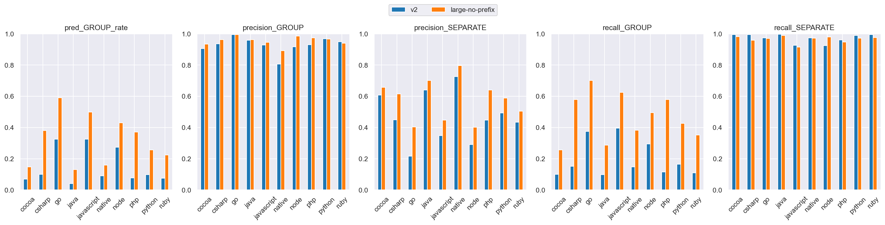
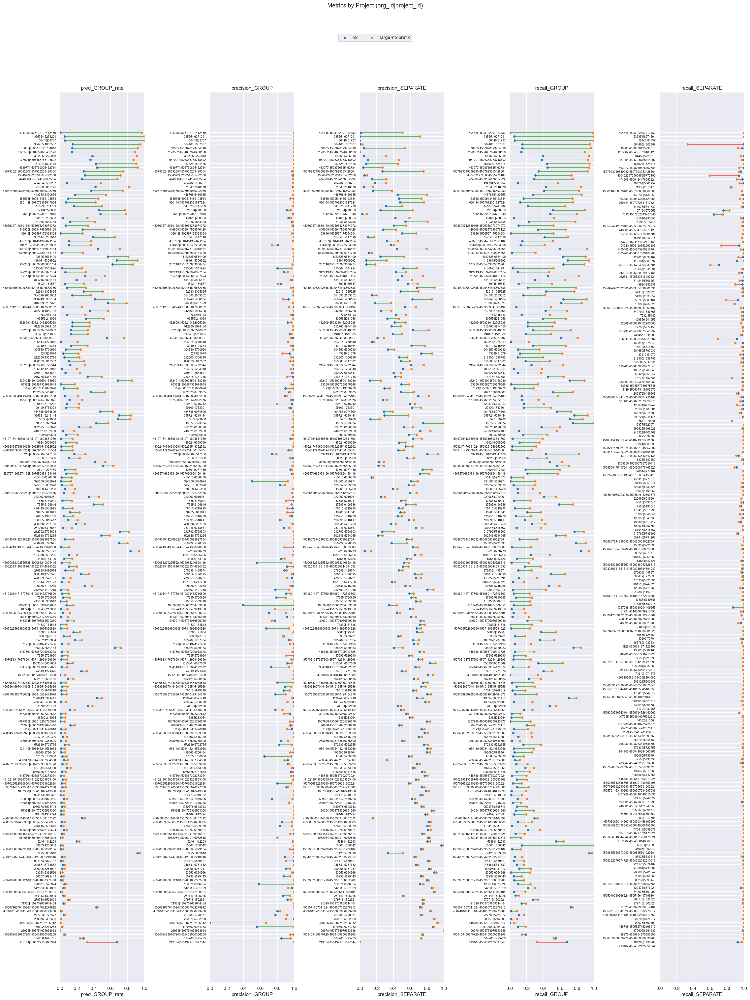

# v2 (dim=64) vs large-no-prefix (dim=64), dataset: test_full2

Command to repro:

```bash
python eval/compare.py \
    --name_model1 v2 \
    --name_model2 large-no-prefix \
    --gcs_model1 gs://grouping-data/runs/issue_grouping_v2/similarities/test_full2 \
    --gcs_model2 gs://grouping-data/runs/2026-04-10-12-39-45-large-no-prefix/similarities/test_full2 \
    --threshold_model1 0.92 \
    --threshold_model2 0.92 \
    --dim_model1 64 \
    --dim_model2 64
```

### Column definitions

- **model**: The name of the model being evaluated.
- **pred_GROUP_rate**: The fraction of pairs this model groups together—lower means more separate issues are created. It's smaller than prod b/c the test dataset contains far more borderline cases; it's missing pairs that are very close.  This bias also means precision_GROUP is lower than what it'd be in prod.
- **precision_GROUP**: When the model groups a pair, how often is it correct? Higher = less over-grouping.
- **precision_SEPARATE**: When the model separates a pair, how often is it correct?
- **recall_GROUP**: Of all pairs that should be grouped, what fraction does the model correctly group? Higher = less under-grouping.
- **recall_SEPARATE**: Of all pairs that should be separate, what fraction does the model correctly separate?

## Aggregate results


### Overall metrics

| model           | pred_GROUP_rate | precision_GROUP | precision_SEPARATE | recall_GROUP | recall_SEPARATE |
|-----------------|-----------------|-----------------|--------------------|--------------|-----------------|
| v2              | 0.21            | 0.98            | 0.47               | 0.33         | 0.99            |
| large-no-prefix | 0.4             | 0.98            | 0.61               | 0.62         | 0.98            |

### Project-averaged metrics (210 projects)

| model           | pred_GROUP_rate | precision_GROUP | precision_SEPARATE | recall_GROUP | recall_SEPARATE |
|-----------------|-----------------|-----------------|--------------------|--------------|-----------------|
| v2              | 0.15            | 0.94            | 0.52               | 0.21         | 0.98            |
| large-no-prefix | 0.3             | 0.96            | 0.61               | 0.46         | 0.97            |

### Conditional probabilities

P(large-no-prefix GROUP | v2 GROUP)    = 0.8725

P(large-no-prefix GROUP | v2 SEPARATE) = 0.2709

P(large-no-prefix GROUP | v2 GROUP, distance < 0.005) = 0.9899  (n=9362)

### Thresholds

```json
{
  "v2": 0.92,
  "large-no-prefix": 0.92
}
```

### Distance distribution

| statistic  | value    |
|------------|----------|
| count      | 235298.0 |
| null_count | 0.0      |
| mean       | 0.040396 |
| std        | 0.030303 |
| min        | 0.000514 |
| 25%        | 0.015989 |
| 50%        | 0.033667 |
| 75%        | 0.060711 |
| max        | 0.245969 |

GROUP rate: 62.56%

### Platform stats

| platform   | n_pairs | n_projects | label_GROUP_rate | proportion |
|------------|---------|------------|------------------|------------|
| cocoa      | 35279   | 66         | 0.36             | 0.15       |
| csharp     | 25468   | 27         | 0.66             | 0.11       |
| go         | 23302   | 14         | 0.91             | 0.1        |
| java       | 25776   | 70         | 0.37             | 0.11       |
| javascript | 62545   | 82         | 0.78             | 0.27       |
| native     | 8834    | 49         | 0.27             | 0.04       |
| node       | 11573   | 20         | 0.82             | 0.05       |
| php        | 12019   | 14         | 0.72             | 0.05       |
| python     | 17559   | 15         | 0.54             | 0.07       |
| ruby       | 12943   | 15         | 0.61             | 0.06       |

### Short stacktraces (query_tokens <= p10 = 34 tokens, 24059 pairs)

label GROUP rate: 81.67%
| model           | pred_GROUP_rate | precision_GROUP | precision_SEPARATE | recall_GROUP | recall_SEPARATE |
|-----------------|-----------------|-----------------|--------------------|--------------|-----------------|
| v2              | 0.43            | 0.98            | 0.31               | 0.52         | 0.96            |
| large-no-prefix | 0.45            | 0.99            | 0.32               | 0.55         | 0.97            |

### Long stacktraces (query_tokens >= p90 = 931 tokens, 23577 pairs)

label GROUP rate: 70.76%
| model           | pred_GROUP_rate | precision_GROUP | precision_SEPARATE | recall_GROUP | recall_SEPARATE |
|-----------------|-----------------|-----------------|--------------------|--------------|-----------------|
| v2              | 0.23            | 0.99            | 0.38               | 0.33         | 0.99            |
| large-no-prefix | 0.52            | 0.99            | 0.59               | 0.72         | 0.97            |

## Threshold sweep


### Threshold sweep for large-no-prefix

| threshold | pred_GROUP_rate | precision_GROUP | precision_SEPARATE | recall_GROUP | recall_SEPARATE |
|-----------|-----------------|-----------------|--------------------|--------------|-----------------|
| 0.8       | 0.59            | 0.91            | 0.78               | 0.86         | 0.86            |
| 0.85      | 0.52            | 0.94            | 0.72               | 0.79         | 0.92            |
| 0.87      | 0.49            | 0.96            | 0.69               | 0.75         | 0.94            |
| 0.9       | 0.44            | 0.97            | 0.64               | 0.68         | 0.97            |

## Platform-level results


### Metrics by platform, avg over projects (v2, threshold=0.92)

| platform   | n_pairs | n_projects | label_GROUP_rate | min_threshold | pred_GROUP_rate | precision_GROUP | precision_SEPARATE | recall_GROUP | recall_SEPARATE |
|------------|---------|------------|------------------|---------------|-----------------|-----------------|--------------------|--------------|-----------------|
| cocoa      | 35279   | 66         | 0.365            | 0.92          | 0.07            | 0.906           | 0.607              | 0.101        | 0.994           |
| csharp     | 25468   | 27         | 0.662            | 0.92          | 0.1             | 0.935           | 0.45               | 0.151        | 0.996           |
| go         | 23302   | 14         | 0.91             | 0.92          | 0.325           | 0.995           | 0.216              | 0.375        | 0.974           |
| java       | 25776   | 70         | 0.368            | 0.92          | 0.042           | 0.958           | 0.641              | 0.097        | 0.997           |
| javascript | 62545   | 82         | 0.781            | 0.92          | 0.325           | 0.927           | 0.348              | 0.396        | 0.925           |
| native     | 8834    | 49         | 0.272            | 0.92          | 0.091           | 0.807           | 0.726              | 0.148        | 0.974           |
| node       | 11573   | 20         | 0.825            | 0.92          | 0.273           | 0.917           | 0.291              | 0.294        | 0.923           |
| php        | 12019   | 14         | 0.722            | 0.92          | 0.077           | 0.931           | 0.447              | 0.115        | 0.961           |
| python     | 17559   | 15         | 0.535            | 0.92          | 0.099           | 0.968           | 0.492              | 0.164        | 0.989           |
| ruby       | 12943   | 15         | 0.61             | 0.92          | 0.076           | 0.948           | 0.434              | 0.109        | 0.995           |

### Metrics by platform, avg over projects (large-no-prefix, threshold=0.92)

| platform   | n_pairs | n_projects | label_GROUP_rate | min_threshold | pred_GROUP_rate | precision_GROUP | precision_SEPARATE | recall_GROUP | recall_SEPARATE |
|------------|---------|------------|------------------|---------------|-----------------|-----------------|--------------------|--------------|-----------------|
| cocoa      | 35279   | 66         | 0.365            | 0.92          | 0.148           | 0.934           | 0.658              | 0.257        | 0.981           |
| csharp     | 25468   | 27         | 0.662            | 0.92          | 0.381           | 0.962           | 0.615              | 0.579        | 0.958           |
| go         | 23302   | 14         | 0.91             | 0.92          | 0.59            | 0.995           | 0.404              | 0.7          | 0.971           |
| java       | 25776   | 70         | 0.368            | 0.92          | 0.131           | 0.962           | 0.702              | 0.286        | 0.99            |
| javascript | 62545   | 82         | 0.781            | 0.92          | 0.499           | 0.944           | 0.447              | 0.624        | 0.915           |
| native     | 8834    | 49         | 0.272            | 0.92          | 0.159           | 0.892           | 0.796              | 0.383        | 0.972           |
| node       | 11573   | 20         | 0.825            | 0.92          | 0.43            | 0.986           | 0.402              | 0.494        | 0.98            |
| php        | 12019   | 14         | 0.722            | 0.92          | 0.372           | 0.973           | 0.641              | 0.579        | 0.948           |
| python     | 17559   | 15         | 0.535            | 0.92          | 0.256           | 0.966           | 0.589              | 0.426        | 0.972           |
| ruby       | 12943   | 15         | 0.61             | 0.92          | 0.225           | 0.939           | 0.505              | 0.353        | 0.975           |

### Min threshold for >= 95% avg project precision_GROUP by platform (v2)

| platform   | n_pairs | n_projects | label_GROUP_rate | min_threshold | pred_GROUP_rate | precision_GROUP | precision_SEPARATE | recall_GROUP | recall_SEPARATE |
|------------|---------|------------|------------------|---------------|-----------------|-----------------|--------------------|--------------|-----------------|
| cocoa      | 35279   | 66         | 0.365            | null          | null            | null            | null               | null         | null            |
| csharp     | 25468   | 27         | 0.662            | 0.94          | 0.067           | 0.955           | 0.437              | 0.101        | 0.997           |
| go         | 23302   | 14         | 0.91             | 0.59          | 0.719           | 0.95            | 0.406              | 0.819        | 0.671           |
| java       | 25776   | 70         | 0.368            | 0.86          | 0.07            | 0.951           | 0.653              | 0.159        | 0.994           |
| javascript | 62545   | 82         | 0.781            | 0.96          | 0.191           | 0.962           | 0.316              | 0.237        | 0.967           |
| native     | 8834    | 49         | 0.272            | 0.99          | 0.001           | 1.0             | 0.677              | 0.002        | 1.0             |
| node       | 11573   | 20         | 0.825            | 0.95          | 0.193           | 0.999           | 0.278              | 0.21         | 0.994           |
| php        | 12019   | 14         | 0.722            | null          | null            | null            | null               | null         | null            |
| python     | 17559   | 15         | 0.535            | 0.9           | 0.126           | 0.959           | 0.505              | 0.208        | 0.983           |
| ruby       | 12943   | 15         | 0.61             | 0.94          | 0.051           | 0.953           | 0.426              | 0.074        | 0.998           |

### Min threshold for >= 95% avg project precision_GROUP by platform (large-no-prefix)

| platform   | n_pairs | n_projects | label_GROUP_rate | min_threshold | pred_GROUP_rate | precision_GROUP | precision_SEPARATE | recall_GROUP | recall_SEPARATE |
|------------|---------|------------|------------------|---------------|-----------------|-----------------|--------------------|--------------|-----------------|
| cocoa      | 35279   | 66         | 0.365            | 0.94          | 0.12            | 0.955           | 0.643              | 0.202        | 0.985           |
| csharp     | 25468   | 27         | 0.662            | 0.91          | 0.397           | 0.955           | 0.627              | 0.604        | 0.955           |
| go         | 23302   | 14         | 0.91             | 0.77          | 0.788           | 0.95            | 0.555              | 0.903        | 0.709           |
| java       | 25776   | 70         | 0.368            | 0.9           | 0.153           | 0.951           | 0.716              | 0.335        | 0.985           |
| javascript | 62545   | 82         | 0.781            | 0.93          | 0.465           | 0.951           | 0.426              | 0.58         | 0.933           |
| native     | 8834    | 49         | 0.272            | 0.95          | 0.131           | 0.959           | 0.785              | 0.32         | 0.994           |
| node       | 11573   | 20         | 0.825            | 0.87          | 0.624           | 0.967           | 0.512              | 0.698        | 0.931           |
| php        | 12019   | 14         | 0.722            | 0.9           | 0.408           | 0.959           | 0.673              | 0.641        | 0.931           |
| python     | 17559   | 15         | 0.535            | 0.9           | 0.305           | 0.952           | 0.622              | 0.501        | 0.955           |
| ruby       | 12943   | 15         | 0.61             | 0.95          | 0.155           | 0.956           | 0.473              | 0.247        | 0.993           |

<details>
<summary>Metrics by platform</summary>


</details>


<details>
<summary>Similarity distribution (v2)</summary>


</details>


<details>
<summary>Similarity distribution (large-no-prefix)</summary>


</details>


## Project-level results

**Project win rate for large-no-prefix**: 82/210 (39%) projects where both precision_GROUP and recall_GROUP are higher


<details>
<summary>Dumbbell by project</summary>


</details>


### >= 15% group rate increase (stratified by platform)

| org_id           | project_id       | platform   | n_pairs | label_GROUP_rate | v2_GROUP_rate | v2_prec | v2_rec | large-no-prefix_GROUP_rate | large-no-prefix_prec | large-no-prefix_rec | group_rate_increase |
|------------------|------------------|------------|---------|------------------|---------------|---------|--------|----------------------------|----------------------|---------------------|---------------------|
| 494745           | 4508122107412480 | csharp     | 2923    | 0.99             | 0.0           | 1.0     | 0.0    | 0.97                       | 1.0                  | 0.99                | 0.97                |
| 335354           | 6271291          | csharp     | 5539    | 1.0              | 0.05          | 1.0     | 0.05   | 1.0                        | 1.0                  | 1.0                 | 0.94                |
| 36448            | 81737            | go         | 1248    | 1.0              | 0.06          | 1.0     | 0.06   | 1.0                        | 1.0                  | 1.0                 | 0.94                |
| 364465           | 1807587          | csharp     | 686     | 1.0              | 0.15          | 1.0     | 0.15   | 0.95                       | 1.0                  | 0.95                | 0.8                 |
| 18005            | 4508876123734016 | php        | 5687    | 0.96             | 0.15          | 1.0     | 0.15   | 0.93                       | 1.0                  | 0.96                | 0.78                |
| 1123562          | 4504657826480128 | javascript | 36      | 1.0              | 0.14          | 1.0     | 0.14   | 0.89                       | 1.0                  | 0.89                | 0.75                |
| 364465           | 5225018          | csharp     | 1034    | 0.97             | 0.38          | 1.0     | 0.4    | 0.91                       | 1.0                  | 0.94                | 0.53                |
| 937001           | 4506358788718592 | go         | 1358    | 0.94             | 0.36          | 1.0     | 0.38   | 0.87                       | 1.0                  | 0.93                | 0.51                |
| 157624           | 1824476          | node       | 1494    | 0.96             | 0.42          | 1.0     | 0.44   | 0.91                       | 1.0                  | 0.95                | 0.48                |
| 463977           | 4508760825462784 | javascript | 4758    | 0.98             | 0.44          | 1.0     | 0.45   | 0.92                       | 1.0                  | 0.94                | 0.48                |
| 4507923249889280 | 4507923253428304 | go         | 1837    | 0.8              | 0.28          | 0.98    | 0.34   | 0.75                       | 0.98                 | 0.92                | 0.47                |
| 4504022972563456 | 5772180          | javascript | 1743    | 0.96             | 0.29          | 0.99    | 0.3    | 0.72                       | 0.98                 | 0.73                | 0.42                |
| 474806           | 4509124176052224 | node       | 1083    | 0.89             | 0.26          | 0.99    | 0.29   | 0.68                       | 0.99                 | 0.75                | 0.42                |
| 494704           | 5566257          | go         | 2481    | 0.83             | 0.08          | 0.99    | 0.1    | 0.48                       | 0.98                 | 0.57                | 0.41                |
| 448768           | 5430655          | php        | 1634    | 0.63             | 0.18          | 1.0     | 0.28   | 0.54                       | 0.99                 | 0.85                | 0.37                |
| 183536           | 4509513485123584 | php        | 95      | 0.58             | 0.09          | 1.0     | 0.16   | 0.45                       | 0.95                 | 0.75                | 0.36                |
| 141073           | 5741739          | python     | 2380    | 0.74             | 0.16          | 0.99    | 0.22   | 0.49                       | 0.99                 | 0.66                | 0.33                |
| 4505624712839168 | 4505958273974272 | ruby       | 1831    | 0.62             | 0.07          | 0.99    | 0.11   | 0.33                       | 0.98                 | 0.52                | 0.26                |
| 433797           | 4504451302621184 | ruby       | 2078    | 0.71             | 0.11          | 0.98    | 0.15   | 0.37                       | 0.99                 | 0.51                | 0.26                |
| 194313           | 4506110352293888 | cocoa      | 202     | 0.65             | 0.1           | 0.81    | 0.13   | 0.36                       | 0.74                 | 0.41                | 0.26                |
| 1122625          | 6534409          | node       | 2825    | 0.89             | 0.57          | 1.0     | 0.63   | 0.81                       | 0.99                 | 0.9                 | 0.24                |
| 942219           | 4505920070877184 | ruby       | 1909    | 0.59             | 0.06          | 0.88    | 0.09   | 0.3                        | 0.92                 | 0.47                | 0.24                |
| 18924            | 180537           | native     | 1739    | 0.46             | 0.06          | 0.85    | 0.1    | 0.29                       | 0.8                  | 0.51                | 0.23                |
| 956749           | 5906164          | python     | 960     | 0.61             | 0.41          | 0.93    | 0.64   | 0.64                       | 0.87                 | 0.91                | 0.22                |
| 4509791299764224 | 4509889047560192 | java       | 776     | 0.49             | 0.04          | 1.0     | 0.08   | 0.26                       | 0.94                 | 0.49                | 0.22                |
| 7612             | 35143            | python     | 1372    | 0.6              | 0.09          | 0.98    | 0.14   | 0.3                        | 0.96                 | 0.48                | 0.21                |
| 512760           | 5974150          | java       | 458     | 0.68             | 0.14          | 1.0     | 0.21   | 0.35                       | 0.99                 | 0.51                | 0.2                 |
| 350427           | 6553847          | java       | 2982    | 0.62             | 0.06          | 0.98    | 0.1    | 0.24                       | 0.99                 | 0.37                | 0.17                |
| 83388            | 4505567339675648 | native     | 1130    | 0.51             | 0.01          | 1.0     | 0.02   | 0.18                       | 0.96                 | 0.33                | 0.17                |
| 1129             | 4506378119806976 | cocoa      | 1494    | 0.72             | 0.04          | 0.9     | 0.06   | 0.21                       | 0.99                 | 0.29                | 0.16                |

### >= 10% group rate decrease

| org_id | project_id       | platform | n_pairs | label_GROUP_rate | v2_GROUP_rate | v2_prec | v2_rec | large-no-prefix_GROUP_rate | large-no-prefix_prec | large-no-prefix_rec | group_rate_decrease |
|--------|------------------|----------|---------|------------------|---------------|---------|--------|----------------------------|----------------------|---------------------|---------------------|
| 213164 | 4504322135097344 | go       | 9407    | 1.0              | 0.68          | 1.0     | 0.68   | 0.32                       | 1.0                  | 0.32                | 0.35                |
