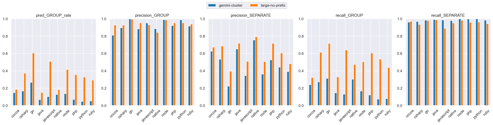
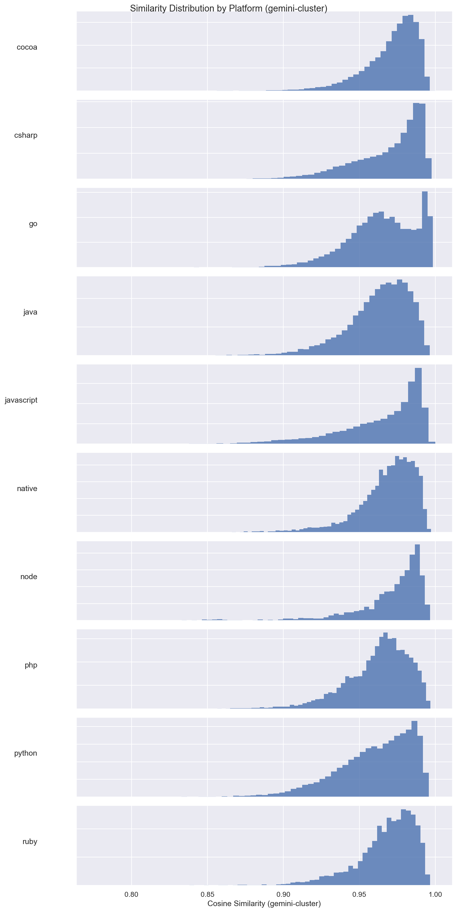
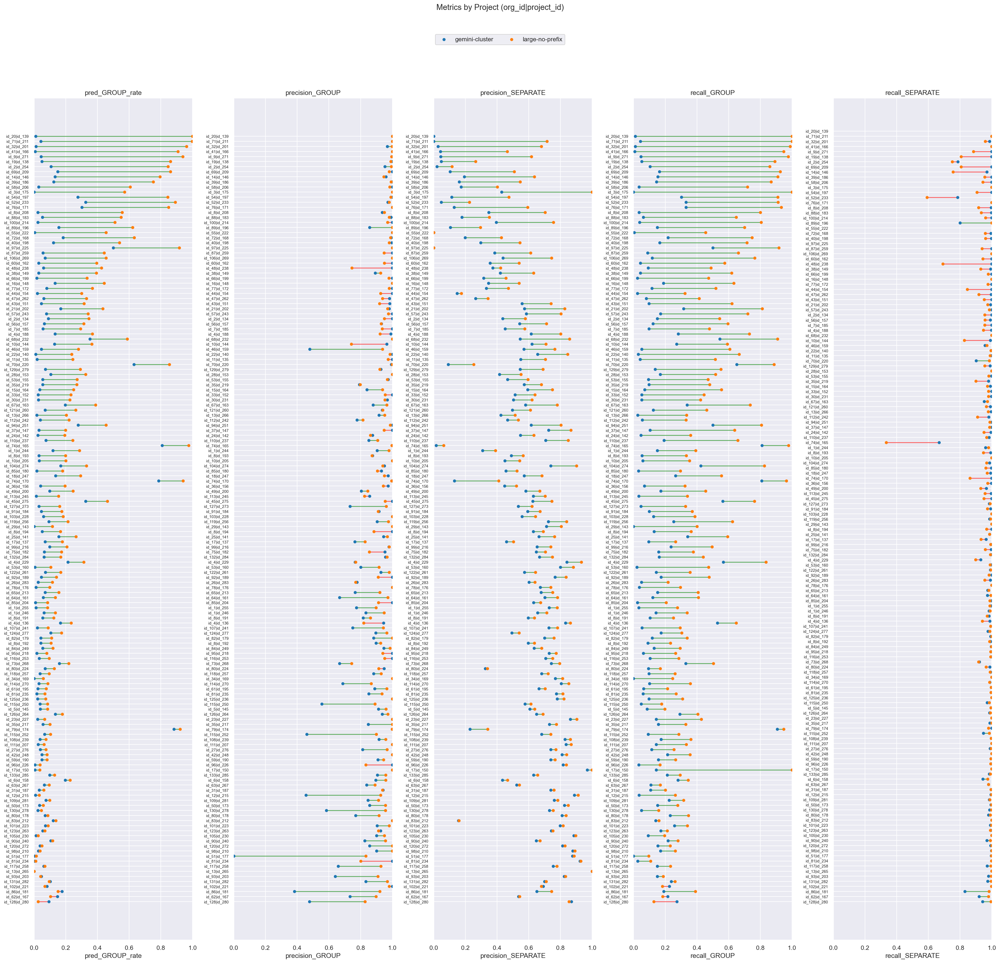

# gemini-cluster (dim=3072) vs large-no-prefix (dim=64), dataset: test_full3

Command to repro:

```bash
python -m eval.compare \
    --name_model1 gemini-cluster \
    --name_model2 large-no-prefix \
    --gcs_model1 gs://$GROUPING_TRAINER_BUCKET/runs/gemini-embedding-2/similarities/test_full3 \
    --gcs_model2 gs://$GROUPING_TRAINER_BUCKET/runs/2026-04-10-12-39-45-large-no-prefix/similarities/test_full3 \
    --threshold_model1 0.99 \
    --threshold_model2 0.90 \
    --dim_model1 3072 \
    --dim_model2 64 \
    --overwrite
```

### Column definitions

- **model**: The name of the model being evaluated.
- **pred_GROUP_rate**: The fraction of pairs this model groups together—lower means more separate issues are created. It's smaller than prod b/c the test dataset contains far more borderline cases; it's missing pairs that are very close.  This bias also means precision_GROUP is lower than what it'd be in prod.
- **precision_GROUP**: When the model groups a pair, how often is it correct? Higher = less over-grouping.
- **precision_SEPARATE**: When the model separates a pair, how often is it correct?
- **recall_GROUP**: Of all pairs that should be grouped, what fraction does the model correctly group? Higher = less under-grouping.
- **recall_SEPARATE**: Of all pairs that should be separate, what fraction does the model correctly separate?

## Aggregate results


### Overall metrics

| model           | pred_GROUP_rate | precision_GROUP | precision_SEPARATE | recall_GROUP | recall_SEPARATE |
|-----------------|-----------------|-----------------|--------------------|--------------|-----------------|
| gemini-cluster  | 0.09            | 0.93            | 0.45               | 0.15         | 0.98            |
| large-no-prefix | 0.38            | 0.97            | 0.65               | 0.62         | 0.97            |

### Project-averaged metrics (152 projects)

| model           | pred_GROUP_rate | precision_GROUP | precision_SEPARATE | recall_GROUP | recall_SEPARATE |
|-----------------|-----------------|-----------------|--------------------|--------------|-----------------|
| gemini-cluster  | 0.09            | 0.9             | 0.54               | 0.16         | 0.98            |
| large-no-prefix | 0.29            | 0.94            | 0.66               | 0.49         | 0.96            |

### Conditional probabilities

P(large-no-prefix GROUP | gemini-cluster GROUP)    = 0.8474

P(large-no-prefix GROUP | gemini-cluster SEPARATE) = 0.3305

P(large-no-prefix GROUP | gemini-cluster GROUP, distance < 0.005) = 0.9137  (n=5681)

### Thresholds

```json
{
  "gemini-cluster": 0.99,
  "large-no-prefix": 0.9
}
```

### Distance distribution

| statistic  | value    |
|------------|----------|
| count      | 150303.0 |
| null_count | 0.0      |
| mean       | 0.042189 |
| std        | 0.032109 |
| min        | 0.000514 |
| 25%        | 0.016303 |
| 50%        | 0.035027 |
| 75%        | 0.063571 |
| max        | 0.245969 |

GROUP rate: 58.75%

### Platform stats

| platform   | n_pairs | n_projects | label_GROUP_rate | proportion |
|------------|---------|------------|------------------|------------|
| cocoa      | 30321   | 58         | 0.38             | 0.2        |
| csharp     | 21936   | 21         | 0.62             | 0.15       |
| go         | 17160   | 8          | 0.95             | 0.11       |
| java       | 17043   | 58         | 0.32             | 0.11       |
| javascript | 24492   | 53         | 0.73             | 0.16       |
| native     | 6560    | 41         | 0.31             | 0.04       |
| node       | 3242    | 12         | 0.88             | 0.02       |
| php        | 9592    | 8          | 0.75             | 0.06       |
| python     | 13428   | 8          | 0.57             | 0.09       |
| ruby       | 6529    | 8          | 0.59             | 0.04       |

### Short stacktraces (query_tokens <= p10 = 32 tokens, 15296 pairs)

label GROUP rate: 83.18%
| model           | pred_GROUP_rate | precision_GROUP | precision_SEPARATE | recall_GROUP | recall_SEPARATE |
|-----------------|-----------------|-----------------|--------------------|--------------|-----------------|
| gemini-cluster  | 0.07            | 0.92            | 0.18               | 0.08         | 0.97            |
| large-no-prefix | 0.44            | 0.99            | 0.29               | 0.52         | 0.98            |

### Long stacktraces (query_tokens >= p90 = 764 tokens, 15036 pairs)

label GROUP rate: 59.37%
| model           | pred_GROUP_rate | precision_GROUP | precision_SEPARATE | recall_GROUP | recall_SEPARATE |
|-----------------|-----------------|-----------------|--------------------|--------------|-----------------|
| gemini-cluster  | 0.22            | 0.97            | 0.51               | 0.35         | 0.99            |
| large-no-prefix | 0.4             | 0.96            | 0.65               | 0.65         | 0.96            |

## Threshold sweep


### Threshold sweep for gemini-cluster

| threshold | pred_GROUP_rate | precision_GROUP | precision_SEPARATE | recall_GROUP | recall_SEPARATE |
|-----------|-----------------|-----------------|--------------------|--------------|-----------------|
| 0.8       | 1.0             | 0.59            | 1.0                | 1.0          | 0.0             |
| 0.85      | 1.0             | 0.59            | 0.83               | 1.0          | 0.0             |
| 0.87      | 1.0             | 0.59            | 0.82               | 1.0          | 0.01            |
| 0.9       | 0.98            | 0.59            | 0.7                | 0.99         | 0.03            |

### Threshold sweep for large-no-prefix

| threshold | pred_GROUP_rate | precision_GROUP | precision_SEPARATE | recall_GROUP | recall_SEPARATE |
|-----------|-----------------|-----------------|--------------------|--------------|-----------------|
| 0.8       | 0.54            | 0.9             | 0.78               | 0.83         | 0.87            |
| 0.85      | 0.47            | 0.94            | 0.72               | 0.75         | 0.93            |
| 0.87      | 0.43            | 0.95            | 0.69               | 0.7          | 0.95            |
| 0.9       | 0.38            | 0.97            | 0.65               | 0.62         | 0.97            |

## Platform-level results


### Metrics by platform, avg over projects (gemini-cluster, threshold=0.99)

| platform   | n_pairs | n_projects | label_GROUP_rate | min_threshold | pred_GROUP_rate | precision_GROUP | precision_SEPARATE | recall_GROUP | recall_SEPARATE |
|------------|---------|------------|------------------|---------------|-----------------|-----------------|--------------------|--------------|-----------------|
| cocoa      | 30321   | 58         | 0.38             | 0.99          | 0.148           | 0.81            | 0.625              | 0.239        | 0.961           |
| csharp     | 21936   | 21         | 0.617            | 0.99          | 0.167           | 0.897           | 0.533              | 0.272        | 0.969           |
| go         | 17160   | 8          | 0.953            | 0.99          | 0.267           | 0.998           | 0.223              | 0.312        | 0.983           |
| java       | 17043   | 58         | 0.322            | 0.99          | 0.067           | 0.882           | 0.651              | 0.146        | 0.991           |
| javascript | 24492   | 53         | 0.729            | 0.99          | 0.103           | 0.951           | 0.344              | 0.132        | 0.985           |
| native     | 6560    | 41         | 0.31             | 0.99          | 0.127           | 0.883           | 0.754              | 0.302        | 0.977           |
| node       | 3242    | 12         | 0.884            | 0.99          | 0.137           | 0.989           | 0.362              | 0.166        | 0.999           |
| php        | 9592    | 8          | 0.75             | 0.99          | 0.07            | 0.92            | 0.525              | 0.12         | 0.996           |
| python     | 13428   | 8          | 0.568            | 0.99          | 0.046           | 0.987           | 0.442              | 0.073        | 0.999           |
| ruby       | 6529    | 8          | 0.59             | 0.99          | 0.053           | 0.915           | 0.393              | 0.08         | 0.983           |

### Metrics by platform, avg over projects (large-no-prefix, threshold=0.9)

| platform   | n_pairs | n_projects | label_GROUP_rate | min_threshold | pred_GROUP_rate | precision_GROUP | precision_SEPARATE | recall_GROUP | recall_SEPARATE |
|------------|---------|------------|------------------|---------------|-----------------|-----------------|--------------------|--------------|-----------------|
| cocoa      | 30321   | 58         | 0.38             | 0.9           | 0.187           | 0.926           | 0.672              | 0.323        | 0.971           |
| csharp     | 21936   | 21         | 0.617            | 0.9           | 0.373           | 0.927           | 0.686              | 0.613        | 0.934           |
| go         | 17160   | 8          | 0.953            | 0.9           | 0.606           | 0.994           | 0.395              | 0.716        | 0.98            |
| java       | 17043   | 58         | 0.322            | 0.9           | 0.15            | 0.953           | 0.718              | 0.33         | 0.988           |
| javascript | 24492   | 53         | 0.729            | 0.9           | 0.509           | 0.93            | 0.508              | 0.64         | 0.891           |
| native     | 6560    | 41         | 0.31             | 0.9           | 0.182           | 0.843           | 0.793              | 0.472        | 0.951           |
| node       | 3242    | 12         | 0.884            | 0.9           | 0.416           | 0.987           | 0.507              | 0.504        | 0.982           |
| php        | 9592    | 8          | 0.75             | 0.9           | 0.356           | 0.953           | 0.716              | 0.606        | 0.958           |
| python     | 13428   | 8          | 0.568            | 0.9           | 0.33            | 0.953           | 0.607              | 0.535        | 0.962           |
| ruby       | 6529    | 8          | 0.59             | 0.9           | 0.292           | 0.938           | 0.482              | 0.439        | 0.943           |

### Min threshold for >= 95% avg project precision_GROUP by platform (gemini-cluster)

| platform   | n_pairs | n_projects | label_GROUP_rate | min_threshold | pred_GROUP_rate | precision_GROUP | precision_SEPARATE | recall_GROUP | recall_SEPARATE |
|------------|---------|------------|------------------|---------------|-----------------|-----------------|--------------------|--------------|-----------------|
| cocoa      | 30321   | 58         | 0.38             | null          | null            | null            | null               | null         | null            |
| csharp     | 21936   | 21         | 0.617            | null          | null            | null            | null               | null         | null            |
| go         | 17160   | 8          | 0.953            | 0.97          | 0.476           | 0.971           | 0.31               | 0.562        | 0.797           |
| java       | 17043   | 58         | 0.322            | null          | null            | null            | null               | null         | null            |
| javascript | 24492   | 53         | 0.729            | 0.99          | 0.103           | 0.951           | 0.344              | 0.132        | 0.985           |
| native     | 6560    | 41         | 0.31             | null          | null            | null            | null               | null         | null            |
| node       | 3242    | 12         | 0.884            | 0.99          | 0.137           | 0.989           | 0.362              | 0.166        | 0.999           |
| php        | 9592    | 8          | 0.75             | null          | null            | null            | null               | null         | null            |
| python     | 13428   | 8          | 0.568            | 0.99          | 0.046           | 0.987           | 0.442              | 0.073        | 0.999           |
| ruby       | 6529    | 8          | 0.59             | null          | null            | null            | null               | null         | null            |

### Min threshold for >= 95% avg project precision_GROUP by platform (large-no-prefix)

| platform   | n_pairs | n_projects | label_GROUP_rate | min_threshold | pred_GROUP_rate | precision_GROUP | precision_SEPARATE | recall_GROUP | recall_SEPARATE |
|------------|---------|------------|------------------|---------------|-----------------|-----------------|--------------------|--------------|-----------------|
| cocoa      | 30321   | 58         | 0.38             | 0.94          | 0.128           | 0.952           | 0.633              | 0.208        | 0.983           |
| csharp     | 21936   | 21         | 0.617            | 0.92          | 0.338           | 0.951           | 0.657              | 0.558        | 0.95            |
| go         | 17160   | 8          | 0.953            | 0.78          | 0.769           | 0.951           | 0.488              | 0.871        | 0.76            |
| java       | 17043   | 58         | 0.322            | 0.9           | 0.15            | 0.953           | 0.718              | 0.33         | 0.988           |
| javascript | 24492   | 53         | 0.729            | 0.94          | 0.383           | 0.975           | 0.447              | 0.493        | 0.96            |
| native     | 6560    | 41         | 0.31             | 0.95          | 0.13            | 0.95            | 0.771              | 0.347        | 0.993           |
| node       | 3242    | 12         | 0.884            | 0.87          | 0.537           | 0.959           | 0.579              | 0.627        | 0.953           |
| php        | 9592    | 8          | 0.75             | 0.9           | 0.356           | 0.953           | 0.716              | 0.606        | 0.958           |
| python     | 13428   | 8          | 0.568            | 0.9           | 0.33            | 0.953           | 0.607              | 0.535        | 0.962           |
| ruby       | 6529    | 8          | 0.59             | 0.92          | 0.242           | 0.96            | 0.467              | 0.375        | 0.974           |

<details>
<summary>Metrics by platform</summary>


</details>


<details>
<summary>Similarity distribution (gemini-cluster)</summary>


</details>


<details>
<summary>Similarity distribution (large-no-prefix)</summary>


</details>


## Project-level results

**Project win rate for large-no-prefix**: 67/152 (44%) projects where both precision_GROUP and recall_GROUP are higher


<details>
<summary>Dumbbell by project</summary>


</details>


### >= 15% group rate increase (stratified by platform)

| org_id | project_id | platform   | n_pairs | label_GROUP_rate | gemini-cluster_GROUP_rate | gemini-cluster_prec | gemini-cluster_rec | large-no-prefix_GROUP_rate | large-no-prefix_prec | large-no-prefix_rec | group_rate_increase |
|--------|------------|------------|---------|------------------|---------------------------|---------------------|--------------------|----------------------------|----------------------|---------------------|---------------------|
| id_20  | id_139     | go         | 1248    | 1.0              | 0.01                      | 1.0                 | 0.01               | 1.0                        | 1.0                  | 1.0                 | 0.99                |
| id_71  | id_211     | csharp     | 5539    | 1.0              | 0.04                      | 1.0                 | 0.04               | 1.0                        | 1.0                  | 1.0                 | 0.96                |
| id_32  | id_201     | javascript | 2733    | 0.97             | 0.01                      | 0.97                | 0.01               | 0.96                       | 1.0                  | 0.99                | 0.95                |
| id_41  | id_166     | node       | 1494    | 0.96             | 0.01                      | 1.0                 | 0.01               | 0.91                       | 1.0                  | 0.95                | 0.9                 |
| id_9   | id_271     | php        | 5687    | 0.96             | 0.04                      | 1.0                 | 0.05               | 0.94                       | 0.99                 | 0.98                | 0.9                 |
| id_19  | id_138     | javascript | 790     | 0.95             | 0.05                      | 1.0                 | 0.05               | 0.86                       | 0.99                 | 0.89                | 0.81                |
| id_2   | id_254     | javascript | 1182    | 0.98             | 0.11                      | 0.95                | 0.1                | 0.85                       | 0.99                 | 0.86                | 0.74                |
| id_39  | id_186     | node       | 629     | 0.86             | 0.12                      | 1.0                 | 0.14               | 0.75                       | 0.99                 | 0.87                | 0.63                |
| id_3   | id_175     | java       | 7       | 0.57             | 0.0                       | NaN                 | 0.0                | 0.57                       | 1.0                  | 1.0                 | 0.57                |
| id_88  | id_183     | go         | 2481    | 0.83             | 0.05                      | 0.99                | 0.06               | 0.55                       | 0.98                 | 0.65                | 0.5                 |
| id_100 | id_214     | native     | 467     | 0.61             | 0.02                      | 1.0                 | 0.04               | 0.51                       | 0.97                 | 0.8                 | 0.49                |
| id_55  | id_222     | go         | 9407    | 1.0              | 0.0                       | 1.0                 | 0.0                | 0.45                       | 1.0                  | 0.45                | 0.45                |
| id_40  | id_198     | python     | 2380    | 0.74             | 0.12                      | 1.0                 | 0.17               | 0.54                       | 0.98                 | 0.72                | 0.42                |
| id_87  | id_259     | python     | 88      | 0.64             | 0.06                      | 1.0                 | 0.09               | 0.44                       | 0.95                 | 0.66                | 0.39                |
| id_60  | id_162     | python     | 1990    | 0.65             | 0.03                      | 1.0                 | 0.04               | 0.4                        | 0.95                 | 0.57                | 0.37                |
| id_48  | id_238     | cocoa      | 202     | 0.65             | 0.06                      | 1.0                 | 0.09               | 0.43                       | 0.74                 | 0.49                | 0.37                |
| id_38  | id_149     | php        | 971     | 0.59             | 0.03                      | 0.89                | 0.04               | 0.39                       | 0.93                 | 0.62                | 0.36                |
| id_66  | id_199     | csharp     | 998     | 0.69             | 0.02                      | 1.0                 | 0.02               | 0.33                       | 0.98                 | 0.47                | 0.32                |
| id_44  | id_154     | ruby       | 1026    | 0.86             | 0.02                      | 1.0                 | 0.03               | 0.3                        | 0.93                 | 0.32                | 0.28                |
| id_21  | id_202     | csharp     | 2044    | 0.52             | 0.17                      | 0.98                | 0.32               | 0.43                       | 0.97                 | 0.81                | 0.27                |
| id_56  | id_157     | php        | 450     | 0.49             | 0.06                      | 0.93                | 0.12               | 0.31                       | 0.93                 | 0.6                 | 0.25                |
| id_7   | id_185     | java       | 160     | 0.57             | 0.06                      | 1.0                 | 0.1                | 0.29                       | 0.94                 | 0.48                | 0.24                |
| id_10  | id_144     | native     | 1739    | 0.46             | 0.13                      | 0.96                | 0.27               | 0.36                       | 0.74                 | 0.59                | 0.24                |
| id_129 | id_279     | java       | 776     | 0.49             | 0.07                      | 0.93                | 0.14               | 0.29                       | 0.92                 | 0.55                | 0.22                |
| id_28  | id_153     | ruby       | 218     | 0.63             | 0.11                      | 1.0                 | 0.17               | 0.33                       | 1.0                  | 0.52                | 0.22                |
| id_33  | id_152     | ruby       | 941     | 0.5              | 0.03                      | 1.0                 | 0.05               | 0.23                       | 0.95                 | 0.44                | 0.21                |
| id_30  | id_231     | native     | 1130    | 0.51             | 0.03                      | 0.97                | 0.05               | 0.23                       | 0.95                 | 0.42                | 0.2                 |
| id_13  | id_266     | cocoa      | 715     | 0.58             | 0.02                      | 0.92                | 0.03               | 0.2                        | 0.95                 | 0.33                | 0.19                |
| id_1   | id_244     | cocoa      | 1494    | 0.72             | 0.12                      | 0.9                 | 0.15               | 0.29                       | 0.98                 | 0.39                | 0.17                |
| id_10  | id_205     | node       | 30      | 0.57             | 0.03                      | 1.0                 | 0.06               | 0.2                        | 1.0                  | 0.35                | 0.17                |


---

_Real report with original org/project IDs at_ `gs://$GROUPING_TRAINER_BUCKET/eval/comparisons/test_full3/gemini-cluster_dim3072_vs_large-no-prefix_dim64/`
