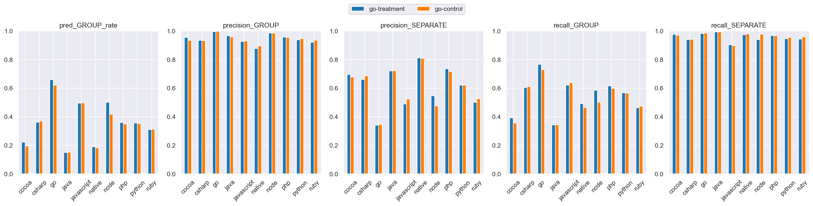
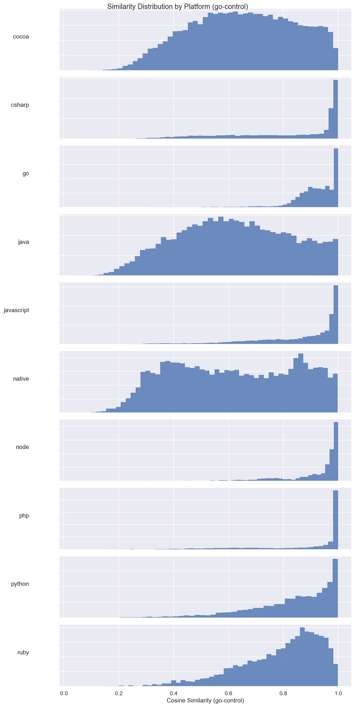
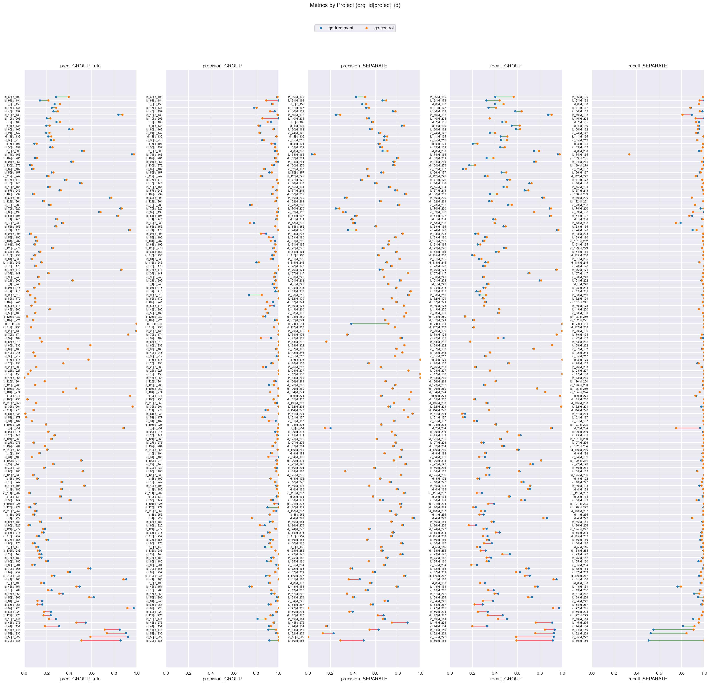

# go-treatment (dim=768) vs go-control (dim=768), dataset: test_full3

Command to repro:

```bash
python -m eval.compare \
    --gcs_model1 gs://$GROUPING_TRAINER_BUCKET/runs/2026-06-05-19-25-10-go-treatment/similarities/test_full3 \
    --threshold_model1 0.90 \
    --gcs_model2 gs://$GROUPING_TRAINER_BUCKET/runs/2026-06-05-19-29-15-go-control/similarities/test_full3 \
    --threshold_model2 0.90 \
    --overwrite
```

### Column definitions

- **model**: The name of the model being evaluated.
- **pred_GROUP_rate**: The fraction of pairs this model groups together—lower means more separate issues are created. It's smaller than prod b/c the test dataset contains far more borderline cases; it's missing pairs that are very close.  This bias also means precision_GROUP is lower than what it'd be in prod.
- **precision_GROUP**: When the model groups a pair, how often is it correct? Higher = less over-grouping.
- **precision_SEPARATE**: When the model separates a pair, how often is it correct?
- **recall_GROUP**: Of all pairs that should be grouped, what fraction does the model correctly group? Higher = less under-grouping.
- **recall_SEPARATE**: Of all pairs that should be separate, what fraction does the model correctly separate?

## Aggregate results


### Overall metrics

| model        | pred_GROUP_rate | precision_GROUP | precision_SEPARATE | recall_GROUP | recall_SEPARATE |
|--------------|-----------------|-----------------|--------------------|--------------|-----------------|
| go-treatment | 0.42            | 0.96            | 0.68               | 0.68         | 0.96            |
| go-control   | 0.39            | 0.97            | 0.65               | 0.64         | 0.97            |

### Project-averaged metrics (152 projects)

| model        | pred_GROUP_rate | precision_GROUP | precision_SEPARATE | recall_GROUP | recall_SEPARATE |
|--------------|-----------------|-----------------|--------------------|--------------|-----------------|
| go-treatment | 0.3             | 0.95            | 0.66               | 0.5          | 0.96            |
| go-control   | 0.29            | 0.95            | 0.66               | 0.49         | 0.97            |

### Conditional probabilities

P(go-control GROUP | go-treatment GROUP)    = 0.8890

P(go-control GROUP | go-treatment SEPARATE) = 0.0313

P(go-control GROUP | go-treatment GROUP, distance < 0.005) = 0.9618  (n=8647)

### Thresholds

```json
{
  "go-treatment": 0.9,
  "go-control": 0.9
}
```

### Distance distribution

| statistic  | value    |
|------------|----------|
| count      | 150303.0 |
| null_count | 0.0      |
| mean       | 0.042189 |
| std        | 0.032109 |
| min        | 0.000514 |
| 25%        | 0.016303 |
| 50%        | 0.035027 |
| 75%        | 0.063571 |
| max        | 0.245969 |

GROUP rate: 58.75%

### Platform stats

| platform   | n_pairs | n_projects | label_GROUP_rate | proportion |
|------------|---------|------------|------------------|------------|
| cocoa      | 30321   | 58         | 0.38             | 0.2        |
| csharp     | 21936   | 21         | 0.62             | 0.15       |
| go         | 17160   | 8          | 0.95             | 0.11       |
| java       | 17043   | 58         | 0.32             | 0.11       |
| javascript | 24492   | 53         | 0.73             | 0.16       |
| native     | 6560    | 41         | 0.31             | 0.04       |
| node       | 3242    | 12         | 0.88             | 0.02       |
| php        | 9592    | 8          | 0.75             | 0.06       |
| python     | 13428   | 8          | 0.57             | 0.09       |
| ruby       | 6529    | 8          | 0.59             | 0.04       |

### Short stacktraces (query_tokens <= p10 = 32 tokens, 15296 pairs)

label GROUP rate: 83.18%
| model        | pred_GROUP_rate | precision_GROUP | precision_SEPARATE | recall_GROUP | recall_SEPARATE |
|--------------|-----------------|-----------------|--------------------|--------------|-----------------|
| go-treatment | 0.72            | 1.0             | 0.6                | 0.87         | 0.99            |
| go-control   | 0.52            | 1.0             | 0.35               | 0.62         | 0.99            |

### Long stacktraces (query_tokens >= p90 = 764 tokens, 15036 pairs)

label GROUP rate: 59.37%
| model        | pred_GROUP_rate | precision_GROUP | precision_SEPARATE | recall_GROUP | recall_SEPARATE |
|--------------|-----------------|-----------------|--------------------|--------------|-----------------|
| go-treatment | 0.41            | 0.95            | 0.66               | 0.66         | 0.95            |
| go-control   | 0.43            | 0.95            | 0.67               | 0.68         | 0.95            |

## Threshold sweep


### Threshold sweep for go-treatment

| threshold | pred_GROUP_rate | precision_GROUP | precision_SEPARATE | recall_GROUP | recall_SEPARATE |
|-----------|-----------------|-----------------|--------------------|--------------|-----------------|
| 0.8       | 0.55            | 0.89            | 0.79               | 0.84         | 0.86            |
| 0.85      | 0.49            | 0.93            | 0.74               | 0.78         | 0.92            |
| 0.87      | 0.46            | 0.94            | 0.72               | 0.75         | 0.94            |
| 0.9       | 0.42            | 0.96            | 0.68               | 0.68         | 0.96            |

### Threshold sweep for go-control

| threshold | pred_GROUP_rate | precision_GROUP | precision_SEPARATE | recall_GROUP | recall_SEPARATE |
|-----------|-----------------|-----------------|--------------------|--------------|-----------------|
| 0.8       | 0.55            | 0.9             | 0.79               | 0.84         | 0.86            |
| 0.85      | 0.48            | 0.93            | 0.73               | 0.76         | 0.92            |
| 0.87      | 0.45            | 0.95            | 0.7                | 0.72         | 0.94            |
| 0.9       | 0.39            | 0.97            | 0.65               | 0.64         | 0.97            |

## Platform-level results


### Metrics by platform, avg over projects (go-treatment, threshold=0.9)

| platform   | n_pairs | n_projects | label_GROUP_rate | min_threshold | pred_GROUP_rate | precision_GROUP | precision_SEPARATE | recall_GROUP | recall_SEPARATE |
|------------|---------|------------|------------------|---------------|-----------------|-----------------|--------------------|--------------|-----------------|
| cocoa      | 30321   | 58         | 0.38             | 0.9           | 0.223           | 0.954           | 0.695              | 0.393        | 0.976           |
| csharp     | 21936   | 21         | 0.617            | 0.9           | 0.362           | 0.934           | 0.661              | 0.604        | 0.94            |
| go         | 17160   | 8          | 0.953            | 0.9           | 0.66            | 0.995           | 0.341              | 0.766        | 0.981           |
| java       | 17043   | 58         | 0.322            | 0.9           | 0.15            | 0.965           | 0.721              | 0.343        | 0.992           |
| javascript | 24492   | 53         | 0.729            | 0.9           | 0.496           | 0.925           | 0.49               | 0.621        | 0.904           |
| native     | 6560    | 41         | 0.31             | 0.9           | 0.19            | 0.876           | 0.811              | 0.492        | 0.973           |
| node       | 3242    | 12         | 0.884            | 0.9           | 0.501           | 0.984           | 0.546              | 0.585        | 0.939           |
| php        | 9592    | 8          | 0.75             | 0.9           | 0.36            | 0.957           | 0.736              | 0.616        | 0.968           |
| python     | 13428   | 8          | 0.568            | 0.9           | 0.356           | 0.938           | 0.62               | 0.568        | 0.946           |
| ruby       | 6529    | 8          | 0.59             | 0.9           | 0.311           | 0.92            | 0.501              | 0.462        | 0.942           |

### Metrics by platform, avg over projects (go-control, threshold=0.9)

| platform   | n_pairs | n_projects | label_GROUP_rate | min_threshold | pred_GROUP_rate | precision_GROUP | precision_SEPARATE | recall_GROUP | recall_SEPARATE |
|------------|---------|------------|------------------|---------------|-----------------|-----------------|--------------------|--------------|-----------------|
| cocoa      | 30321   | 58         | 0.38             | 0.9           | 0.195           | 0.934           | 0.677              | 0.356        | 0.969           |
| csharp     | 21936   | 21         | 0.617            | 0.9           | 0.369           | 0.933           | 0.685              | 0.611        | 0.942           |
| go         | 17160   | 8          | 0.953            | 0.9           | 0.621           | 0.996           | 0.346              | 0.729        | 0.985           |
| java       | 17043   | 58         | 0.322            | 0.9           | 0.151           | 0.959           | 0.723              | 0.345        | 0.992           |
| javascript | 24492   | 53         | 0.729            | 0.9           | 0.497           | 0.93            | 0.524              | 0.639        | 0.897           |
| native     | 6560    | 41         | 0.31             | 0.9           | 0.182           | 0.896           | 0.808              | 0.464        | 0.98            |
| node       | 3242    | 12         | 0.884            | 0.9           | 0.417           | 0.985           | 0.477              | 0.5          | 0.978           |
| php        | 9592    | 8          | 0.75             | 0.9           | 0.351           | 0.955           | 0.717              | 0.597        | 0.965           |
| python     | 13428   | 8          | 0.568            | 0.9           | 0.352           | 0.947           | 0.621              | 0.566        | 0.954           |
| ruby       | 6529    | 8          | 0.59             | 0.9           | 0.312           | 0.933           | 0.525              | 0.475        | 0.958           |

### Min threshold for >= 95% avg project precision_GROUP by platform (go-treatment)

| platform   | n_pairs | n_projects | label_GROUP_rate | min_threshold | pred_GROUP_rate | precision_GROUP | precision_SEPARATE | recall_GROUP | recall_SEPARATE |
|------------|---------|------------|------------------|---------------|-----------------|-----------------|--------------------|--------------|-----------------|
| cocoa      | 30321   | 58         | 0.38             | 0.9           | 0.223           | 0.954           | 0.695              | 0.393        | 0.976           |
| csharp     | 21936   | 21         | 0.617            | 0.92          | 0.332           | 0.953           | 0.63               | 0.55         | 0.952           |
| go         | 17160   | 8          | 0.953            | 0.77          | 0.788           | 0.953           | 0.583              | 0.892        | 0.702           |
| java       | 17043   | 58         | 0.322            | 0.88          | 0.17            | 0.954           | 0.737              | 0.395        | 0.989           |
| javascript | 24492   | 53         | 0.729            | 0.94          | 0.384           | 0.95            | 0.45               | 0.492        | 0.966           |
| native     | 6560    | 41         | 0.31             | 0.94          | 0.128           | 0.961           | 0.764              | 0.333        | 0.991           |
| node       | 3242    | 12         | 0.884            | 0.85          | 0.566           | 0.955           | 0.606              | 0.661        | 0.885           |
| php        | 9592    | 8          | 0.75             | 0.9           | 0.36            | 0.957           | 0.736              | 0.616        | 0.968           |
| python     | 13428   | 8          | 0.568            | 0.92          | 0.307           | 0.958           | 0.589              | 0.5          | 0.969           |
| ruby       | 6529    | 8          | 0.59             | 0.94          | 0.195           | 0.951           | 0.444              | 0.301        | 0.984           |

### Min threshold for >= 95% avg project precision_GROUP by platform (go-control)

| platform   | n_pairs | n_projects | label_GROUP_rate | min_threshold | pred_GROUP_rate | precision_GROUP | precision_SEPARATE | recall_GROUP | recall_SEPARATE |
|------------|---------|------------|------------------|---------------|-----------------|-----------------|--------------------|--------------|-----------------|
| cocoa      | 30321   | 58         | 0.38             | 0.93          | 0.15            | 0.972           | 0.636              | 0.26         | 0.984           |
| csharp     | 21936   | 21         | 0.617            | 0.92          | 0.336           | 0.952           | 0.644              | 0.553        | 0.951           |
| go         | 17160   | 8          | 0.953            | 0.74          | 0.822           | 0.951           | 0.69               | 0.933        | 0.615           |
| java       | 17043   | 58         | 0.322            | 0.89          | 0.161           | 0.952           | 0.729              | 0.373        | 0.99            |
| javascript | 24492   | 53         | 0.729            | 0.96          | 0.333           | 0.985           | 0.42               | 0.427        | 0.981           |
| native     | 6560    | 41         | 0.31             | 0.96          | 0.109           | 0.994           | 0.752              | 0.272        | 0.999           |
| node       | 3242    | 12         | 0.884            | 0.83          | 0.564           | 0.957           | 0.6                | 0.654        | 0.938           |
| php        | 9592    | 8          | 0.75             | 0.89          | 0.364           | 0.951           | 0.73               | 0.619        | 0.958           |
| python     | 13428   | 8          | 0.568            | 0.91          | 0.323           | 0.959           | 0.602              | 0.527        | 0.967           |
| ruby       | 6529    | 8          | 0.59             | 0.93          | 0.225           | 0.956           | 0.464              | 0.359        | 0.985           |

<details>
<summary>Metrics by platform</summary>


</details>


<details>
<summary>Similarity distribution (go-treatment)</summary>


</details>


<details>
<summary>Similarity distribution (go-control)</summary>


</details>


## Project-level results

**Project win rate for go-control**: 36/152 (24%) projects where both precision_GROUP and recall_GROUP are higher


<details>
<summary>Dumbbell by project</summary>


</details>


### >= 10% group rate decrease

| org_id | project_id | platform   | n_pairs | label_GROUP_rate | go-treatment_GROUP_rate | go-treatment_prec | go-treatment_rec | go-control_GROUP_rate | go-control_prec | go-control_rec | group_rate_decrease |
|--------|------------|------------|---------|------------------|-------------------------|-------------------|------------------|-----------------------|-----------------|----------------|---------------------|
| id_39  | id_186     | node       | 629     | 0.86             | 0.86                    | 0.92              | 0.91             | 0.51                  | 1.0             | 0.59           | 0.35                |
| id_55  | id_222     | go         | 9407    | 1.0              | 0.92                    | 1.0               | 0.92             | 0.59                  | 1.0             | 0.59           | 0.33                |
| id_52  | id_233     | javascript | 2125    | 0.96             | 0.9                     | 0.98              | 0.92             | 0.73                  | 0.99            | 0.76           | 0.17                |
| id_14  | id_146     | javascript | 1513    | 0.83             | 0.85                    | 0.91              | 0.93             | 0.72                  | 0.98            | 0.84           | 0.13                |
| id_44  | id_154     | ruby       | 1026    | 0.86             | 0.31                    | 0.91              | 0.33             | 0.18                  | 0.93            | 0.2            | 0.13                |


---

_Real report with original org/project IDs at_ `gs://$GROUPING_TRAINER_BUCKET/eval/comparisons/test_full3/go-treatment_dim768_vs_go-control_dim768/`
