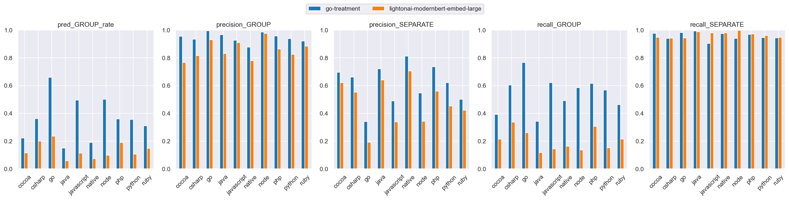
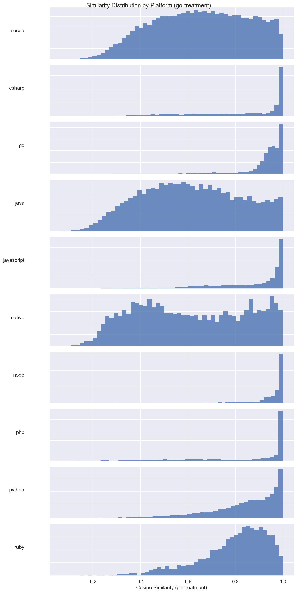
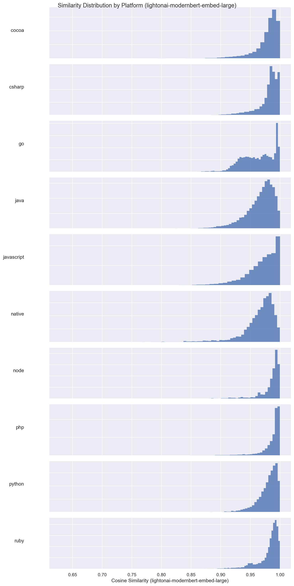
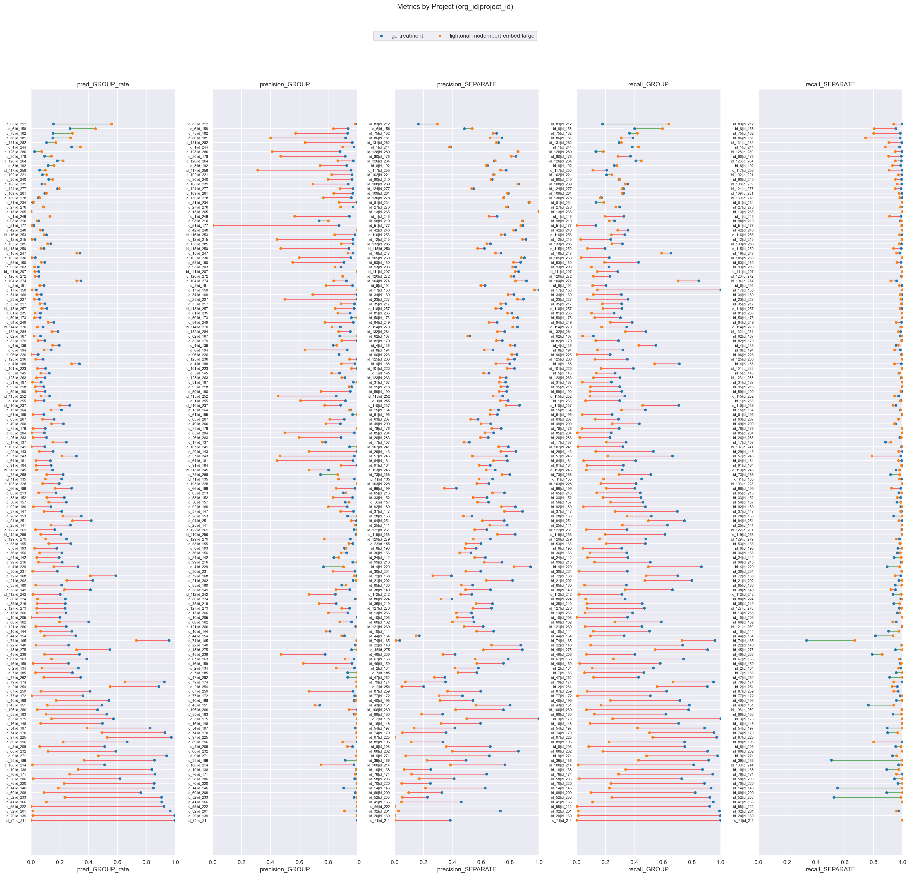

# go-treatment (dim=768) vs lightonai-modernbert-embed-large (dim=768), dataset: test_full3

Command to repro:

```bash
python -m eval.compare \
    --gcs_model1 gs://$GROUPING_TRAINER_BUCKET/runs/2026-06-05-19-25-10-go-treatment/similarities/test_full3 \
    --threshold_model1 0.90 \
    --gcs_model2 gs://$GROUPING_TRAINER_BUCKET/runs/lightonai-modernbert-embed-large/similarities/test_full3 \
    --threshold_model2 0.995 \
    --overwrite
```

### Column definitions

- **model**: The name of the model being evaluated.
- **pred_GROUP_rate**: The fraction of pairs this model groups together—lower means more separate issues are created. It's smaller than prod b/c the test dataset contains far more borderline cases; it's missing pairs that are very close.  This bias also means precision_GROUP is lower than what it'd be in prod.
- **precision_GROUP**: When the model groups a pair, how often is it correct? Higher = less over-grouping.
- **precision_SEPARATE**: When the model separates a pair, how often is it correct?
- **recall_GROUP**: Of all pairs that should be grouped, what fraction does the model correctly group? Higher = less under-grouping.
- **recall_SEPARATE**: Of all pairs that should be separate, what fraction does the model correctly separate?

## Aggregate results


### Overall metrics

| model                            | pred_GROUP_rate | precision_GROUP | precision_SEPARATE | recall_GROUP | recall_SEPARATE |
|----------------------------------|-----------------|-----------------|--------------------|--------------|-----------------|
| go-treatment                     | 0.42            | 0.96            | 0.68               | 0.68         | 0.96            |
| lightonai-modernbert-embed-large | 0.14            | 0.89            | 0.46               | 0.21         | 0.96            |

### Project-averaged metrics (152 projects)

| model                            | pred_GROUP_rate | precision_GROUP | precision_SEPARATE | recall_GROUP | recall_SEPARATE |
|----------------------------------|-----------------|-----------------|--------------------|--------------|-----------------|
| go-treatment                     | 0.3             | 0.95            | 0.66               | 0.5          | 0.96            |
| lightonai-modernbert-embed-large | 0.12            | 0.84            | 0.55               | 0.2          | 0.97            |

### Conditional probabilities

P(lightonai-modernbert-embed-large GROUP | go-treatment GROUP)    = 0.2584

P(lightonai-modernbert-embed-large GROUP | go-treatment SEPARATE) = 0.0500

P(lightonai-modernbert-embed-large GROUP | go-treatment GROUP, distance < 0.005) = 0.6984  (n=8647)

### Thresholds

```json
{
  "go-treatment": 0.9,
  "lightonai-modernbert-embed-large": 0.995
}
```

### Distance distribution

| statistic  | value    |
|------------|----------|
| count      | 150303.0 |
| null_count | 0.0      |
| mean       | 0.042189 |
| std        | 0.032109 |
| min        | 0.000514 |
| 25%        | 0.016303 |
| 50%        | 0.035027 |
| 75%        | 0.063571 |
| max        | 0.245969 |

GROUP rate: 58.75%

### Platform stats

| platform   | n_pairs | n_projects | label_GROUP_rate | proportion |
|------------|---------|------------|------------------|------------|
| cocoa      | 30321   | 58         | 0.38             | 0.2        |
| csharp     | 21936   | 21         | 0.62             | 0.15       |
| go         | 17160   | 8          | 0.95             | 0.11       |
| java       | 17043   | 58         | 0.32             | 0.11       |
| javascript | 24492   | 53         | 0.73             | 0.16       |
| native     | 6560    | 41         | 0.31             | 0.04       |
| node       | 3242    | 12         | 0.88             | 0.02       |
| php        | 9592    | 8          | 0.75             | 0.06       |
| python     | 13428   | 8          | 0.57             | 0.09       |
| ruby       | 6529    | 8          | 0.59             | 0.04       |

### Short stacktraces (query_tokens <= p10 = 32 tokens, 15296 pairs)

label GROUP rate: 83.18%
| model                            | pred_GROUP_rate | precision_GROUP | precision_SEPARATE | recall_GROUP | recall_SEPARATE |
|----------------------------------|-----------------|-----------------|--------------------|--------------|-----------------|
| go-treatment                     | 0.72            | 1.0             | 0.6                | 0.87         | 0.99            |
| lightonai-modernbert-embed-large | 0.03            | 0.96            | 0.17               | 0.04         | 0.99            |

### Long stacktraces (query_tokens >= p90 = 764 tokens, 15036 pairs)

label GROUP rate: 59.37%
| model                            | pred_GROUP_rate | precision_GROUP | precision_SEPARATE | recall_GROUP | recall_SEPARATE |
|----------------------------------|-----------------|-----------------|--------------------|--------------|-----------------|
| go-treatment                     | 0.41            | 0.95            | 0.66               | 0.66         | 0.95            |
| lightonai-modernbert-embed-large | 0.28            | 0.92            | 0.53               | 0.43         | 0.95            |

## Threshold sweep


### Threshold sweep for go-treatment

| threshold | pred_GROUP_rate | precision_GROUP | precision_SEPARATE | recall_GROUP | recall_SEPARATE |
|-----------|-----------------|-----------------|--------------------|--------------|-----------------|
| 0.8       | 0.55            | 0.89            | 0.79               | 0.84         | 0.86            |
| 0.85      | 0.49            | 0.93            | 0.74               | 0.78         | 0.92            |
| 0.87      | 0.46            | 0.94            | 0.72               | 0.75         | 0.94            |
| 0.9       | 0.42            | 0.96            | 0.68               | 0.68         | 0.96            |

### Threshold sweep for lightonai-modernbert-embed-large

| threshold | pred_GROUP_rate | precision_GROUP | precision_SEPARATE | recall_GROUP | recall_SEPARATE |
|-----------|-----------------|-----------------|--------------------|--------------|-----------------|
| 0.8       | 1.0             | 0.59            | 0.91               | 1.0          | 0.0             |
| 0.85      | 1.0             | 0.59            | 0.83               | 1.0          | 0.0             |
| 0.87      | 1.0             | 0.59            | 0.79               | 1.0          | 0.01            |
| 0.9       | 0.98            | 0.59            | 0.73               | 0.99         | 0.03            |

## Platform-level results


### Metrics by platform, avg over projects (go-treatment, threshold=0.9)

| platform   | n_pairs | n_projects | label_GROUP_rate | min_threshold | pred_GROUP_rate | precision_GROUP | precision_SEPARATE | recall_GROUP | recall_SEPARATE |
|------------|---------|------------|------------------|---------------|-----------------|-----------------|--------------------|--------------|-----------------|
| cocoa      | 30321   | 58         | 0.38             | 0.9           | 0.223           | 0.954           | 0.695              | 0.393        | 0.976           |
| csharp     | 21936   | 21         | 0.617            | 0.9           | 0.362           | 0.934           | 0.661              | 0.604        | 0.94            |
| go         | 17160   | 8          | 0.953            | 0.9           | 0.66            | 0.995           | 0.341              | 0.766        | 0.981           |
| java       | 17043   | 58         | 0.322            | 0.9           | 0.15            | 0.965           | 0.721              | 0.343        | 0.992           |
| javascript | 24492   | 53         | 0.729            | 0.9           | 0.496           | 0.925           | 0.49               | 0.621        | 0.904           |
| native     | 6560    | 41         | 0.31             | 0.9           | 0.19            | 0.876           | 0.811              | 0.492        | 0.973           |
| node       | 3242    | 12         | 0.884            | 0.9           | 0.501           | 0.984           | 0.546              | 0.585        | 0.939           |
| php        | 9592    | 8          | 0.75             | 0.9           | 0.36            | 0.957           | 0.736              | 0.616        | 0.968           |
| python     | 13428   | 8          | 0.568            | 0.9           | 0.356           | 0.938           | 0.62               | 0.568        | 0.946           |
| ruby       | 6529    | 8          | 0.59             | 0.9           | 0.311           | 0.92            | 0.501              | 0.462        | 0.942           |

### Metrics by platform, avg over projects (lightonai-modernbert-embed-large, threshold=0.995)

| platform   | n_pairs | n_projects | label_GROUP_rate | min_threshold | pred_GROUP_rate | precision_GROUP | precision_SEPARATE | recall_GROUP | recall_SEPARATE |
|------------|---------|------------|------------------|---------------|-----------------|-----------------|--------------------|--------------|-----------------|
| cocoa      | 30321   | 58         | 0.38             | 0.995         | 0.115           | 0.766           | 0.621              | 0.215        | 0.948           |
| csharp     | 21936   | 21         | 0.617            | 0.995         | 0.199           | 0.816           | 0.552              | 0.337        | 0.942           |
| go         | 17160   | 8          | 0.953            | 0.995         | 0.236           | 0.929           | 0.193              | 0.26         | 0.943           |
| java       | 17043   | 58         | 0.322            | 0.995         | 0.058           | 0.83            | 0.641              | 0.118        | 0.987           |
| javascript | 24492   | 53         | 0.729            | 0.995         | 0.114           | 0.908           | 0.339              | 0.143        | 0.979           |
| native     | 6560    | 41         | 0.31             | 0.995         | 0.073           | 0.78            | 0.704              | 0.163        | 0.979           |
| node       | 3242    | 12         | 0.884            | 0.995         | 0.098           | 0.975           | 0.342              | 0.137        | 0.996           |
| php        | 9592    | 8          | 0.75             | 0.995         | 0.191           | 0.863           | 0.559              | 0.306        | 0.971           |
| python     | 13428   | 8          | 0.568            | 0.995         | 0.107           | 0.826           | 0.454              | 0.152        | 0.961           |
| ruby       | 6529    | 8          | 0.59             | 0.995         | 0.148           | 0.883           | 0.422              | 0.215        | 0.948           |

### Min threshold for >= 95% avg project precision_GROUP by platform (go-treatment)

| platform   | n_pairs | n_projects | label_GROUP_rate | min_threshold | pred_GROUP_rate | precision_GROUP | precision_SEPARATE | recall_GROUP | recall_SEPARATE |
|------------|---------|------------|------------------|---------------|-----------------|-----------------|--------------------|--------------|-----------------|
| cocoa      | 30321   | 58         | 0.38             | 0.9           | 0.223           | 0.954           | 0.695              | 0.393        | 0.976           |
| csharp     | 21936   | 21         | 0.617            | 0.92          | 0.332           | 0.953           | 0.63               | 0.55         | 0.952           |
| go         | 17160   | 8          | 0.953            | 0.77          | 0.788           | 0.953           | 0.583              | 0.892        | 0.702           |
| java       | 17043   | 58         | 0.322            | 0.88          | 0.17            | 0.954           | 0.737              | 0.395        | 0.989           |
| javascript | 24492   | 53         | 0.729            | 0.94          | 0.384           | 0.95            | 0.45               | 0.492        | 0.966           |
| native     | 6560    | 41         | 0.31             | 0.94          | 0.128           | 0.961           | 0.764              | 0.333        | 0.991           |
| node       | 3242    | 12         | 0.884            | 0.85          | 0.566           | 0.955           | 0.606              | 0.661        | 0.885           |
| php        | 9592    | 8          | 0.75             | 0.9           | 0.36            | 0.957           | 0.736              | 0.616        | 0.968           |
| python     | 13428   | 8          | 0.568            | 0.92          | 0.307           | 0.958           | 0.589              | 0.5          | 0.969           |
| ruby       | 6529    | 8          | 0.59             | 0.94          | 0.195           | 0.951           | 0.444              | 0.301        | 0.984           |

### Min threshold for >= 95% avg project precision_GROUP by platform (lightonai-modernbert-embed-large)

| platform   | n_pairs | n_projects | label_GROUP_rate | min_threshold | pred_GROUP_rate | precision_GROUP | precision_SEPARATE | recall_GROUP | recall_SEPARATE |
|------------|---------|------------|------------------|---------------|-----------------|-----------------|--------------------|--------------|-----------------|
| cocoa      | 30321   | 58         | 0.38             | null          | null            | null            | null               | null         | null            |
| csharp     | 21936   | 21         | 0.617            | null          | null            | null            | null               | null         | null            |
| go         | 17160   | 8          | 0.953            | null          | null            | null            | null               | null         | null            |
| java       | 17043   | 58         | 0.322            | null          | null            | null            | null               | null         | null            |
| javascript | 24492   | 53         | 0.729            | null          | null            | null            | null               | null         | null            |
| native     | 6560    | 41         | 0.31             | null          | null            | null            | null               | null         | null            |
| node       | 3242    | 12         | 0.884            | null          | null            | null            | null               | null         | null            |
| php        | 9592    | 8          | 0.75             | null          | null            | null            | null               | null         | null            |
| python     | 13428   | 8          | 0.568            | null          | null            | null            | null               | null         | null            |
| ruby       | 6529    | 8          | 0.59             | null          | null            | null            | null               | null         | null            |

<details>
<summary>Metrics by platform</summary>


</details>


<details>
<summary>Similarity distribution (go-treatment)</summary>


</details>


<details>
<summary>Similarity distribution (lightonai-modernbert-embed-large)</summary>


</details>


## Project-level results

**Project win rate for lightonai-modernbert-embed-large**: 0/152 (0%) projects where both precision_GROUP and recall_GROUP are higher


<details>
<summary>Dumbbell by project</summary>


</details>


### >= 15% group rate increase (stratified by platform)

| org_id | project_id | platform | n_pairs | label_GROUP_rate | go-treatment_GROUP_rate | go-treatment_prec | go-treatment_rec | lightonai-modernbert-embed-large_GROUP_rate | lightonai-modernbert-embed-large_prec | lightonai-modernbert-embed-large_rec | group_rate_increase |
|--------|------------|----------|---------|------------------|-------------------------|-------------------|------------------|---------------------------------------------|---------------------------------------|--------------------------------------|---------------------|
| id_83  | id_212     | go       | 116     | 0.86             | 0.16                    | 1.0               | 0.18             | 0.56                                        | 0.98                                  | 0.64                                 | 0.41                |
| id_6   | id_158     | ruby     | 533     | 0.63             | 0.27                    | 0.94              | 0.4              | 0.45                                        | 0.84                                  | 0.6                                  | 0.18                |

### >= 10% group rate decrease

| org_id | project_id | platform   | n_pairs | label_GROUP_rate | go-treatment_GROUP_rate | go-treatment_prec | go-treatment_rec | lightonai-modernbert-embed-large_GROUP_rate | lightonai-modernbert-embed-large_prec | lightonai-modernbert-embed-large_rec | group_rate_decrease |
|--------|------------|------------|---------|------------------|-------------------------|-------------------|------------------|---------------------------------------------|---------------------------------------|--------------------------------------|---------------------|
| id_71  | id_211     | csharp     | 5539    | 1.0              | 1.0                     | 1.0               | 1.0              | 0.0                                         | NaN                                   | 0.0                                  | 1.0                 |
| id_20  | id_139     | go         | 1248    | 1.0              | 1.0                     | 1.0               | 1.0              | 0.01                                        | 1.0                                   | 0.01                                 | 0.98                |
| id_32  | id_201     | javascript | 2733    | 0.97             | 0.96                    | 1.0               | 0.99             | 0.01                                        | 0.91                                  | 0.01                                 | 0.95                |
| id_55  | id_222     | go         | 9407    | 1.0              | 0.92                    | 1.0               | 0.92             | 0.0                                         | 1.0                                   | 0.0                                  | 0.92                |
| id_41  | id_166     | node       | 1494    | 0.96             | 0.91                    | 1.0               | 0.95             | 0.11                                        | 1.0                                   | 0.11                                 | 0.8                 |
| id_52  | id_233     | javascript | 2125    | 0.96             | 0.9                     | 0.98              | 0.92             | 0.23                                        | 1.0                                   | 0.24                                 | 0.67                |
| id_69  | id_209     | javascript | 409     | 0.91             | 0.76                    | 0.99              | 0.82             | 0.09                                        | 1.0                                   | 0.1                                  | 0.67                |
| id_14  | id_146     | javascript | 1513    | 0.83             | 0.85                    | 0.91              | 0.93             | 0.19                                        | 1.0                                   | 0.23                                 | 0.66                |
| id_70  | id_220     | go         | 1633    | 0.96             | 0.85                    | 1.0               | 0.89             | 0.23                                        | 1.0                                   | 0.24                                 | 0.62                |
| id_58  | id_206     | javascript | 209     | 0.83             | 0.62                    | 0.98              | 0.73             | 0.01                                        | 1.0                                   | 0.02                                 | 0.6                 |
| id_76  | id_171     | javascript | 1038    | 0.91             | 0.86                    | 1.0               | 0.94             | 0.27                                        | 0.99                                  | 0.29                                 | 0.59                |
| id_19  | id_138     | javascript | 790     | 0.95             | 0.84                    | 0.99              | 0.87             | 0.33                                        | 1.0                                   | 0.34                                 | 0.51                |
| id_100 | id_214     | native     | 467     | 0.61             | 0.51                    | 0.98              | 0.81             | 0.01                                        | 0.75                                  | 0.01                                 | 0.5                 |
| id_39  | id_186     | node       | 629     | 0.86             | 0.86                    | 0.92              | 0.91             | 0.37                                        | 1.0                                   | 0.43                                 | 0.49                |
| id_9   | id_271     | php        | 5687    | 0.96             | 0.94                    | 1.0               | 0.98             | 0.47                                        | 1.0                                   | 0.48                                 | 0.47                |
| id_68  | id_232     | go         | 17      | 0.65             | 0.59                    | 1.0               | 0.91             | 0.12                                        | 1.0                                   | 0.18                                 | 0.47                |
| id_8   | id_208     | javascript | 1270    | 0.66             | 0.51                    | 0.97              | 0.75             | 0.06                                        | 0.93                                  | 0.08                                 | 0.45                |
| id_89  | id_196     | javascript | 90      | 0.89             | 0.67                    | 1.0               | 0.75             | 0.22                                        | 0.9                                   | 0.22                                 | 0.44                |
| id_97  | id_225     | javascript | 36      | 1.0              | 0.97                    | 1.0               | 0.97             | 0.53                                        | 1.0                                   | 0.53                                 | 0.44                |
| id_74  | id_170     | csharp     | 1034    | 0.97             | 0.93                    | 1.0               | 0.95             | 0.49                                        | 1.0                                   | 0.51                                 | 0.44                |
| id_54  | id_197     | javascript | 902     | 0.92             | 0.82                    | 0.99              | 0.89             | 0.39                                        | 1.0                                   | 0.42                                 | 0.44                |
| id_16  | id_148     | javascript | 1365    | 0.7              | 0.5                     | 1.0               | 0.71             | 0.07                                        | 1.0                                   | 0.09                                 | 0.43                |
| id_3   | id_175     | java       | 7       | 0.57             | 0.57                    | 1.0               | 1.0              | 0.14                                        | 1.0                                   | 0.25                                 | 0.43                |
| id_88  | id_183     | go         | 2481    | 0.83             | 0.53                    | 0.98              | 0.62             | 0.1                                         | 0.99                                  | 0.12                                 | 0.42                |
| id_106 | id_269     | javascript | 416     | 0.59             | 0.46                    | 1.0               | 0.78             | 0.04                                        | 0.94                                  | 0.07                                 | 0.42                |
| id_43  | id_151     | python     | 5426    | 0.47             | 0.49                    | 0.74              | 0.78             | 0.11                                        | 0.71                                  | 0.17                                 | 0.38                |
| id_40  | id_198     | python     | 2380    | 0.74             | 0.54                    | 0.98              | 0.72             | 0.18                                        | 0.99                                  | 0.23                                 | 0.36                |
| id_77  | id_172     | javascript | 533     | 0.69             | 0.36                    | 0.98              | 0.51             | 0.0                                         | 1.0                                   | 0.01                                 | 0.36                |
| id_87  | id_259     | python     | 88      | 0.64             | 0.41                    | 0.97              | 0.62             | 0.07                                        | 0.67                                  | 0.07                                 | 0.34                |
| id_2   | id_254     | javascript | 1182    | 0.98             | 0.89                    | 1.0               | 0.91             | 0.55                                        | 1.0                                   | 0.56                                 | 0.34                |
| id_79  | id_174     | go         | 1786    | 0.97             | 0.92                    | 1.0               | 0.95             | 0.65                                        | 1.0                                   | 0.67                                 | 0.27                |
| id_47  | id_262     | javascript | 881     | 0.75             | 0.35                    | 0.93              | 0.43             | 0.09                                        | 1.0                                   | 0.12                                 | 0.26                |
| id_7   | id_185     | java       | 160     | 0.57             | 0.29                    | 0.93              | 0.47             | 0.03                                        | 1.0                                   | 0.05                                 | 0.26                |
| id_2   | id_134     | python     | 1372    | 0.6              | 0.33                    | 0.98              | 0.53             | 0.08                                        | 0.86                                  | 0.11                                 | 0.25                |
| id_46  | id_159     | javascript | 2487    | 0.43             | 0.26                    | 0.96              | 0.58             | 0.01                                        | 0.63                                  | 0.02                                 | 0.25                |
| id_67  | id_163     | javascript | 586     | 0.51             | 0.39                    | 0.98              | 0.74             | 0.14                                        | 0.92                                  | 0.25                                 | 0.25                |
| id_48  | id_238     | cocoa      | 202     | 0.65             | 0.34                    | 0.78              | 0.4              | 0.09                                        | 0.47                                  | 0.07                                 | 0.24                |
| id_45  | id_275     | php        | 95      | 0.58             | 0.55                    | 0.96              | 0.91             | 0.32                                        | 1.0                                   | 0.55                                 | 0.23                |
| id_22  | id_140     | javascript | 290     | 0.35             | 0.26                    | 0.99              | 0.74             | 0.03                                        | 1.0                                   | 0.1                                  | 0.23                |
| id_74  | id_165     | csharp     | 686     | 1.0              | 0.96                    | 1.0               | 0.96             | 0.73                                        | 1.0                                   | 0.73                                 | 0.23                |
| id_44  | id_154     | ruby       | 1026    | 0.86             | 0.31                    | 0.91              | 0.33             | 0.09                                        | 0.89                                  | 0.1                                  | 0.22                |
| id_10  | id_144     | native     | 1739    | 0.46             | 0.28                    | 0.81              | 0.51             | 0.07                                        | 0.79                                  | 0.12                                 | 0.22                |
| id_121 | id_260     | java       | 438     | 0.53             | 0.24                    | 0.99              | 0.45             | 0.03                                        | 1.0                                   | 0.06                                 | 0.21                |
| id_60  | id_162     | python     | 1990    | 0.65             | 0.4                     | 0.96              | 0.59             | 0.2                                         | 0.88                                  | 0.27                                 | 0.2                 |
| id_10  | id_205     | node       | 30      | 0.57             | 0.2                     | 1.0               | 0.35             | 0.0                                         | NaN                                   | 0.0                                  | 0.2                 |
| id_13  | id_266     | cocoa      | 715     | 0.58             | 0.24                    | 0.94              | 0.39             | 0.04                                        | 0.8                                   | 0.06                                 | 0.2                 |
| id_127 | id_273     | java       | 489     | 0.47             | 0.24                    | 0.95              | 0.47             | 0.04                                        | 0.89                                  | 0.07                                 | 0.2                 |
| id_35  | id_219     | java       | 436     | 0.45             | 0.24                    | 0.86              | 0.45             | 0.04                                        | 0.74                                  | 0.07                                 | 0.19                |
| id_80  | id_224     | cocoa      | 274     | 0.69             | 0.24                    | 0.98              | 0.34             | 0.04                                        | 1.0                                   | 0.06                                 | 0.19                |
| id_112 | id_242     | javascript | 462     | 0.54             | 0.2                     | 0.85              | 0.31             | 0.01                                        | 0.67                                  | 0.02                                 | 0.19                |
| id_38  | id_149     | php        | 971     | 0.59             | 0.41                    | 0.95              | 0.66             | 0.23                                        | 0.85                                  | 0.34                                 | 0.18                |
| id_85  | id_180     | python     | 1582    | 0.55             | 0.21                    | 0.89              | 0.34             | 0.03                                        | 0.92                                  | 0.05                                 | 0.18                |
| id_21  | id_202     | csharp     | 2044    | 0.52             | 0.43                    | 0.97              | 0.8              | 0.25                                        | 0.99                                  | 0.47                                 | 0.18                |
| id_72  | id_168     | javascript | 1924    | 0.84             | 0.59                    | 1.0               | 0.7              | 0.41                                        | 0.98                                  | 0.48                                 | 0.18                |
| id_30  | id_231     | native     | 1130    | 0.51             | 0.18                    | 0.99              | 0.35             | 0.01                                        | 0.83                                  | 0.02                                 | 0.17                |
| id_4   | id_229     | csharp     | 1337    | 0.29             | 0.33                    | 0.77              | 0.87             | 0.16                                        | 0.91                                  | 0.5                                  | 0.17                |
| id_99  | id_216     | java       | 472     | 0.41             | 0.22                    | 0.97              | 0.51             | 0.05                                        | 1.0                                   | 0.12                                 | 0.17                |
| id_24  | id_142     | javascript | 1933    | 0.46             | 0.2                     | 0.84              | 0.35             | 0.04                                        | 0.87                                  | 0.08                                 | 0.16                |
| id_36  | id_156     | cocoa      | 912     | 0.57             | 0.21                    | 0.93              | 0.35             | 0.06                                        | 0.89                                  | 0.09                                 | 0.15                |
| id_8   | id_193     | java       | 508     | 0.52             | 0.18                    | 0.91              | 0.31             | 0.03                                        | 0.92                                  | 0.05                                 | 0.15                |
| id_53  | id_155     | php        | 720     | 0.56             | 0.28                    | 0.97              | 0.48             | 0.12                                        | 0.94                                  | 0.21                                 | 0.15                |
| id_129 | id_279     | java       | 776     | 0.49             | 0.25                    | 0.95              | 0.48             | 0.1                                         | 0.77                                  | 0.16                                 | 0.14                |
| id_119 | id_256     | javascript | 554     | 0.34             | 0.21                    | 0.99              | 0.61             | 0.07                                        | 1.0                                   | 0.2                                  | 0.14                |
| id_122 | id_261     | java       | 588     | 0.46             | 0.16                    | 0.98              | 0.35             | 0.03                                        | 1.0                                   | 0.07                                 | 0.13                |
| id_25  | id_141     | javascript | 469     | 0.43             | 0.27                    | 0.99              | 0.63             | 0.14                                        | 0.98                                  | 0.32                                 | 0.13                |
| id_94  | id_251     | csharp     | 522     | 0.56             | 0.42                    | 1.0               | 0.75             | 0.29                                        | 0.96                                  | 0.5                                  | 0.13                |
| id_28  | id_153     | ruby       | 218     | 0.63             | 0.35                    | 0.93              | 0.52             | 0.22                                        | 1.0                                   | 0.35                                 | 0.13                |
| id_37  | id_147     | ruby       | 391     | 0.3              | 0.21                    | 0.98              | 0.7              | 0.09                                        | 0.89                                  | 0.27                                 | 0.12                |
| id_92  | id_189     | javascript | 319     | 0.27             | 0.14                    | 0.93              | 0.48             | 0.02                                        | 0.8                                   | 0.05                                 | 0.12                |
| id_56  | id_157     | php        | 450     | 0.49             | 0.24                    | 0.92              | 0.46             | 0.12                                        | 0.95                                  | 0.24                                 | 0.12                |
| id_33  | id_152     | ruby       | 941     | 0.5              | 0.23                    | 0.97              | 0.45             | 0.11                                        | 0.83                                  | 0.18                                 | 0.12                |
| id_65  | id_213     | java       | 243     | 0.35             | 0.17                    | 0.9               | 0.44             | 0.05                                        | 0.92                                  | 0.14                                 | 0.12                |
| id_66  | id_199     | csharp     | 998     | 0.69             | 0.28                    | 0.99              | 0.4              | 0.17                                        | 0.86                                  | 0.21                                 | 0.12                |
| id_103 | id_228     | cocoa      | 250     | 0.48             | 0.2                     | 1.0               | 0.41             | 0.08                                        | 1.0                                   | 0.17                                 | 0.12                |
| id_11  | id_135     | python     | 475     | 0.46             | 0.21                    | 0.98              | 0.45             | 0.1                                         | 0.87                                  | 0.19                                 | 0.11                |
| id_73  | id_268     | cocoa      | 338     | 0.32             | 0.22                    | 0.75              | 0.51             | 0.11                                        | 0.86                                  | 0.29                                 | 0.11                |
| id_113 | id_245     | csharp     | 476     | 0.38             | 0.15                    | 0.8               | 0.32             | 0.04                                        | 0.67                                  | 0.07                                 | 0.11                |
| id_91  | id_184     | javascript | 258     | 0.43             | 0.14                    | 1.0               | 0.32             | 0.03                                        | 0.89                                  | 0.07                                 | 0.1                 |
| id_64  | id_161     | javascript | 259     | 0.32             | 0.14                    | 0.97              | 0.41             | 0.03                                        | 0.44                                  | 0.05                                 | 0.1                 |


---

_Real report with original org/project IDs at_ `gs://$GROUPING_TRAINER_BUCKET/eval/comparisons/test_full3/go-treatment_dim768_vs_lightonai-modernbert-embed-large_dim768/`
