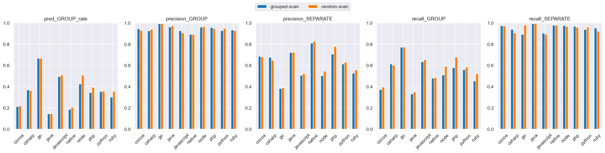
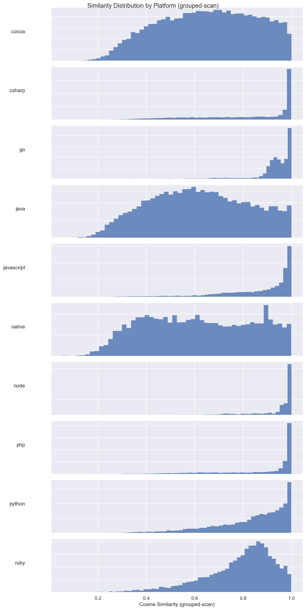
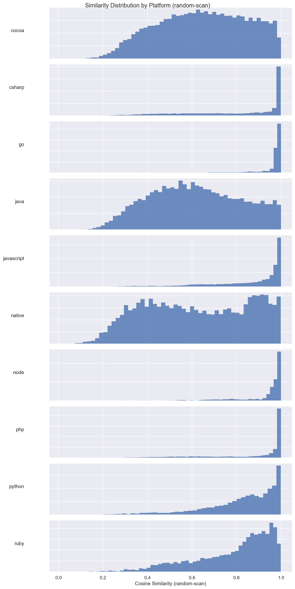
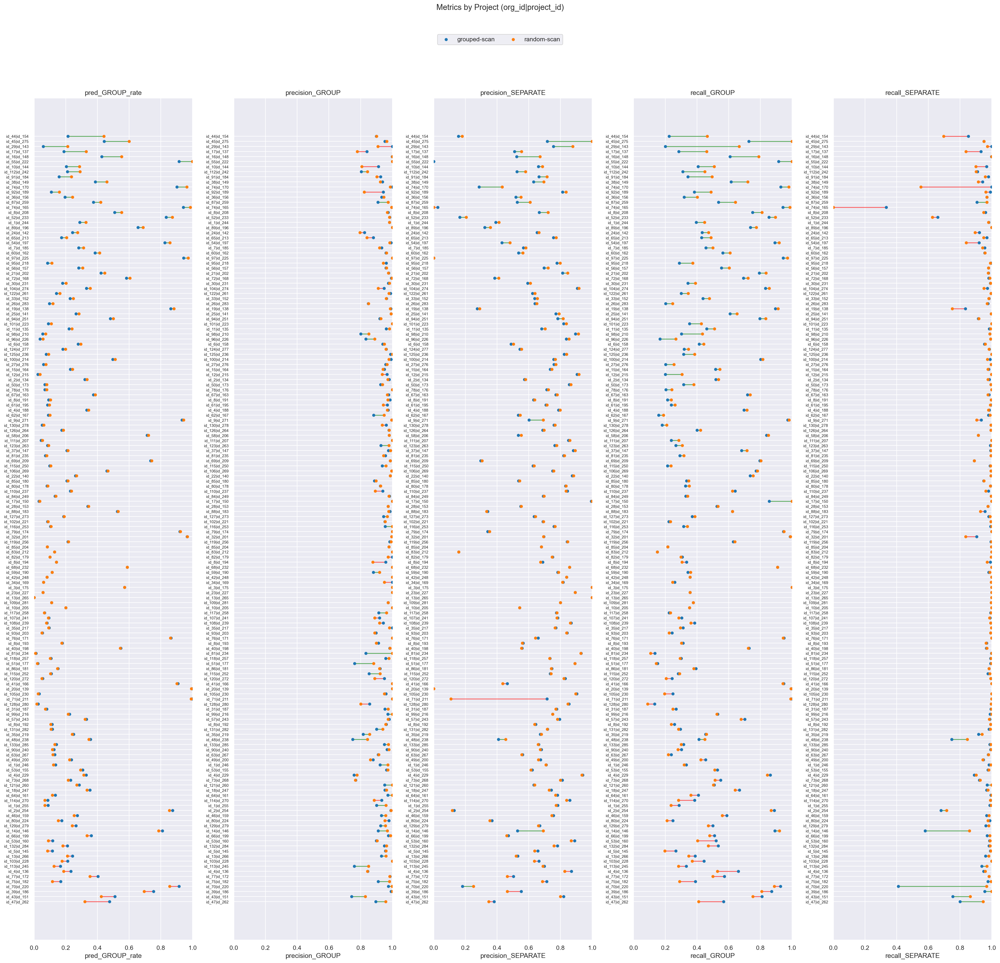

# grouped-scan (dim=768) vs random-scan (dim=768), dataset: test_full3

Command to repro:

```bash
python -m eval.compare \
    --name_model1 grouped-scan \
    --gcs_model1 gs://$GROUPING_TRAINER_BUCKET/runs/2026-05-12-23-57-13-grouped-scan/similarities/test_full3 \
    --threshold_model1 0.90 \
    --name_model2 random-scan \
    --gcs_model2 gs://$GROUPING_TRAINER_BUCKET/runs/2026-04-30-08-23-30-random-scan/similarities/test_full3 \
    --threshold_model2 0.90 \
    --overwrite
```

### Column definitions

- **model**: The name of the model being evaluated.
- **pred_GROUP_rate**: The fraction of pairs this model groups together—lower means more separate issues are created. It's smaller than prod b/c the test dataset contains far more borderline cases; it's missing pairs that are very close.  This bias also means precision_GROUP is lower than what it'd be in prod.
- **precision_GROUP**: When the model groups a pair, how often is it correct? Higher = less over-grouping.
- **precision_SEPARATE**: When the model separates a pair, how often is it correct?
- **recall_GROUP**: Of all pairs that should be grouped, what fraction does the model correctly group? Higher = less under-grouping.
- **recall_SEPARATE**: Of all pairs that should be separate, what fraction does the model correctly separate?

## Aggregate results


### Overall metrics

| model        | pred_GROUP_rate | precision_GROUP | precision_SEPARATE | recall_GROUP | recall_SEPARATE |
|--------------|-----------------|-----------------|--------------------|--------------|-----------------|
| grouped-scan | 0.41            | 0.96            | 0.68               | 0.68         | 0.96            |
| random-scan  | 0.42            | 0.97            | 0.69               | 0.7          | 0.97            |

### Project-averaged metrics (152 projects)

| model        | pred_GROUP_rate | precision_GROUP | precision_SEPARATE | recall_GROUP | recall_SEPARATE |
|--------------|-----------------|-----------------|--------------------|--------------|-----------------|
| grouped-scan | 0.3             | 0.94            | 0.66               | 0.49         | 0.96            |
| random-scan  | 0.3             | 0.95            | 0.67               | 0.51         | 0.96            |

### Conditional probabilities

P(random-scan GROUP | grouped-scan GROUP)    = 0.9411

P(random-scan GROUP | grouped-scan SEPARATE) = 0.0587

P(random-scan GROUP | grouped-scan GROUP, distance < 0.005) = 0.9747  (n=8649)

### Thresholds

```json
{
  "grouped-scan": 0.9,
  "random-scan": 0.9
}
```

### Distance distribution

| statistic  | value    |
|------------|----------|
| count      | 150303.0 |
| null_count | 0.0      |
| mean       | 0.042189 |
| std        | 0.032109 |
| min        | 0.000514 |
| 25%        | 0.016303 |
| 50%        | 0.035027 |
| 75%        | 0.063571 |
| max        | 0.245969 |

GROUP rate: 58.75%

### Platform stats

| platform   | n_pairs | n_projects | label_GROUP_rate | proportion |
|------------|---------|------------|------------------|------------|
| cocoa      | 30321   | 58         | 0.38             | 0.2        |
| csharp     | 21936   | 21         | 0.62             | 0.15       |
| go         | 17160   | 8          | 0.95             | 0.11       |
| java       | 17043   | 58         | 0.32             | 0.11       |
| javascript | 24492   | 53         | 0.73             | 0.16       |
| native     | 6560    | 41         | 0.31             | 0.04       |
| node       | 3242    | 12         | 0.88             | 0.02       |
| php        | 9592    | 8          | 0.75             | 0.06       |
| python     | 13428   | 8          | 0.57             | 0.09       |
| ruby       | 6529    | 8          | 0.59             | 0.04       |

### Short stacktraces (query_tokens <= p10 = 32 tokens, 15296 pairs)

label GROUP rate: 83.18%
| model        | pred_GROUP_rate | precision_GROUP | precision_SEPARATE | recall_GROUP | recall_SEPARATE |
|--------------|-----------------|-----------------|--------------------|--------------|-----------------|
| grouped-scan | 0.73            | 0.99            | 0.6                | 0.87         | 0.97            |
| random-scan  | 0.77            | 1.0             | 0.73               | 0.93         | 0.99            |

### Long stacktraces (query_tokens >= p90 = 764 tokens, 15036 pairs)

label GROUP rate: 59.37%
| model        | pred_GROUP_rate | precision_GROUP | precision_SEPARATE | recall_GROUP | recall_SEPARATE |
|--------------|-----------------|-----------------|--------------------|--------------|-----------------|
| grouped-scan | 0.41            | 0.95            | 0.66               | 0.66         | 0.95            |
| random-scan  | 0.44            | 0.95            | 0.68               | 0.7          | 0.94            |

## Threshold sweep


### Threshold sweep for grouped-scan

| threshold | pred_GROUP_rate | precision_GROUP | precision_SEPARATE | recall_GROUP | recall_SEPARATE |
|-----------|-----------------|-----------------|--------------------|--------------|-----------------|
| 0.8       | 0.56            | 0.89            | 0.79               | 0.84         | 0.85            |
| 0.85      | 0.49            | 0.93            | 0.74               | 0.78         | 0.91            |
| 0.87      | 0.46            | 0.94            | 0.72               | 0.74         | 0.94            |
| 0.9       | 0.41            | 0.96            | 0.68               | 0.68         | 0.96            |

### Threshold sweep for random-scan

| threshold | pred_GROUP_rate | precision_GROUP | precision_SEPARATE | recall_GROUP | recall_SEPARATE |
|-----------|-----------------|-----------------|--------------------|--------------|-----------------|
| 0.8       | 0.55            | 0.9             | 0.8                | 0.85         | 0.87            |
| 0.85      | 0.49            | 0.94            | 0.75               | 0.79         | 0.92            |
| 0.87      | 0.47            | 0.95            | 0.73               | 0.75         | 0.94            |
| 0.9       | 0.42            | 0.97            | 0.69               | 0.7          | 0.97            |

## Platform-level results


### Metrics by platform, avg over projects (grouped-scan, threshold=0.9)

| platform   | n_pairs | n_projects | label_GROUP_rate | min_threshold | pred_GROUP_rate | precision_GROUP | precision_SEPARATE | recall_GROUP | recall_SEPARATE |
|------------|---------|------------|------------------|---------------|-----------------|-----------------|--------------------|--------------|-----------------|
| cocoa      | 30321   | 58         | 0.38             | 0.9           | 0.213           | 0.946           | 0.685              | 0.374        | 0.973           |
| csharp     | 21936   | 21         | 0.617            | 0.9           | 0.37            | 0.927           | 0.676              | 0.613        | 0.939           |
| go         | 17160   | 8          | 0.953            | 0.9           | 0.666           | 0.993           | 0.382              | 0.772        | 0.893           |
| java       | 17043   | 58         | 0.322            | 0.9           | 0.144           | 0.963           | 0.721              | 0.332        | 0.993           |
| javascript | 24492   | 53         | 0.729            | 0.9           | 0.496           | 0.926           | 0.507              | 0.634        | 0.903           |
| native     | 6560    | 41         | 0.31             | 0.9           | 0.186           | 0.892           | 0.809              | 0.481        | 0.977           |
| node       | 3242    | 12         | 0.884            | 0.9           | 0.424           | 0.961           | 0.503              | 0.51         | 0.976           |
| php        | 9592    | 8          | 0.75             | 0.9           | 0.344           | 0.958           | 0.706              | 0.58         | 0.968           |
| python     | 13428   | 8          | 0.568            | 0.9           | 0.354           | 0.927           | 0.614              | 0.56         | 0.937           |
| ruby       | 6529    | 8          | 0.59             | 0.9           | 0.302           | 0.934           | 0.527              | 0.454        | 0.953           |

### Metrics by platform, avg over projects (random-scan, threshold=0.9)

| platform   | n_pairs | n_projects | label_GROUP_rate | min_threshold | pred_GROUP_rate | precision_GROUP | precision_SEPARATE | recall_GROUP | recall_SEPARATE |
|------------|---------|------------|------------------|---------------|-----------------|-----------------|--------------------|--------------|-----------------|
| cocoa      | 30321   | 58         | 0.38             | 0.9           | 0.219           | 0.93            | 0.68               | 0.395        | 0.969           |
| csharp     | 21936   | 21         | 0.617            | 0.9           | 0.365           | 0.94            | 0.65               | 0.601        | 0.907           |
| go         | 17160   | 8          | 0.953            | 0.9           | 0.668           | 0.994           | 0.391              | 0.774        | 0.98            |
| java       | 17043   | 58         | 0.322            | 0.9           | 0.147           | 0.973           | 0.723              | 0.351        | 0.995           |
| javascript | 24492   | 53         | 0.729            | 0.9           | 0.51            | 0.907           | 0.523              | 0.654        | 0.893           |
| native     | 6560    | 41         | 0.31             | 0.9           | 0.206           | 0.893           | 0.827              | 0.485        | 0.978           |
| node       | 3242    | 12         | 0.884            | 0.9           | 0.508           | 0.967           | 0.547              | 0.59         | 0.966           |
| php        | 9592    | 8          | 0.75             | 0.9           | 0.394           | 0.947           | 0.777              | 0.679        | 0.958           |
| python     | 13428   | 8          | 0.568            | 0.9           | 0.358           | 0.95            | 0.63               | 0.584        | 0.96            |
| ruby       | 6529    | 8          | 0.59             | 0.9           | 0.356           | 0.929           | 0.559              | 0.521        | 0.922           |

### Min threshold for >= 95% avg project precision_GROUP by platform (grouped-scan)

| platform   | n_pairs | n_projects | label_GROUP_rate | min_threshold | pred_GROUP_rate | precision_GROUP | precision_SEPARATE | recall_GROUP | recall_SEPARATE |
|------------|---------|------------|------------------|---------------|-----------------|-----------------|--------------------|--------------|-----------------|
| cocoa      | 30321   | 58         | 0.38             | 0.91          | 0.2             | 0.95            | 0.677              | 0.346        | 0.975           |
| csharp     | 21936   | 21         | 0.617            | 0.94          | 0.309           | 0.955           | 0.627              | 0.511        | 0.956           |
| go         | 17160   | 8          | 0.953            | 0.8           | 0.754           | 0.954           | 0.524              | 0.855        | 0.719           |
| java       | 17043   | 58         | 0.322            | 0.88          | 0.163           | 0.951           | 0.735              | 0.388        | 0.989           |
| javascript | 24492   | 53         | 0.729            | 0.95          | 0.348           | 0.953           | 0.422              | 0.44         | 0.97            |
| native     | 6560    | 41         | 0.31             | 0.95          | 0.131           | 0.965           | 0.773              | 0.349        | 0.996           |
| node       | 3242    | 12         | 0.884            | 0.9           | 0.424           | 0.961           | 0.503              | 0.51         | 0.976           |
| php        | 9592    | 8          | 0.75             | 0.89          | 0.355           | 0.953           | 0.72               | 0.597        | 0.963           |
| python     | 13428   | 8          | 0.568            | 0.94          | 0.244           | 0.96            | 0.549              | 0.403        | 0.979           |
| ruby       | 6529    | 8          | 0.59             | 0.92          | 0.253           | 0.953           | 0.487              | 0.391        | 0.977           |

### Min threshold for >= 95% avg project precision_GROUP by platform (random-scan)

| platform   | n_pairs | n_projects | label_GROUP_rate | min_threshold | pred_GROUP_rate | precision_GROUP | precision_SEPARATE | recall_GROUP | recall_SEPARATE |
|------------|---------|------------|------------------|---------------|-----------------|-----------------|--------------------|--------------|-----------------|
| cocoa      | 30321   | 58         | 0.38             | 0.93          | 0.159           | 0.964           | 0.648              | 0.266        | 0.984           |
| csharp     | 21936   | 21         | 0.617            | 0.91          | 0.351           | 0.952           | 0.643              | 0.58         | 0.926           |
| go         | 17160   | 8          | 0.953            | 0.74          | 0.777           | 0.953           | 0.666              | 0.882        | 0.711           |
| java       | 17043   | 58         | 0.322            | 0.87          | 0.183           | 0.954           | 0.748              | 0.431        | 0.989           |
| javascript | 24492   | 53         | 0.729            | 0.96          | 0.334           | 0.972           | 0.415              | 0.424        | 0.981           |
| native     | 6560    | 41         | 0.31             | 0.97          | 0.033           | 0.98            | 0.688              | 0.129        | 0.998           |
| node       | 3242    | 12         | 0.884            | 0.89          | 0.517           | 0.95            | 0.548              | 0.595        | 0.952           |
| php        | 9592    | 8          | 0.75             | 0.91          | 0.381           | 0.954           | 0.757              | 0.658        | 0.965           |
| python     | 13428   | 8          | 0.568            | 0.91          | 0.336           | 0.957           | 0.615              | 0.552        | 0.968           |
| ruby       | 6529    | 8          | 0.59             | 0.93          | 0.253           | 0.952           | 0.464              | 0.389        | 0.957           |

<details>
<summary>Metrics by platform</summary>


</details>


<details>
<summary>Similarity distribution (grouped-scan)</summary>


</details>


<details>
<summary>Similarity distribution (random-scan)</summary>


</details>


## Project-level results

**Project win rate for random-scan**: 42/152 (28%) projects where both precision_GROUP and recall_GROUP are higher


<details>
<summary>Dumbbell by project</summary>


</details>


### >= 15% group rate increase (stratified by platform)

| org_id | project_id | platform | n_pairs | label_GROUP_rate | grouped-scan_GROUP_rate | grouped-scan_prec | grouped-scan_rec | random-scan_GROUP_rate | random-scan_prec | random-scan_rec | group_rate_increase |
|--------|------------|----------|---------|------------------|-------------------------|-------------------|------------------|------------------------|------------------|-----------------|---------------------|
| id_44  | id_154     | ruby     | 1026    | 0.86             | 0.21                    | 0.9               | 0.22             | 0.44                   | 0.9              | 0.46            | 0.23                |
| id_45  | id_275     | php      | 95      | 0.58             | 0.44                    | 0.95              | 0.73             | 0.6                    | 0.96             | 1.0             | 0.16                |
| id_29  | id_143     | php      | 52      | 0.29             | 0.06                    | 1.0               | 0.2              | 0.21                   | 0.91             | 0.67            | 0.15                |

### >= 10% group rate decrease

| org_id | project_id | platform   | n_pairs | label_GROUP_rate | grouped-scan_GROUP_rate | grouped-scan_prec | grouped-scan_rec | random-scan_GROUP_rate | random-scan_prec | random-scan_rec | group_rate_decrease |
|--------|------------|------------|---------|------------------|-------------------------|-------------------|------------------|------------------------|------------------|-----------------|---------------------|
| id_47  | id_262     | javascript | 881     | 0.75             | 0.48                    | 0.9               | 0.57             | 0.32                   | 0.96             | 0.41            | 0.16                |


---

_Real report with original org/project IDs at_ `gs://$GROUPING_TRAINER_BUCKET/eval/comparisons/test_full3/grouped-scan_dim768_vs_random-scan_dim768/`
