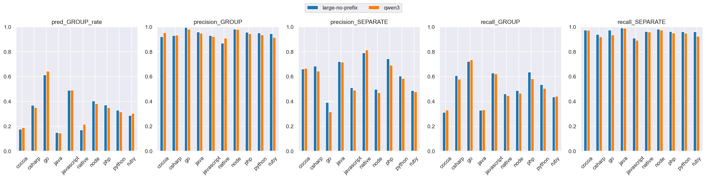
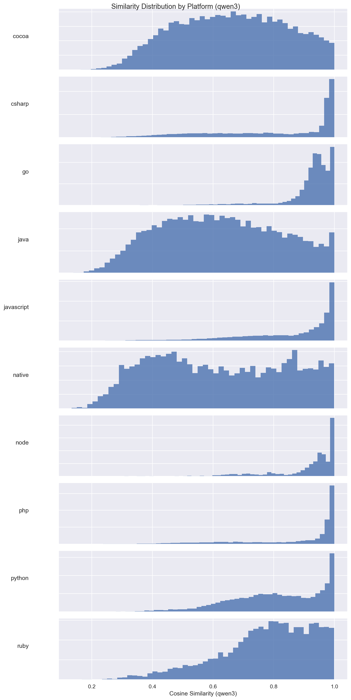
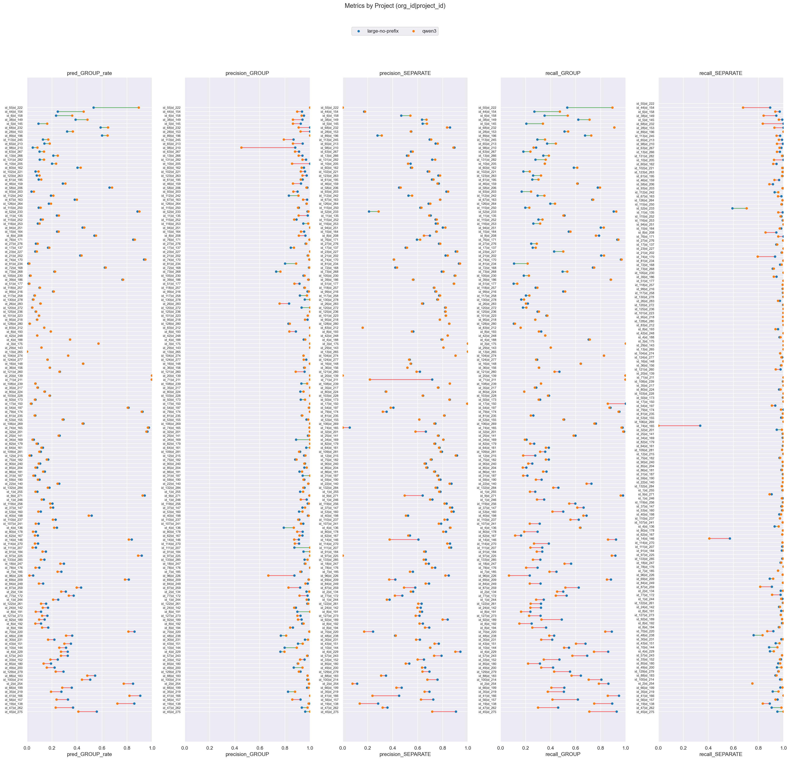

# large-no-prefix (dim=768) vs qwen3 (dim=768), dataset: test_full3

Command to repro:

```bash
python -m eval.compare \
    --gcs_model1 gs://$GROUPING_TRAINER_BUCKET/runs/2026-04-10-12-39-45-large-no-prefix/similarities/test_full3 \
    --threshold_model1 0.90 \
    --gcs_model2 gs://$GROUPING_TRAINER_BUCKET/runs/2026-04-08-00-14-53-qwen3/similarities/test_full3 \
    --threshold_model2 0.90 \
    --overwrite
```

### Column definitions

- **model**: The name of the model being evaluated.
- **pred_GROUP_rate**: The fraction of pairs this model groups together—lower means more separate issues are created. It's smaller than prod b/c the test dataset contains far more borderline cases; it's missing pairs that are very close.  This bias also means precision_GROUP is lower than what it'd be in prod.
- **precision_GROUP**: When the model groups a pair, how often is it correct? Higher = less over-grouping.
- **precision_SEPARATE**: When the model separates a pair, how often is it correct?
- **recall_GROUP**: Of all pairs that should be grouped, what fraction does the model correctly group? Higher = less under-grouping.
- **recall_SEPARATE**: Of all pairs that should be separate, what fraction does the model correctly separate?

## Aggregate results


### Overall metrics

| model           | pred_GROUP_rate | precision_GROUP | precision_SEPARATE | recall_GROUP | recall_SEPARATE |
|-----------------|-----------------|-----------------|--------------------|--------------|-----------------|
| large-no-prefix | 0.38            | 0.97            | 0.65               | 0.63         | 0.97            |
| qwen3           | 0.39            | 0.97            | 0.66               | 0.65         | 0.97            |

### Project-averaged metrics (152 projects)

| model           | pred_GROUP_rate | precision_GROUP | precision_SEPARATE | recall_GROUP | recall_SEPARATE |
|-----------------|-----------------|-----------------|--------------------|--------------|-----------------|
| large-no-prefix | 0.29            | 0.95            | 0.66               | 0.49         | 0.96            |
| qwen3           | 0.28            | 0.94            | 0.64               | 0.47         | 0.95            |

### Conditional probabilities

P(qwen3 GROUP | large-no-prefix GROUP)    = 0.8864

P(qwen3 GROUP | large-no-prefix SEPARATE) = 0.0889

P(qwen3 GROUP | large-no-prefix GROUP, distance < 0.005) = 0.9519  (n=8604)

### Thresholds

```json
{
  "large-no-prefix": 0.9,
  "qwen3": 0.9
}
```

### Distance distribution

| statistic  | value    |
|------------|----------|
| count      | 150303.0 |
| null_count | 0.0      |
| mean       | 0.042189 |
| std        | 0.032109 |
| min        | 0.000514 |
| 25%        | 0.016303 |
| 50%        | 0.035027 |
| 75%        | 0.063571 |
| max        | 0.245969 |

GROUP rate: 58.75%

### Platform stats

| platform   | n_pairs | n_projects | label_GROUP_rate | proportion |
|------------|---------|------------|------------------|------------|
| cocoa      | 30321   | 58         | 0.38             | 0.2        |
| csharp     | 21936   | 21         | 0.62             | 0.15       |
| go         | 17160   | 8          | 0.95             | 0.11       |
| java       | 17043   | 58         | 0.32             | 0.11       |
| javascript | 24492   | 53         | 0.73             | 0.16       |
| native     | 6560    | 41         | 0.31             | 0.04       |
| node       | 3242    | 12         | 0.88             | 0.02       |
| php        | 9592    | 8          | 0.75             | 0.06       |
| python     | 13428   | 8          | 0.57             | 0.09       |
| ruby       | 6529    | 8          | 0.59             | 0.04       |

### Short stacktraces (query_tokens <= p10 = 32 tokens, 15296 pairs)

label GROUP rate: 83.18%
| model           | pred_GROUP_rate | precision_GROUP | precision_SEPARATE | recall_GROUP | recall_SEPARATE |
|-----------------|-----------------|-----------------|--------------------|--------------|-----------------|
| large-no-prefix | 0.49            | 0.99            | 0.32               | 0.58         | 0.98            |
| qwen3           | 0.7             | 0.99            | 0.54               | 0.84         | 0.95            |

### Long stacktraces (query_tokens >= p90 = 764 tokens, 15036 pairs)

label GROUP rate: 59.37%
| model           | pred_GROUP_rate | precision_GROUP | precision_SEPARATE | recall_GROUP | recall_SEPARATE |
|-----------------|-----------------|-----------------|--------------------|--------------|-----------------|
| large-no-prefix | 0.41            | 0.96            | 0.66               | 0.66         | 0.96            |
| qwen3           | 0.4             | 0.96            | 0.65               | 0.64         | 0.96            |

## Threshold sweep


### Threshold sweep for large-no-prefix

| threshold | pred_GROUP_rate | precision_GROUP | precision_SEPARATE | recall_GROUP | recall_SEPARATE |
|-----------|-----------------|-----------------|--------------------|--------------|-----------------|
| 0.8       | 0.55            | 0.9             | 0.79               | 0.84         | 0.87            |
| 0.85      | 0.47            | 0.94            | 0.73               | 0.76         | 0.93            |
| 0.87      | 0.44            | 0.95            | 0.7                | 0.71         | 0.95            |
| 0.9       | 0.38            | 0.97            | 0.65               | 0.63         | 0.97            |

### Threshold sweep for qwen3

| threshold | pred_GROUP_rate | precision_GROUP | precision_SEPARATE | recall_GROUP | recall_SEPARATE |
|-----------|-----------------|-----------------|--------------------|--------------|-----------------|
| 0.8       | 0.53            | 0.91            | 0.77               | 0.82         | 0.88            |
| 0.85      | 0.47            | 0.95            | 0.72               | 0.75         | 0.94            |
| 0.87      | 0.44            | 0.96            | 0.7                | 0.72         | 0.95            |
| 0.9       | 0.39            | 0.97            | 0.66               | 0.65         | 0.97            |

## Platform-level results


### Metrics by platform, avg over projects (large-no-prefix, threshold=0.9)

| platform   | n_pairs | n_projects | label_GROUP_rate | min_threshold | pred_GROUP_rate | precision_GROUP | precision_SEPARATE | recall_GROUP | recall_SEPARATE |
|------------|---------|------------|------------------|---------------|-----------------|-----------------|--------------------|--------------|-----------------|
| cocoa      | 30321   | 58         | 0.38             | 0.9           | 0.177           | 0.92            | 0.661              | 0.312        | 0.973           |
| csharp     | 21936   | 21         | 0.617            | 0.9           | 0.368           | 0.93            | 0.683              | 0.608        | 0.94            |
| go         | 17160   | 8          | 0.953            | 0.9           | 0.614           | 0.995           | 0.392              | 0.722        | 0.974           |
| java       | 17043   | 58         | 0.322            | 0.9           | 0.15            | 0.959           | 0.72               | 0.33         | 0.991           |
| javascript | 24492   | 53         | 0.729            | 0.9           | 0.489           | 0.93            | 0.511              | 0.628        | 0.909           |
| native     | 6560    | 41         | 0.31             | 0.9           | 0.172           | 0.869           | 0.79               | 0.461        | 0.962           |
| node       | 3242    | 12         | 0.884            | 0.9           | 0.404           | 0.982           | 0.496              | 0.487        | 0.982           |
| php        | 9592    | 8          | 0.75             | 0.9           | 0.372           | 0.957           | 0.744              | 0.637        | 0.962           |
| python     | 13428   | 8          | 0.568            | 0.9           | 0.329           | 0.951           | 0.604              | 0.535        | 0.96            |
| ruby       | 6529    | 8          | 0.59             | 0.9           | 0.287           | 0.945           | 0.488              | 0.436        | 0.96            |

### Metrics by platform, avg over projects (qwen3, threshold=0.9)

| platform   | n_pairs | n_projects | label_GROUP_rate | min_threshold | pred_GROUP_rate | precision_GROUP | precision_SEPARATE | recall_GROUP | recall_SEPARATE |
|------------|---------|------------|------------------|---------------|-----------------|-----------------|--------------------|--------------|-----------------|
| cocoa      | 30321   | 58         | 0.38             | 0.9           | 0.189           | 0.952           | 0.667              | 0.33         | 0.973           |
| csharp     | 21936   | 21         | 0.617            | 0.9           | 0.352           | 0.934           | 0.644              | 0.579        | 0.921           |
| go         | 17160   | 8          | 0.953            | 0.9           | 0.644           | 0.982           | 0.315              | 0.735        | 0.935           |
| java       | 17043   | 58         | 0.322            | 0.9           | 0.146           | 0.949           | 0.717              | 0.334        | 0.99            |
| javascript | 24492   | 53         | 0.729            | 0.9           | 0.491           | 0.922           | 0.491              | 0.624        | 0.891           |
| native     | 6560    | 41         | 0.31             | 0.9           | 0.217           | 0.909           | 0.813              | 0.447        | 0.959           |
| node       | 3242    | 12         | 0.884            | 0.9           | 0.382           | 0.979           | 0.471              | 0.466        | 0.974           |
| php        | 9592    | 8          | 0.75             | 0.9           | 0.35            | 0.946           | 0.692              | 0.583        | 0.952           |
| python     | 13428   | 8          | 0.568            | 0.9           | 0.315           | 0.935           | 0.585              | 0.505        | 0.95            |
| ruby       | 6529    | 8          | 0.59             | 0.9           | 0.304           | 0.915           | 0.478              | 0.442        | 0.925           |

### Min threshold for >= 95% avg project precision_GROUP by platform (large-no-prefix)

| platform   | n_pairs | n_projects | label_GROUP_rate | min_threshold | pred_GROUP_rate | precision_GROUP | precision_SEPARATE | recall_GROUP | recall_SEPARATE |
|------------|---------|------------|------------------|---------------|-----------------|-----------------|--------------------|--------------|-----------------|
| cocoa      | 30321   | 58         | 0.38             | 0.94          | 0.136           | 0.964           | 0.637              | 0.216        | 0.985           |
| csharp     | 21936   | 21         | 0.617            | 0.93          | 0.316           | 0.956           | 0.619              | 0.523        | 0.956           |
| go         | 17160   | 8          | 0.953            | 0.8           | 0.771           | 0.959           | 0.474              | 0.879        | 0.731           |
| java       | 17043   | 58         | 0.322            | 0.89          | 0.159           | 0.952           | 0.725              | 0.353        | 0.987           |
| javascript | 24492   | 53         | 0.729            | 0.93          | 0.408           | 0.953           | 0.457              | 0.516        | 0.944           |
| native     | 6560    | 41         | 0.31             | 0.96          | 0.108           | 0.954           | 0.751              | 0.272        | 0.997           |
| node       | 3242    | 12         | 0.884            | 0.86          | 0.548           | 0.957           | 0.583              | 0.641        | 0.962           |
| php        | 9592    | 8          | 0.75             | 0.89          | 0.386           | 0.952           | 0.762              | 0.669        | 0.956           |
| python     | 13428   | 8          | 0.568            | 0.9           | 0.329           | 0.951           | 0.604              | 0.535        | 0.96            |
| ruby       | 6529    | 8          | 0.59             | 0.91          | 0.26            | 0.955           | 0.476              | 0.399        | 0.969           |

### Min threshold for >= 95% avg project precision_GROUP by platform (qwen3)

| platform   | n_pairs | n_projects | label_GROUP_rate | min_threshold | pred_GROUP_rate | precision_GROUP | precision_SEPARATE | recall_GROUP | recall_SEPARATE |
|------------|---------|------------|------------------|---------------|-----------------|-----------------|--------------------|--------------|-----------------|
| cocoa      | 30321   | 58         | 0.38             | 0.9           | 0.189           | 0.952           | 0.667              | 0.33         | 0.973           |
| csharp     | 21936   | 21         | 0.617            | 0.94          | 0.287           | 0.957           | 0.596              | 0.462        | 0.957           |
| go         | 17160   | 8          | 0.953            | 0.85          | 0.716           | 0.963           | 0.347              | 0.812        | 0.827           |
| java       | 17043   | 58         | 0.322            | 0.91          | 0.134           | 0.959           | 0.707              | 0.305        | 0.993           |
| javascript | 24492   | 53         | 0.729            | 0.93          | 0.402           | 0.954           | 0.445              | 0.523        | 0.943           |
| native     | 6560    | 41         | 0.31             | 0.98          | 0.027           | 0.993           | 0.687              | 0.104        | 0.999           |
| node       | 3242    | 12         | 0.884            | 0.86          | 0.533           | 0.952           | 0.546              | 0.616        | 0.933           |
| php        | 9592    | 8          | 0.75             | 0.91          | 0.326           | 0.953           | 0.672              | 0.533        | 0.962           |
| python     | 13428   | 8          | 0.568            | 0.94          | 0.231           | 0.951           | 0.531              | 0.371        | 0.97            |
| ruby       | 6529    | 8          | 0.59             | 0.97          | 0.092           | 0.957           | 0.406              | 0.149        | 0.992           |

<details>
<summary>Metrics by platform</summary>


</details>


<details>
<summary>Similarity distribution (large-no-prefix)</summary>


</details>


<details>
<summary>Similarity distribution (qwen3)</summary>


</details>


## Project-level results

**Project win rate for qwen3**: 19/152 (12%) projects where both precision_GROUP and recall_GROUP are higher


<details>
<summary>Dumbbell by project</summary>


</details>


### >= 15% group rate increase (stratified by platform)

| org_id | project_id | platform | n_pairs | label_GROUP_rate | large-no-prefix_GROUP_rate | large-no-prefix_prec | large-no-prefix_rec | qwen3_GROUP_rate | qwen3_prec | qwen3_rec | group_rate_increase |
|--------|------------|----------|---------|------------------|----------------------------|----------------------|---------------------|------------------|------------|-----------|---------------------|
| id_55  | id_222     | go       | 9407    | 1.0              | 0.53                       | 1.0                  | 0.53                | 0.89             | 1.0        | 0.89      | 0.36                |
| id_44  | id_154     | ruby     | 1026    | 0.86             | 0.25                       | 0.94                 | 0.27                | 0.45             | 0.9        | 0.47      | 0.21                |

### >= 10% group rate decrease

| org_id | project_id | platform   | n_pairs | label_GROUP_rate | large-no-prefix_GROUP_rate | large-no-prefix_prec | large-no-prefix_rec | qwen3_GROUP_rate | qwen3_prec | qwen3_rec | group_rate_decrease |
|--------|------------|------------|---------|------------------|----------------------------|----------------------|---------------------|------------------|------------|-----------|---------------------|
| id_45  | id_275     | php        | 95      | 0.58             | 0.56                       | 0.96                 | 0.93                | 0.41             | 1.0        | 0.71      | 0.15                |
| id_47  | id_262     | javascript | 881     | 0.75             | 0.37                       | 0.94                 | 0.46                | 0.23             | 0.98       | 0.3       | 0.14                |
| id_19  | id_138     | javascript | 790     | 0.95             | 0.86                       | 0.99                 | 0.89                | 0.72             | 0.99       | 0.75      | 0.14                |


---

_Real report with original org/project IDs at_ `gs://$GROUPING_TRAINER_BUCKET/eval/comparisons/test_full3/large-no-prefix_dim768_vs_qwen3_dim768/`
