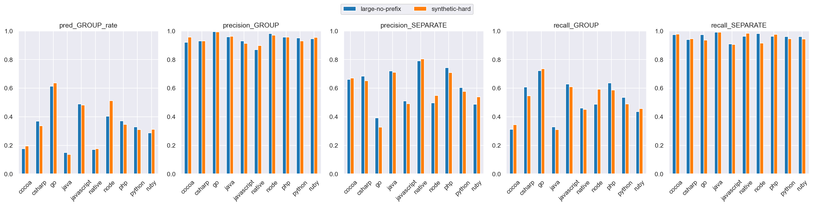
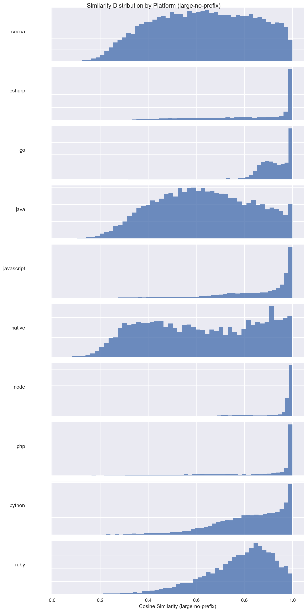
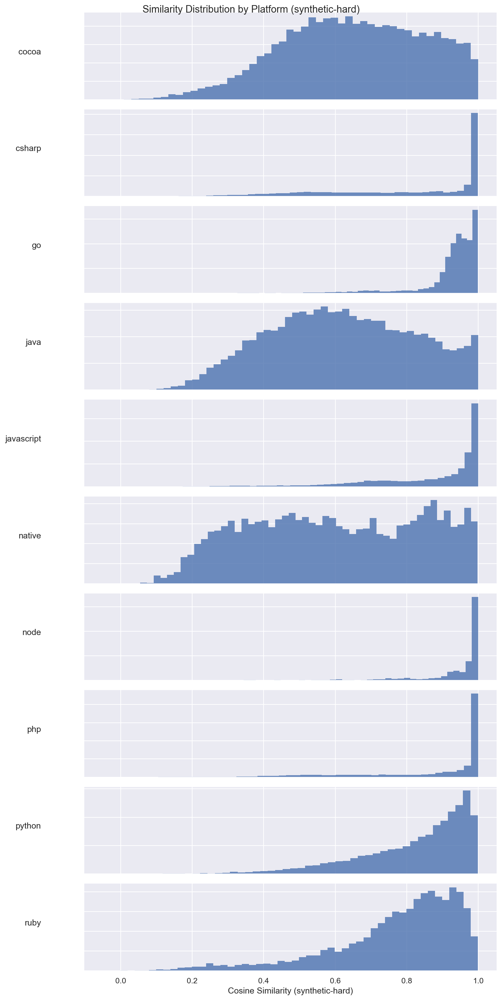
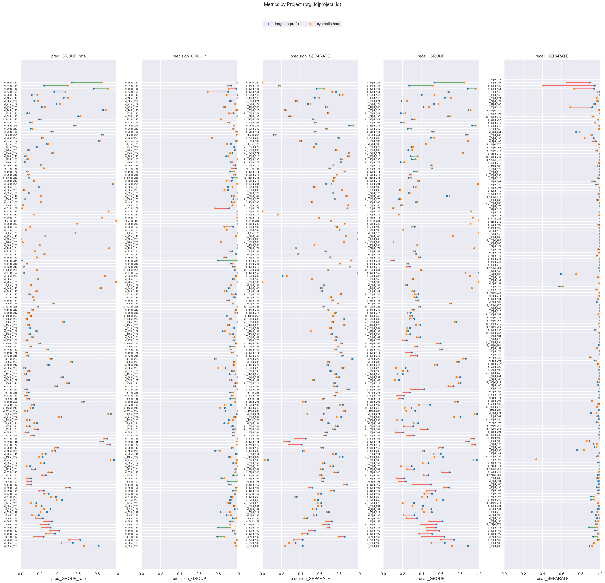

# large-no-prefix (dim=768) vs synthetic-hard (dim=768), dataset: test_full3

Command to repro:

```bash
python -m eval.compare \
    --name_model1 large-no-prefix \
    --gcs_model1 gs://$GROUPING_TRAINER_BUCKET/runs/2026-04-10-12-39-45-large-no-prefix/similarities/test_full3 \
    --threshold_model1 0.90 \
    --name_model2 synthetic-hard \
    --gcs_model2 gs://$GROUPING_TRAINER_BUCKET/runs/2026-05-31-19-56-46-synthetic-hard/similarities/test_full3 \
    --threshold_model2 0.91 \
    --overwrite
```

### Column definitions

- **model**: The name of the model being evaluated.
- **pred_GROUP_rate**: The fraction of pairs this model groups together—lower means more separate issues are created. It's smaller than prod b/c the test dataset contains far more borderline cases; it's missing pairs that are very close.  This bias also means precision_GROUP is lower than what it'd be in prod.
- **precision_GROUP**: When the model groups a pair, how often is it correct? Higher = less over-grouping.
- **precision_SEPARATE**: When the model separates a pair, how often is it correct?
- **recall_GROUP**: Of all pairs that should be grouped, what fraction does the model correctly group? Higher = less under-grouping.
- **recall_SEPARATE**: Of all pairs that should be separate, what fraction does the model correctly separate?

## Aggregate results


### Overall metrics

| model           | pred_GROUP_rate | precision_GROUP | precision_SEPARATE | recall_GROUP | recall_SEPARATE |
|-----------------|-----------------|-----------------|--------------------|--------------|-----------------|
| large-no-prefix | 0.38            | 0.97            | 0.65               | 0.63         | 0.97            |
| synthetic-hard  | 0.39            | 0.97            | 0.66               | 0.64         | 0.97            |

### Project-averaged metrics (152 projects)

| model           | pred_GROUP_rate | precision_GROUP | precision_SEPARATE | recall_GROUP | recall_SEPARATE |
|-----------------|-----------------|-----------------|--------------------|--------------|-----------------|
| large-no-prefix | 0.29            | 0.95            | 0.66               | 0.49         | 0.96            |
| synthetic-hard  | 0.28            | 0.95            | 0.64               | 0.46         | 0.96            |

### Conditional probabilities

P(synthetic-hard GROUP | large-no-prefix GROUP)    = 0.9056

P(synthetic-hard GROUP | large-no-prefix SEPARATE) = 0.0716

P(synthetic-hard GROUP | large-no-prefix GROUP, distance < 0.005) = 0.9608  (n=8604)

### Thresholds

```json
{
  "large-no-prefix": 0.9,
  "synthetic-hard": 0.91
}
```

### Distance distribution

| statistic  | value    |
|------------|----------|
| count      | 150303.0 |
| null_count | 0.0      |
| mean       | 0.042189 |
| std        | 0.032109 |
| min        | 0.000514 |
| 25%        | 0.016303 |
| 50%        | 0.035027 |
| 75%        | 0.063571 |
| max        | 0.245969 |

GROUP rate: 58.75%

### Platform stats

| platform   | n_pairs | n_projects | label_GROUP_rate | proportion |
|------------|---------|------------|------------------|------------|
| cocoa      | 30321   | 58         | 0.38             | 0.2        |
| csharp     | 21936   | 21         | 0.62             | 0.15       |
| go         | 17160   | 8          | 0.95             | 0.11       |
| java       | 17043   | 58         | 0.32             | 0.11       |
| javascript | 24492   | 53         | 0.73             | 0.16       |
| native     | 6560    | 41         | 0.31             | 0.04       |
| node       | 3242    | 12         | 0.88             | 0.02       |
| php        | 9592    | 8          | 0.75             | 0.06       |
| python     | 13428   | 8          | 0.57             | 0.09       |
| ruby       | 6529    | 8          | 0.59             | 0.04       |

### Short stacktraces (query_tokens <= p10 = 32 tokens, 15296 pairs)

label GROUP rate: 83.18%
| model           | pred_GROUP_rate | precision_GROUP | precision_SEPARATE | recall_GROUP | recall_SEPARATE |
|-----------------|-----------------|-----------------|--------------------|--------------|-----------------|
| large-no-prefix | 0.49            | 0.99            | 0.32               | 0.58         | 0.98            |
| synthetic-hard  | 0.68            | 1.0             | 0.51               | 0.81         | 0.98            |

### Long stacktraces (query_tokens >= p90 = 764 tokens, 15036 pairs)

label GROUP rate: 59.37%
| model           | pred_GROUP_rate | precision_GROUP | precision_SEPARATE | recall_GROUP | recall_SEPARATE |
|-----------------|-----------------|-----------------|--------------------|--------------|-----------------|
| large-no-prefix | 0.41            | 0.96            | 0.66               | 0.66         | 0.96            |
| synthetic-hard  | 0.37            | 0.97            | 0.63               | 0.6          | 0.97            |

## Threshold sweep


### Threshold sweep for large-no-prefix

| threshold | pred_GROUP_rate | precision_GROUP | precision_SEPARATE | recall_GROUP | recall_SEPARATE |
|-----------|-----------------|-----------------|--------------------|--------------|-----------------|
| 0.8       | 0.55            | 0.9             | 0.79               | 0.84         | 0.87            |
| 0.85      | 0.47            | 0.94            | 0.73               | 0.76         | 0.93            |
| 0.87      | 0.44            | 0.95            | 0.7                | 0.71         | 0.95            |
| 0.9       | 0.38            | 0.97            | 0.65               | 0.63         | 0.97            |

### Threshold sweep for synthetic-hard

| threshold | pred_GROUP_rate | precision_GROUP | precision_SEPARATE | recall_GROUP | recall_SEPARATE |
|-----------|-----------------|-----------------|--------------------|--------------|-----------------|
| 0.8       | 0.54            | 0.9             | 0.78               | 0.83         | 0.86            |
| 0.85      | 0.48            | 0.93            | 0.73               | 0.76         | 0.92            |
| 0.87      | 0.46            | 0.94            | 0.71               | 0.73         | 0.94            |
| 0.9       | 0.41            | 0.96            | 0.67               | 0.67         | 0.96            |

## Platform-level results


### Metrics by platform, avg over projects (large-no-prefix, threshold=0.9)

| platform   | n_pairs | n_projects | label_GROUP_rate | min_threshold | pred_GROUP_rate | precision_GROUP | precision_SEPARATE | recall_GROUP | recall_SEPARATE |
|------------|---------|------------|------------------|---------------|-----------------|-----------------|--------------------|--------------|-----------------|
| cocoa      | 30321   | 58         | 0.38             | 0.9           | 0.177           | 0.92            | 0.661              | 0.312        | 0.973           |
| csharp     | 21936   | 21         | 0.617            | 0.9           | 0.368           | 0.93            | 0.683              | 0.608        | 0.94            |
| go         | 17160   | 8          | 0.953            | 0.9           | 0.614           | 0.995           | 0.392              | 0.722        | 0.974           |
| java       | 17043   | 58         | 0.322            | 0.9           | 0.15            | 0.959           | 0.72               | 0.33         | 0.991           |
| javascript | 24492   | 53         | 0.729            | 0.9           | 0.489           | 0.93            | 0.511              | 0.628        | 0.909           |
| native     | 6560    | 41         | 0.31             | 0.9           | 0.172           | 0.869           | 0.79               | 0.461        | 0.962           |
| node       | 3242    | 12         | 0.884            | 0.9           | 0.404           | 0.982           | 0.496              | 0.487        | 0.982           |
| php        | 9592    | 8          | 0.75             | 0.9           | 0.372           | 0.957           | 0.744              | 0.637        | 0.962           |
| python     | 13428   | 8          | 0.568            | 0.9           | 0.329           | 0.951           | 0.604              | 0.535        | 0.96            |
| ruby       | 6529    | 8          | 0.59             | 0.9           | 0.287           | 0.945           | 0.488              | 0.436        | 0.96            |

### Metrics by platform, avg over projects (synthetic-hard, threshold=0.91)

| platform   | n_pairs | n_projects | label_GROUP_rate | min_threshold | pred_GROUP_rate | precision_GROUP | precision_SEPARATE | recall_GROUP | recall_SEPARATE |
|------------|---------|------------|------------------|---------------|-----------------|-----------------|--------------------|--------------|-----------------|
| cocoa      | 30321   | 58         | 0.38             | 0.91          | 0.195           | 0.957           | 0.67               | 0.344        | 0.978           |
| csharp     | 21936   | 21         | 0.617            | 0.91          | 0.337           | 0.931           | 0.652              | 0.547        | 0.946           |
| go         | 17160   | 8          | 0.953            | 0.91          | 0.637           | 0.993           | 0.327              | 0.735        | 0.936           |
| java       | 17043   | 58         | 0.322            | 0.91          | 0.137           | 0.963           | 0.71               | 0.31         | 0.99            |
| javascript | 24492   | 53         | 0.729            | 0.91          | 0.482           | 0.912           | 0.49               | 0.609        | 0.904           |
| native     | 6560    | 41         | 0.31             | 0.91          | 0.176           | 0.897           | 0.804              | 0.451        | 0.983           |
| node       | 3242    | 12         | 0.884            | 0.91          | 0.512           | 0.971           | 0.548              | 0.592        | 0.914           |
| php        | 9592    | 8          | 0.75             | 0.91          | 0.346           | 0.957           | 0.709              | 0.586        | 0.975           |
| python     | 13428   | 8          | 0.568            | 0.91          | 0.311           | 0.929           | 0.576              | 0.49         | 0.945           |
| ruby       | 6529    | 8          | 0.59             | 0.91          | 0.311           | 0.954           | 0.54               | 0.457        | 0.944           |

### Min threshold for >= 95% avg project precision_GROUP by platform (large-no-prefix)

| platform   | n_pairs | n_projects | label_GROUP_rate | min_threshold | pred_GROUP_rate | precision_GROUP | precision_SEPARATE | recall_GROUP | recall_SEPARATE |
|------------|---------|------------|------------------|---------------|-----------------|-----------------|--------------------|--------------|-----------------|
| cocoa      | 30321   | 58         | 0.38             | 0.94          | 0.136           | 0.964           | 0.637              | 0.216        | 0.985           |
| csharp     | 21936   | 21         | 0.617            | 0.93          | 0.316           | 0.956           | 0.619              | 0.523        | 0.956           |
| go         | 17160   | 8          | 0.953            | 0.8           | 0.771           | 0.959           | 0.474              | 0.879        | 0.731           |
| java       | 17043   | 58         | 0.322            | 0.89          | 0.159           | 0.952           | 0.725              | 0.353        | 0.987           |
| javascript | 24492   | 53         | 0.729            | 0.93          | 0.408           | 0.953           | 0.457              | 0.516        | 0.944           |
| native     | 6560    | 41         | 0.31             | 0.96          | 0.108           | 0.954           | 0.751              | 0.272        | 0.997           |
| node       | 3242    | 12         | 0.884            | 0.86          | 0.548           | 0.957           | 0.583              | 0.641        | 0.962           |
| php        | 9592    | 8          | 0.75             | 0.89          | 0.386           | 0.952           | 0.762              | 0.669        | 0.956           |
| python     | 13428   | 8          | 0.568            | 0.9           | 0.329           | 0.951           | 0.604              | 0.535        | 0.96            |
| ruby       | 6529    | 8          | 0.59             | 0.91          | 0.26            | 0.955           | 0.476              | 0.399        | 0.969           |

### Min threshold for >= 95% avg project precision_GROUP by platform (synthetic-hard)

| platform   | n_pairs | n_projects | label_GROUP_rate | min_threshold | pred_GROUP_rate | precision_GROUP | precision_SEPARATE | recall_GROUP | recall_SEPARATE |
|------------|---------|------------|------------------|---------------|-----------------|-----------------|--------------------|--------------|-----------------|
| cocoa      | 30321   | 58         | 0.38             | 0.91          | 0.195           | 0.957           | 0.67               | 0.344        | 0.978           |
| csharp     | 21936   | 21         | 0.617            | 0.93          | 0.311           | 0.952           | 0.632              | 0.501        | 0.956           |
| go         | 17160   | 8          | 0.953            | 0.8           | 0.753           | 0.952           | 0.441              | 0.849        | 0.743           |
| java       | 17043   | 58         | 0.322            | 0.89          | 0.156           | 0.954           | 0.723              | 0.358        | 0.986           |
| javascript | 24492   | 53         | 0.729            | 0.95          | 0.363           | 0.952           | 0.428              | 0.447        | 0.961           |
| native     | 6560    | 41         | 0.31             | 0.95          | 0.141           | 0.954           | 0.777              | 0.332        | 0.992           |
| node       | 3242    | 12         | 0.884            | 0.89          | 0.527           | 0.959           | 0.569              | 0.604        | 0.895           |
| php        | 9592    | 8          | 0.75             | 0.9           | 0.364           | 0.951           | 0.729              | 0.623        | 0.972           |
| python     | 13428   | 8          | 0.568            | 0.94          | 0.223           | 0.957           | 0.529              | 0.365        | 0.978           |
| ruby       | 6529    | 8          | 0.59             | 0.91          | 0.311           | 0.954           | 0.54               | 0.457        | 0.944           |

<details>
<summary>Metrics by platform</summary>


</details>


<details>
<summary>Similarity distribution (large-no-prefix)</summary>


</details>


<details>
<summary>Similarity distribution (synthetic-hard)</summary>


</details>


## Project-level results

**Project win rate for synthetic-hard**: 15/152 (10%) projects where both precision_GROUP and recall_GROUP are higher


<details>
<summary>Dumbbell by project</summary>


</details>


### >= 15% group rate increase (stratified by platform)

| org_id | project_id | platform | n_pairs | label_GROUP_rate | large-no-prefix_GROUP_rate | large-no-prefix_prec | large-no-prefix_rec | synthetic-hard_GROUP_rate | synthetic-hard_prec | synthetic-hard_rec | group_rate_increase |
|--------|------------|----------|---------|------------------|----------------------------|----------------------|---------------------|---------------------------|---------------------|--------------------|---------------------|
| id_55  | id_222     | go       | 9407    | 1.0              | 0.53                       | 1.0                  | 0.53                | 0.85                      | 1.0                 | 0.85               | 0.31                |
| id_44  | id_154     | ruby     | 1026    | 0.86             | 0.25                       | 0.94                 | 0.27                | 0.49                      | 0.9                 | 0.52               | 0.24                |

### >= 10% group rate decrease

| org_id | project_id | platform   | n_pairs | label_GROUP_rate | large-no-prefix_GROUP_rate | large-no-prefix_prec | large-no-prefix_rec | synthetic-hard_GROUP_rate | synthetic-hard_prec | synthetic-hard_rec | group_rate_decrease |
|--------|------------|------------|---------|------------------|----------------------------|----------------------|---------------------|---------------------------|---------------------|--------------------|---------------------|
| id_69  | id_209     | javascript | 409     | 0.91             | 0.81                       | 0.99                 | 0.88                | 0.66                      | 0.99                | 0.72               | 0.15                |
| id_88  | id_183     | go         | 2481    | 0.83             | 0.54                       | 0.98                 | 0.64                | 0.43                      | 0.98                | 0.5                | 0.12                |
| id_72  | id_168     | javascript | 1924    | 0.84             | 0.62                       | 0.99                 | 0.74                | 0.51                      | 1.0                 | 0.6                | 0.12                |
| id_4   | id_136     | csharp     | 991     | 0.3              | 0.24                       | 0.79                 | 0.64                | 0.14                      | 0.86                | 0.4                | 0.1                 |


---

_Real report with original org/project IDs at_ `gs://$GROUPING_TRAINER_BUCKET/eval/comparisons/test_full3/large-no-prefix_dim768_vs_synthetic-hard_dim768/`
