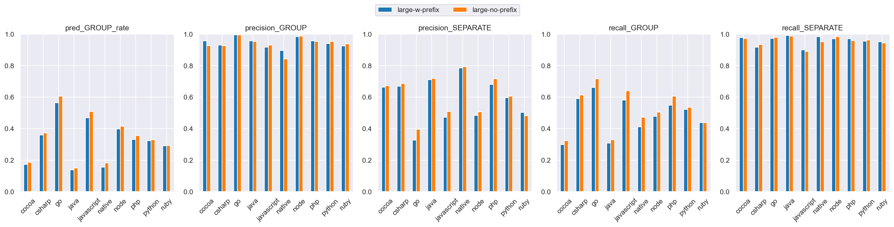
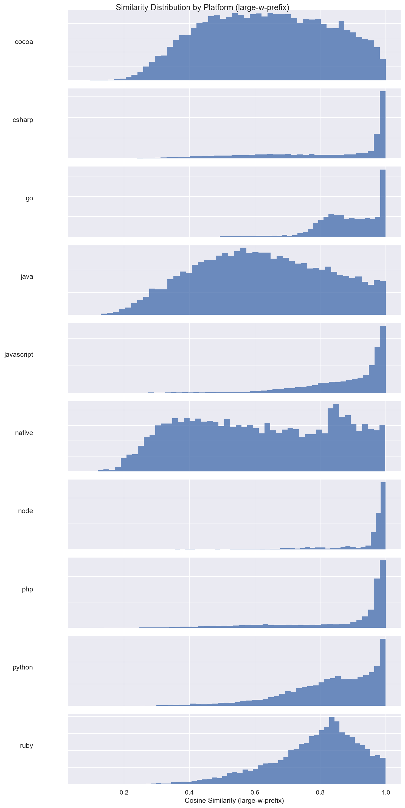
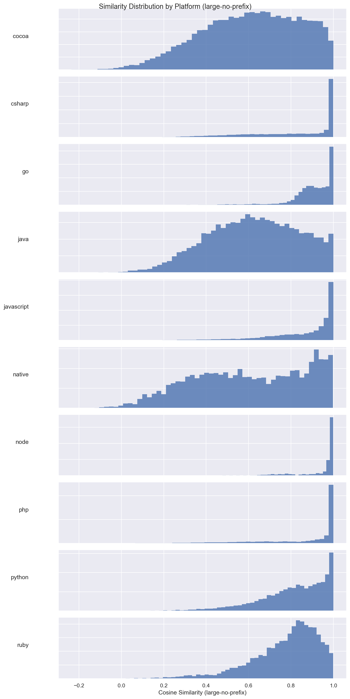
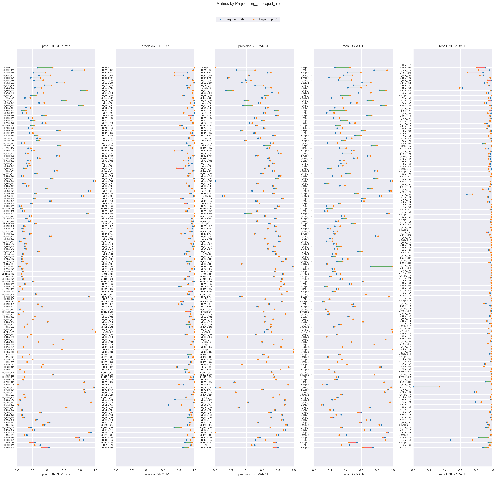

# large-w-prefix (dim=768) vs large-no-prefix (dim=64), dataset: test_full3

Command to repro:

```bash
python -m eval.compare \
    --gcs_model1 gs://$GROUPING_TRAINER_BUCKET/runs/2026-04-07-11-56-28-large-w-prefix/similarities/test_full3 \
    --threshold_model1 0.90 \
    --gcs_model2 gs://$GROUPING_TRAINER_BUCKET/runs/2026-04-10-12-39-45-large-no-prefix/similarities/test_full3 \
    --threshold_model2 0.90 \
    --dim_model2 64 \
    --overwrite
```

### Column definitions

- **model**: The name of the model being evaluated.
- **pred_GROUP_rate**: The fraction of pairs this model groups together—lower means more separate issues are created. It's smaller than prod b/c the test dataset contains far more borderline cases; it's missing pairs that are very close.  This bias also means precision_GROUP is lower than what it'd be in prod.
- **precision_GROUP**: When the model groups a pair, how often is it correct? Higher = less over-grouping.
- **precision_SEPARATE**: When the model separates a pair, how often is it correct?
- **recall_GROUP**: Of all pairs that should be grouped, what fraction does the model correctly group? Higher = less under-grouping.
- **recall_SEPARATE**: Of all pairs that should be separate, what fraction does the model correctly separate?

## Aggregate results


### Overall metrics

| model           | pred_GROUP_rate | precision_GROUP | precision_SEPARATE | recall_GROUP | recall_SEPARATE |
|-----------------|-----------------|-----------------|--------------------|--------------|-----------------|
| large-w-prefix  | 0.35            | 0.97            | 0.62               | 0.58         | 0.97            |
| large-no-prefix | 0.38            | 0.97            | 0.65               | 0.62         | 0.97            |

### Project-averaged metrics (152 projects)

| model           | pred_GROUP_rate | precision_GROUP | precision_SEPARATE | recall_GROUP | recall_SEPARATE |
|-----------------|-----------------|-----------------|--------------------|--------------|-----------------|
| large-w-prefix  | 0.27            | 0.94            | 0.64               | 0.45         | 0.96            |
| large-no-prefix | 0.29            | 0.94            | 0.66               | 0.49         | 0.96            |

### Conditional probabilities

P(large-no-prefix GROUP | large-w-prefix GROUP)    = 0.9400

P(large-no-prefix GROUP | large-w-prefix SEPARATE) = 0.0729

P(large-no-prefix GROUP | large-w-prefix GROUP, distance < 0.005) = 0.9784  (n=8465)

### Thresholds

```json
{
  "large-w-prefix": 0.9,
  "large-no-prefix": 0.9
}
```

### Distance distribution

| statistic  | value    |
|------------|----------|
| count      | 150303.0 |
| null_count | 0.0      |
| mean       | 0.042189 |
| std        | 0.032109 |
| min        | 0.000514 |
| 25%        | 0.016303 |
| 50%        | 0.035027 |
| 75%        | 0.063571 |
| max        | 0.245969 |

GROUP rate: 58.75%

### Platform stats

| platform   | n_pairs | n_projects | label_GROUP_rate | proportion |
|------------|---------|------------|------------------|------------|
| cocoa      | 30321   | 58         | 0.38             | 0.2        |
| csharp     | 21936   | 21         | 0.62             | 0.15       |
| go         | 17160   | 8          | 0.95             | 0.11       |
| java       | 17043   | 58         | 0.32             | 0.11       |
| javascript | 24492   | 53         | 0.73             | 0.16       |
| native     | 6560    | 41         | 0.31             | 0.04       |
| node       | 3242    | 12         | 0.88             | 0.02       |
| php        | 9592    | 8          | 0.75             | 0.06       |
| python     | 13428   | 8          | 0.57             | 0.09       |
| ruby       | 6529    | 8          | 0.59             | 0.04       |

### Short stacktraces (query_tokens <= p10 = 32 tokens, 15296 pairs)

label GROUP rate: 83.18%
| model           | pred_GROUP_rate | precision_GROUP | precision_SEPARATE | recall_GROUP | recall_SEPARATE |
|-----------------|-----------------|-----------------|--------------------|--------------|-----------------|
| large-w-prefix  | 0.32            | 0.97            | 0.24               | 0.37         | 0.95            |
| large-no-prefix | 0.44            | 0.99            | 0.29               | 0.52         | 0.98            |

### Long stacktraces (query_tokens >= p90 = 764 tokens, 15036 pairs)

label GROUP rate: 59.37%
| model           | pred_GROUP_rate | precision_GROUP | precision_SEPARATE | recall_GROUP | recall_SEPARATE |
|-----------------|-----------------|-----------------|--------------------|--------------|-----------------|
| large-w-prefix  | 0.4             | 0.96            | 0.65               | 0.64         | 0.96            |
| large-no-prefix | 0.4             | 0.96            | 0.65               | 0.65         | 0.96            |

## Threshold sweep


### Threshold sweep for large-w-prefix

| threshold | pred_GROUP_rate | precision_GROUP | precision_SEPARATE | recall_GROUP | recall_SEPARATE |
|-----------|-----------------|-----------------|--------------------|--------------|-----------------|
| 0.8       | 0.54            | 0.89            | 0.76               | 0.81         | 0.86            |
| 0.85      | 0.44            | 0.93            | 0.69               | 0.71         | 0.93            |
| 0.87      | 0.41            | 0.95            | 0.66               | 0.66         | 0.95            |
| 0.9       | 0.35            | 0.97            | 0.62               | 0.58         | 0.97            |

### Threshold sweep for large-no-prefix

| threshold | pred_GROUP_rate | precision_GROUP | precision_SEPARATE | recall_GROUP | recall_SEPARATE |
|-----------|-----------------|-----------------|--------------------|--------------|-----------------|
| 0.8       | 0.54            | 0.9             | 0.78               | 0.83         | 0.87            |
| 0.85      | 0.47            | 0.94            | 0.72               | 0.75         | 0.93            |
| 0.87      | 0.43            | 0.95            | 0.69               | 0.7          | 0.95            |
| 0.9       | 0.38            | 0.97            | 0.65               | 0.62         | 0.97            |

## Platform-level results


### Metrics by platform, avg over projects (large-w-prefix, threshold=0.9)

| platform   | n_pairs | n_projects | label_GROUP_rate | min_threshold | pred_GROUP_rate | precision_GROUP | precision_SEPARATE | recall_GROUP | recall_SEPARATE |
|------------|---------|------------|------------------|---------------|-----------------|-----------------|--------------------|--------------|-----------------|
| cocoa      | 30321   | 58         | 0.38             | 0.9           | 0.173           | 0.956           | 0.662              | 0.299        | 0.978           |
| csharp     | 21936   | 21         | 0.617            | 0.9           | 0.359           | 0.931           | 0.668              | 0.591        | 0.917           |
| go         | 17160   | 8          | 0.953            | 0.9           | 0.564           | 0.994           | 0.328              | 0.662        | 0.971           |
| java       | 17043   | 58         | 0.322            | 0.9           | 0.138           | 0.956           | 0.711              | 0.308        | 0.991           |
| javascript | 24492   | 53         | 0.729            | 0.9           | 0.468           | 0.916           | 0.472              | 0.581        | 0.899           |
| native     | 6560    | 41         | 0.31             | 0.9           | 0.155           | 0.895           | 0.785              | 0.41         | 0.984           |
| node       | 3242    | 12         | 0.884            | 0.9           | 0.397           | 0.983           | 0.484              | 0.478        | 0.97            |
| php        | 9592    | 8          | 0.75             | 0.9           | 0.331           | 0.957           | 0.681              | 0.549        | 0.97            |
| python     | 13428   | 8          | 0.568            | 0.9           | 0.323           | 0.94            | 0.597              | 0.522        | 0.955           |
| ruby       | 6529    | 8          | 0.59             | 0.9           | 0.29            | 0.924           | 0.502              | 0.437        | 0.951           |

### Metrics by platform, avg over projects (large-no-prefix, threshold=0.9)

| platform   | n_pairs | n_projects | label_GROUP_rate | min_threshold | pred_GROUP_rate | precision_GROUP | precision_SEPARATE | recall_GROUP | recall_SEPARATE |
|------------|---------|------------|------------------|---------------|-----------------|-----------------|--------------------|--------------|-----------------|
| cocoa      | 30321   | 58         | 0.38             | 0.9           | 0.187           | 0.926           | 0.672              | 0.323        | 0.971           |
| csharp     | 21936   | 21         | 0.617            | 0.9           | 0.373           | 0.927           | 0.686              | 0.613        | 0.934           |
| go         | 17160   | 8          | 0.953            | 0.9           | 0.606           | 0.994           | 0.395              | 0.716        | 0.98            |
| java       | 17043   | 58         | 0.322            | 0.9           | 0.15            | 0.953           | 0.718              | 0.33         | 0.988           |
| javascript | 24492   | 53         | 0.729            | 0.9           | 0.509           | 0.93            | 0.508              | 0.64         | 0.891           |
| native     | 6560    | 41         | 0.31             | 0.9           | 0.182           | 0.843           | 0.793              | 0.472        | 0.951           |
| node       | 3242    | 12         | 0.884            | 0.9           | 0.416           | 0.987           | 0.507              | 0.504        | 0.982           |
| php        | 9592    | 8          | 0.75             | 0.9           | 0.356           | 0.953           | 0.716              | 0.606        | 0.958           |
| python     | 13428   | 8          | 0.568            | 0.9           | 0.33            | 0.953           | 0.607              | 0.535        | 0.962           |
| ruby       | 6529    | 8          | 0.59             | 0.9           | 0.292           | 0.938           | 0.482              | 0.439        | 0.943           |

### Min threshold for >= 95% avg project precision_GROUP by platform (large-w-prefix)

| platform   | n_pairs | n_projects | label_GROUP_rate | min_threshold | pred_GROUP_rate | precision_GROUP | precision_SEPARATE | recall_GROUP | recall_SEPARATE |
|------------|---------|------------|------------------|---------------|-----------------|-----------------|--------------------|--------------|-----------------|
| cocoa      | 30321   | 58         | 0.38             | 0.9           | 0.173           | 0.956           | 0.662              | 0.299        | 0.978           |
| csharp     | 21936   | 21         | 0.617            | 0.93          | 0.309           | 0.952           | 0.61               | 0.506        | 0.954           |
| go         | 17160   | 8          | 0.953            | 0.78          | 0.765           | 0.951           | 0.502              | 0.864        | 0.716           |
| java       | 17043   | 58         | 0.322            | 0.89          | 0.149           | 0.952           | 0.717              | 0.337        | 0.987           |
| javascript | 24492   | 53         | 0.729            | 0.96          | 0.296           | 0.967           | 0.391              | 0.353        | 0.979           |
| native     | 6560    | 41         | 0.31             | 0.97          | 0.063           | 1.0             | 0.711              | 0.166        | 1.0             |
| node       | 3242    | 12         | 0.884            | 0.87          | 0.518           | 0.97            | 0.563              | 0.602        | 0.935           |
| php        | 9592    | 8          | 0.75             | 0.89          | 0.347           | 0.95            | 0.696              | 0.58         | 0.965           |
| python     | 13428   | 8          | 0.568            | 0.92          | 0.27            | 0.956           | 0.564              | 0.443        | 0.974           |
| ruby       | 6529    | 8          | 0.59             | 0.93          | 0.212           | 0.975           | 0.461              | 0.337        | 0.991           |

### Min threshold for >= 95% avg project precision_GROUP by platform (large-no-prefix)

| platform   | n_pairs | n_projects | label_GROUP_rate | min_threshold | pred_GROUP_rate | precision_GROUP | precision_SEPARATE | recall_GROUP | recall_SEPARATE |
|------------|---------|------------|------------------|---------------|-----------------|-----------------|--------------------|--------------|-----------------|
| cocoa      | 30321   | 58         | 0.38             | 0.94          | 0.128           | 0.952           | 0.633              | 0.208        | 0.983           |
| csharp     | 21936   | 21         | 0.617            | 0.92          | 0.338           | 0.951           | 0.657              | 0.558        | 0.95            |
| go         | 17160   | 8          | 0.953            | 0.78          | 0.769           | 0.951           | 0.488              | 0.871        | 0.76            |
| java       | 17043   | 58         | 0.322            | 0.9           | 0.15            | 0.953           | 0.718              | 0.33         | 0.988           |
| javascript | 24492   | 53         | 0.729            | 0.94          | 0.383           | 0.975           | 0.447              | 0.493        | 0.96            |
| native     | 6560    | 41         | 0.31             | 0.95          | 0.13            | 0.95            | 0.771              | 0.347        | 0.993           |
| node       | 3242    | 12         | 0.884            | 0.87          | 0.537           | 0.959           | 0.579              | 0.627        | 0.953           |
| php        | 9592    | 8          | 0.75             | 0.9           | 0.356           | 0.953           | 0.716              | 0.606        | 0.958           |
| python     | 13428   | 8          | 0.568            | 0.9           | 0.33            | 0.953           | 0.607              | 0.535        | 0.962           |
| ruby       | 6529    | 8          | 0.59             | 0.92          | 0.242           | 0.96            | 0.467              | 0.375        | 0.974           |

<details>
<summary>Metrics by platform</summary>


</details>


<details>
<summary>Similarity distribution (large-w-prefix)</summary>


</details>


<details>
<summary>Similarity distribution (large-no-prefix)</summary>


</details>


## Project-level results

**Project win rate for large-no-prefix**: 38/152 (25%) projects where both precision_GROUP and recall_GROUP are higher


<details>
<summary>Dumbbell by project</summary>


</details>


### >= 15% group rate increase (stratified by platform)

| org_id | project_id | platform   | n_pairs | label_GROUP_rate | large-w-prefix_GROUP_rate | large-w-prefix_prec | large-w-prefix_rec | large-no-prefix_GROUP_rate | large-no-prefix_prec | large-no-prefix_rec | group_rate_increase |
|--------|------------|------------|---------|------------------|---------------------------|---------------------|--------------------|----------------------------|----------------------|---------------------|---------------------|
| id_55  | id_222     | go         | 9407    | 1.0              | 0.26                      | 1.0                 | 0.26               | 0.45                       | 1.0                  | 0.45                | 0.19                |
| id_69  | id_209     | javascript | 409     | 0.91             | 0.7                       | 0.99                | 0.76               | 0.86                       | 0.98                 | 0.92                | 0.16                |
| id_10  | id_144     | native     | 1739    | 0.46             | 0.21                      | 0.91                | 0.42               | 0.36                       | 0.74                 | 0.59                | 0.15                |


---

_Real report with original org/project IDs at_ `gs://$GROUPING_TRAINER_BUCKET/eval/comparisons/test_full3/large-w-prefix_dim768_vs_large-no-prefix_dim64/`
