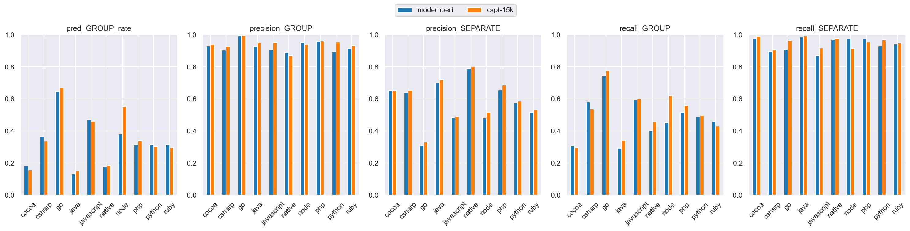
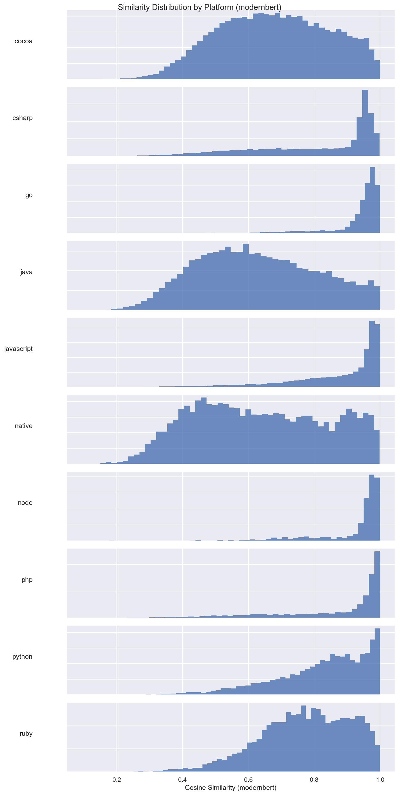
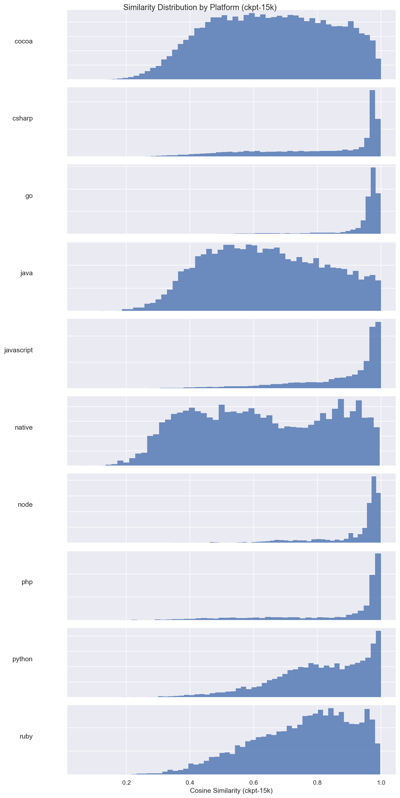
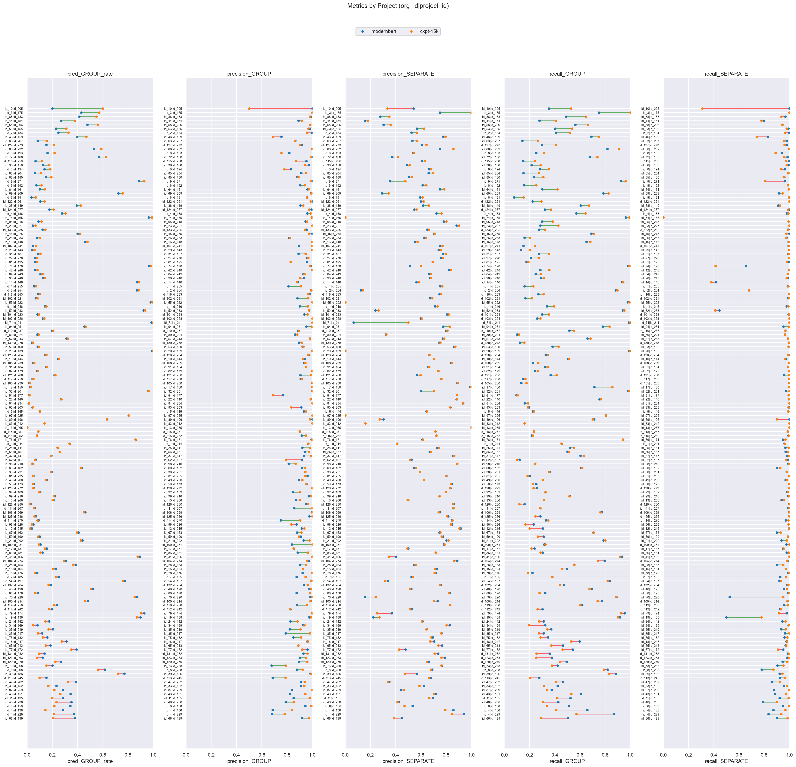

# modernbert (dim=768) vs ckpt-15k (dim=768), dataset: test_full3

Command to repro:

```bash
python -m eval.compare \
    --name_model1 modernbert \
    --gcs_model1 gs://$GROUPING_TRAINER_BUCKET/runs/2026-05-22-14-34-34-modernbert/similarities/test_full3 \
    --threshold_model1 0.90 \
    --name_model2 ckpt-15k \
    --gcs_model2 gs://$GROUPING_TRAINER_BUCKET/runs/2026-05-21-09-13-40-ckpt-15k/similarities/test_full3 \
    --threshold_model2 0.90 \
    --overwrite
```

### Column definitions

- **model**: The name of the model being evaluated.
- **pred_GROUP_rate**: The fraction of pairs this model groups together—lower means more separate issues are created. It's smaller than prod b/c the test dataset contains far more borderline cases; it's missing pairs that are very close.  This bias also means precision_GROUP is lower than what it'd be in prod.
- **precision_GROUP**: When the model groups a pair, how often is it correct? Higher = less over-grouping.
- **precision_SEPARATE**: When the model separates a pair, how often is it correct?
- **recall_GROUP**: Of all pairs that should be grouped, what fraction does the model correctly group? Higher = less under-grouping.
- **recall_SEPARATE**: Of all pairs that should be separate, what fraction does the model correctly separate?

## Aggregate results


### Overall metrics

| model      | pred_GROUP_rate | precision_GROUP | precision_SEPARATE | recall_GROUP | recall_SEPARATE |
|------------|-----------------|-----------------|--------------------|--------------|-----------------|
| modernbert | 0.4             | 0.96            | 0.66               | 0.66         | 0.96            |
| ckpt-15k   | 0.41            | 0.97            | 0.67               | 0.67         | 0.97            |

### Project-averaged metrics (152 projects)

| model      | pred_GROUP_rate | precision_GROUP | precision_SEPARATE | recall_GROUP | recall_SEPARATE |
|------------|-----------------|-----------------|--------------------|--------------|-----------------|
| modernbert | 0.28            | 0.92            | 0.63               | 0.45         | 0.94            |
| ckpt-15k   | 0.28            | 0.94            | 0.64               | 0.46         | 0.95            |

### Conditional probabilities

P(ckpt-15k GROUP | modernbert GROUP)    = 0.9008

P(ckpt-15k GROUP | modernbert SEPARATE) = 0.0694

P(ckpt-15k GROUP | modernbert GROUP, distance < 0.005) = 0.9362  (n=8548)

### Thresholds

```json
{
  "modernbert": 0.9,
  "ckpt-15k": 0.9
}
```

### Distance distribution

| statistic  | value    |
|------------|----------|
| count      | 150303.0 |
| null_count | 0.0      |
| mean       | 0.042189 |
| std        | 0.032109 |
| min        | 0.000514 |
| 25%        | 0.016303 |
| 50%        | 0.035027 |
| 75%        | 0.063571 |
| max        | 0.245969 |

GROUP rate: 58.75%

### Platform stats

| platform   | n_pairs | n_projects | label_GROUP_rate | proportion |
|------------|---------|------------|------------------|------------|
| cocoa      | 30321   | 58         | 0.38             | 0.2        |
| csharp     | 21936   | 21         | 0.62             | 0.15       |
| go         | 17160   | 8          | 0.95             | 0.11       |
| java       | 17043   | 58         | 0.32             | 0.11       |
| javascript | 24492   | 53         | 0.73             | 0.16       |
| native     | 6560    | 41         | 0.31             | 0.04       |
| node       | 3242    | 12         | 0.88             | 0.02       |
| php        | 9592    | 8          | 0.75             | 0.06       |
| python     | 13428   | 8          | 0.57             | 0.09       |
| ruby       | 6529    | 8          | 0.59             | 0.04       |

### Short stacktraces (query_tokens <= p10 = 32 tokens, 15296 pairs)

label GROUP rate: 83.18%
| model      | pred_GROUP_rate | precision_GROUP | precision_SEPARATE | recall_GROUP | recall_SEPARATE |
|------------|-----------------|-----------------|--------------------|--------------|-----------------|
| modernbert | 0.79            | 0.97            | 0.69               | 0.92         | 0.87            |
| ckpt-15k   | 0.79            | 0.97            | 0.69               | 0.92         | 0.84            |

### Long stacktraces (query_tokens >= p90 = 764 tokens, 15036 pairs)

label GROUP rate: 59.37%
| model      | pred_GROUP_rate | precision_GROUP | precision_SEPARATE | recall_GROUP | recall_SEPARATE |
|------------|-----------------|-----------------|--------------------|--------------|-----------------|
| modernbert | 0.4             | 0.95            | 0.64               | 0.64         | 0.95            |
| ckpt-15k   | 0.39            | 0.97            | 0.64               | 0.63         | 0.97            |

## Threshold sweep


### Threshold sweep for modernbert

| threshold | pred_GROUP_rate | precision_GROUP | precision_SEPARATE | recall_GROUP | recall_SEPARATE |
|-----------|-----------------|-----------------|--------------------|--------------|-----------------|
| 0.8       | 0.55            | 0.88            | 0.77               | 0.82         | 0.83            |
| 0.85      | 0.48            | 0.92            | 0.72               | 0.75         | 0.91            |
| 0.87      | 0.45            | 0.94            | 0.7                | 0.72         | 0.93            |
| 0.9       | 0.4             | 0.96            | 0.66               | 0.66         | 0.96            |

### Threshold sweep for ckpt-15k

| threshold | pred_GROUP_rate | precision_GROUP | precision_SEPARATE | recall_GROUP | recall_SEPARATE |
|-----------|-----------------|-----------------|--------------------|--------------|-----------------|
| 0.8       | 0.54            | 0.9             | 0.78               | 0.83         | 0.86            |
| 0.85      | 0.48            | 0.93            | 0.73               | 0.76         | 0.92            |
| 0.87      | 0.45            | 0.95            | 0.71               | 0.73         | 0.94            |
| 0.9       | 0.41            | 0.97            | 0.67               | 0.67         | 0.97            |

## Platform-level results


### Metrics by platform, avg over projects (modernbert, threshold=0.9)

| platform   | n_pairs | n_projects | label_GROUP_rate | min_threshold | pred_GROUP_rate | precision_GROUP | precision_SEPARATE | recall_GROUP | recall_SEPARATE |
|------------|---------|------------|------------------|---------------|-----------------|-----------------|--------------------|--------------|-----------------|
| cocoa      | 30321   | 58         | 0.38             | 0.9           | 0.18            | 0.93            | 0.651              | 0.306        | 0.974           |
| csharp     | 21936   | 21         | 0.617            | 0.9           | 0.363           | 0.904           | 0.638              | 0.582        | 0.895           |
| go         | 17160   | 8          | 0.953            | 0.9           | 0.645           | 0.993           | 0.311              | 0.743        | 0.91            |
| java       | 17043   | 58         | 0.322            | 0.9           | 0.131           | 0.928           | 0.7                | 0.29         | 0.985           |
| javascript | 24492   | 53         | 0.729            | 0.9           | 0.471           | 0.904           | 0.484              | 0.591        | 0.869           |
| native     | 6560    | 41         | 0.31             | 0.9           | 0.178           | 0.89            | 0.789              | 0.402        | 0.97            |
| node       | 3242    | 12         | 0.884            | 0.9           | 0.38            | 0.953           | 0.479              | 0.454        | 0.975           |
| php        | 9592    | 8          | 0.75             | 0.9           | 0.315           | 0.959           | 0.655              | 0.517        | 0.974           |
| python     | 13428   | 8          | 0.568            | 0.9           | 0.314           | 0.895           | 0.573              | 0.486        | 0.93            |
| ruby       | 6529    | 8          | 0.59             | 0.9           | 0.315           | 0.913           | 0.516              | 0.459        | 0.942           |

### Metrics by platform, avg over projects (ckpt-15k, threshold=0.9)

| platform   | n_pairs | n_projects | label_GROUP_rate | min_threshold | pred_GROUP_rate | precision_GROUP | precision_SEPARATE | recall_GROUP | recall_SEPARATE |
|------------|---------|------------|------------------|---------------|-----------------|-----------------|--------------------|--------------|-----------------|
| cocoa      | 30321   | 58         | 0.38             | 0.9           | 0.155           | 0.939           | 0.651              | 0.296        | 0.99            |
| csharp     | 21936   | 21         | 0.617            | 0.9           | 0.337           | 0.927           | 0.653              | 0.538        | 0.906           |
| go         | 17160   | 8          | 0.953            | 0.9           | 0.668           | 0.994           | 0.331              | 0.775        | 0.965           |
| java       | 17043   | 58         | 0.322            | 0.9           | 0.149           | 0.953           | 0.72               | 0.341        | 0.991           |
| javascript | 24492   | 53         | 0.729            | 0.9           | 0.458           | 0.95            | 0.491              | 0.6          | 0.917           |
| native     | 6560    | 41         | 0.31             | 0.9           | 0.186           | 0.868           | 0.803              | 0.454        | 0.975           |
| node       | 3242    | 12         | 0.884            | 0.9           | 0.552           | 0.94            | 0.516              | 0.621        | 0.916           |
| php        | 9592    | 8          | 0.75             | 0.9           | 0.338           | 0.961           | 0.686              | 0.56         | 0.954           |
| python     | 13428   | 8          | 0.568            | 0.9           | 0.304           | 0.955           | 0.587              | 0.496        | 0.968           |
| ruby       | 6529    | 8          | 0.59             | 0.9           | 0.296           | 0.931           | 0.531              | 0.429        | 0.948           |

### Min threshold for >= 95% avg project precision_GROUP by platform (modernbert)

| platform   | n_pairs | n_projects | label_GROUP_rate | min_threshold | pred_GROUP_rate | precision_GROUP | precision_SEPARATE | recall_GROUP | recall_SEPARATE |
|------------|---------|------------|------------------|---------------|-----------------|-----------------|--------------------|--------------|-----------------|
| cocoa      | 30321   | 58         | 0.38             | 0.93          | 0.115           | 0.958           | 0.617              | 0.198        | 0.991           |
| csharp     | 21936   | 21         | 0.617            | 0.96          | 0.193           | 0.957           | 0.547              | 0.324        | 0.957           |
| go         | 17160   | 8          | 0.953            | 0.84          | 0.709           | 0.958           | 0.399              | 0.804        | 0.795           |
| java       | 17043   | 58         | 0.322            | 0.93          | 0.097           | 0.96            | 0.672              | 0.217        | 0.991           |
| javascript | 24492   | 53         | 0.729            | 0.95          | 0.327           | 0.965           | 0.412              | 0.411        | 0.944           |
| native     | 6560    | 41         | 0.31             | 0.95          | 0.099           | 0.954           | 0.735              | 0.225        | 0.996           |
| node       | 3242    | 12         | 0.884            | 0.9           | 0.38            | 0.953           | 0.479              | 0.454        | 0.975           |
| php        | 9592    | 8          | 0.75             | 0.9           | 0.315           | 0.959           | 0.655              | 0.517        | 0.974           |
| python     | 13428   | 8          | 0.568            | 0.96          | 0.148           | 0.958           | 0.49               | 0.244        | 0.99            |
| ruby       | 6529    | 8          | 0.59             | 0.96          | 0.109           | 0.958           | 0.411              | 0.172        | 0.994           |

### Min threshold for >= 95% avg project precision_GROUP by platform (ckpt-15k)

| platform   | n_pairs | n_projects | label_GROUP_rate | min_threshold | pred_GROUP_rate | precision_GROUP | precision_SEPARATE | recall_GROUP | recall_SEPARATE |
|------------|---------|------------|------------------|---------------|-----------------|-----------------|--------------------|--------------|-----------------|
| cocoa      | 30321   | 58         | 0.38             | 0.91          | 0.144           | 0.954           | 0.645              | 0.273        | 0.993           |
| csharp     | 21936   | 21         | 0.617            | 0.92          | 0.304           | 0.95            | 0.612              | 0.478        | 0.926           |
| go         | 17160   | 8          | 0.953            | 0.8           | 0.747           | 0.962           | 0.446              | 0.853        | 0.812           |
| java       | 17043   | 58         | 0.322            | 0.9           | 0.149           | 0.953           | 0.72               | 0.341        | 0.991           |
| javascript | 24492   | 53         | 0.729            | 0.9           | 0.458           | 0.95            | 0.491              | 0.6          | 0.917           |
| native     | 6560    | 41         | 0.31             | 0.95          | 0.09            | 0.982           | 0.734              | 0.204        | 1.0             |
| node       | 3242    | 12         | 0.884            | 0.93          | 0.454           | 0.961           | 0.471              | 0.507        | 0.954           |
| php        | 9592    | 8          | 0.75             | 0.9           | 0.338           | 0.961           | 0.686              | 0.56         | 0.954           |
| python     | 13428   | 8          | 0.568            | 0.9           | 0.304           | 0.955           | 0.587              | 0.496        | 0.968           |
| ruby       | 6529    | 8          | 0.59             | 0.92          | 0.248           | 0.953           | 0.484              | 0.358        | 0.967           |

<details>
<summary>Metrics by platform</summary>


</details>


<details>
<summary>Similarity distribution (modernbert)</summary>


</details>


<details>
<summary>Similarity distribution (ckpt-15k)</summary>


</details>


## Project-level results

**Project win rate for ckpt-15k**: 44/152 (29%) projects where both precision_GROUP and recall_GROUP are higher


<details>
<summary>Dumbbell by project</summary>


</details>


### >= 15% group rate increase (stratified by platform)

| org_id | project_id | platform | n_pairs | label_GROUP_rate | modernbert_GROUP_rate | modernbert_prec | modernbert_rec | ckpt-15k_GROUP_rate | ckpt-15k_prec | ckpt-15k_rec | group_rate_increase |
|--------|------------|----------|---------|------------------|-----------------------|-----------------|----------------|---------------------|---------------|--------------|---------------------|
| id_10  | id_205     | node     | 30      | 0.57             | 0.2                   | 1.0             | 0.35           | 0.6                 | 0.5           | 0.53         | 0.4                 |

### >= 10% group rate decrease

| org_id | project_id | platform | n_pairs | label_GROUP_rate | modernbert_GROUP_rate | modernbert_prec | modernbert_rec | ckpt-15k_GROUP_rate | ckpt-15k_prec | ckpt-15k_rec | group_rate_decrease |
|--------|------------|----------|---------|------------------|-----------------------|-----------------|----------------|---------------------|---------------|--------------|---------------------|
| id_66  | id_199     | csharp   | 998     | 0.69             | 0.38                  | 0.92            | 0.5            | 0.21                | 0.98          | 0.29         | 0.17                |
| id_4   | id_229     | csharp   | 1337    | 0.29             | 0.37                  | 0.68            | 0.87           | 0.21                | 0.78          | 0.57         | 0.16                |
| id_4   | id_136     | csharp   | 991     | 0.3              | 0.29                  | 0.69            | 0.66           | 0.14                | 0.84          | 0.41         | 0.14                |
| id_6   | id_158     | ruby     | 533     | 0.63             | 0.34                  | 0.95            | 0.51           | 0.22                | 0.99          | 0.34         | 0.13                |
| id_48  | id_238     | cocoa    | 202     | 0.65             | 0.35                  | 0.79            | 0.43           | 0.23                | 0.85          | 0.31         | 0.12                |


---

_Real report with original org/project IDs at_ `gs://$GROUPING_TRAINER_BUCKET/eval/comparisons/test_full3/modernbert_dim768_vs_ckpt-15k_dim768/`
