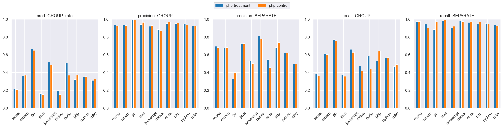
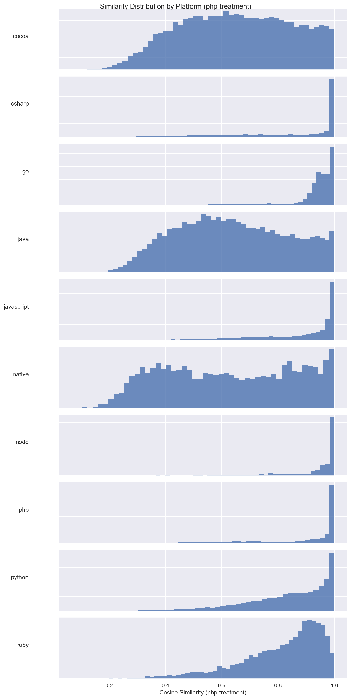
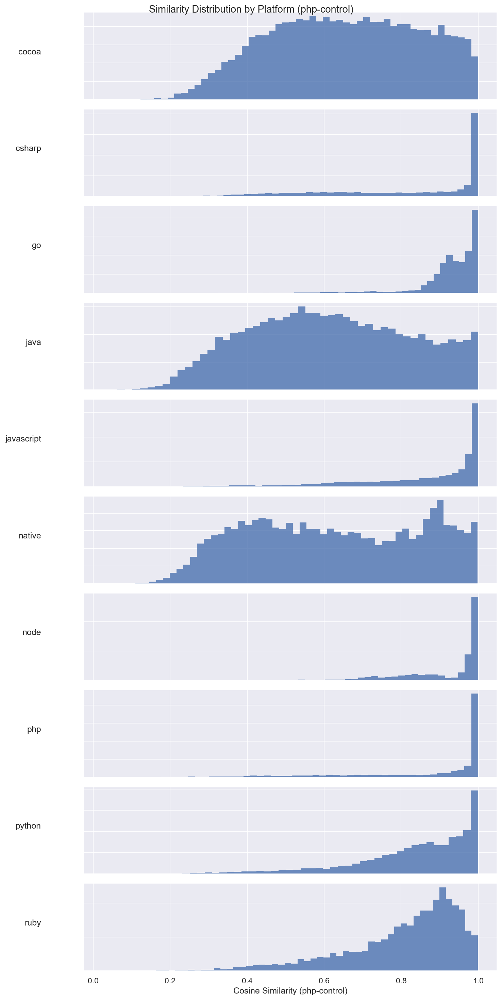
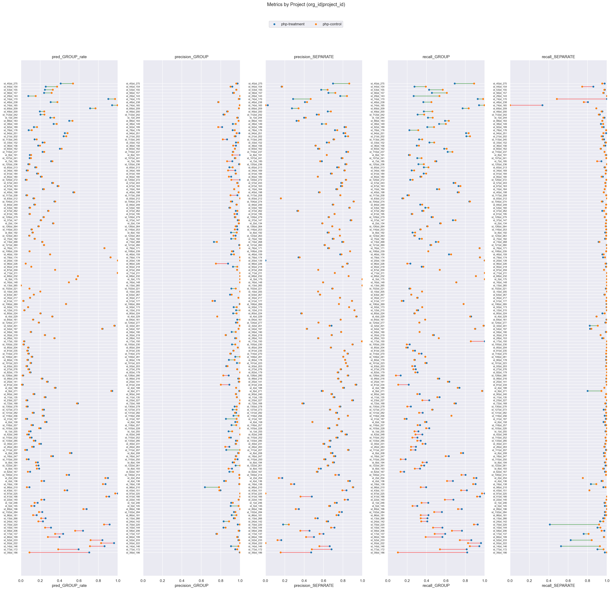

# php-treatment (dim=768) vs php-control (dim=768), dataset: test_full3

Command to repro:

```bash
python -m eval.compare \
    --name_model1 php-treatment \
    --gcs_model1 gs://$GROUPING_TRAINER_BUCKET/runs/2026-06-04-21-08-30-php-treatment/similarities/test_full3 \
    --threshold_model1 0.90 \
    --name_model2 php-control \
    --gcs_model2 gs://$GROUPING_TRAINER_BUCKET/runs/2026-06-04-21-12-48-php-control/similarities/test_full3 \
    --threshold_model2 0.90 \
    --overwrite
```

### Column definitions

- **model**: The name of the model being evaluated.
- **pred_GROUP_rate**: The fraction of pairs this model groups together—lower means more separate issues are created. It's smaller than prod b/c the test dataset contains far more borderline cases; it's missing pairs that are very close.  This bias also means precision_GROUP is lower than what it'd be in prod.
- **precision_GROUP**: When the model groups a pair, how often is it correct? Higher = less over-grouping.
- **precision_SEPARATE**: When the model separates a pair, how often is it correct?
- **recall_GROUP**: Of all pairs that should be grouped, what fraction does the model correctly group? Higher = less under-grouping.
- **recall_SEPARATE**: Of all pairs that should be separate, what fraction does the model correctly separate?

## Aggregate results


### Overall metrics

| model         | pred_GROUP_rate | precision_GROUP | precision_SEPARATE | recall_GROUP | recall_SEPARATE |
|---------------|-----------------|-----------------|--------------------|--------------|-----------------|
| php-treatment | 0.43            | 0.96            | 0.69               | 0.7          | 0.96            |
| php-control   | 0.41            | 0.97            | 0.67               | 0.67         | 0.97            |

### Project-averaged metrics (152 projects)

| model         | pred_GROUP_rate | precision_GROUP | precision_SEPARATE | recall_GROUP | recall_SEPARATE |
|---------------|-----------------|-----------------|--------------------|--------------|-----------------|
| php-treatment | 0.3             | 0.94            | 0.66               | 0.5          | 0.95            |
| php-control   | 0.29            | 0.94            | 0.66               | 0.49         | 0.96            |

### Conditional probabilities

P(php-control GROUP | php-treatment GROUP)    = 0.9000

P(php-control GROUP | php-treatment SEPARATE) = 0.0394

P(php-control GROUP | php-treatment GROUP, distance < 0.005) = 0.9345  (n=8696)

### Thresholds

```json
{
  "php-treatment": 0.9,
  "php-control": 0.9
}
```

### Distance distribution

| statistic  | value    |
|------------|----------|
| count      | 150303.0 |
| null_count | 0.0      |
| mean       | 0.042189 |
| std        | 0.032109 |
| min        | 0.000514 |
| 25%        | 0.016303 |
| 50%        | 0.035027 |
| 75%        | 0.063571 |
| max        | 0.245969 |

GROUP rate: 58.75%

### Platform stats

| platform   | n_pairs | n_projects | label_GROUP_rate | proportion |
|------------|---------|------------|------------------|------------|
| cocoa      | 30321   | 58         | 0.38             | 0.2        |
| csharp     | 21936   | 21         | 0.62             | 0.15       |
| go         | 17160   | 8          | 0.95             | 0.11       |
| java       | 17043   | 58         | 0.32             | 0.11       |
| javascript | 24492   | 53         | 0.73             | 0.16       |
| native     | 6560    | 41         | 0.31             | 0.04       |
| node       | 3242    | 12         | 0.88             | 0.02       |
| php        | 9592    | 8          | 0.75             | 0.06       |
| python     | 13428   | 8          | 0.57             | 0.09       |
| ruby       | 6529    | 8          | 0.59             | 0.04       |

### Short stacktraces (query_tokens <= p10 = 32 tokens, 15296 pairs)

label GROUP rate: 83.18%
| model         | pred_GROUP_rate | precision_GROUP | precision_SEPARATE | recall_GROUP | recall_SEPARATE |
|---------------|-----------------|-----------------|--------------------|--------------|-----------------|
| php-treatment | 0.76            | 0.99            | 0.67               | 0.9          | 0.97            |
| php-control   | 0.66            | 1.0             | 0.49               | 0.8          | 0.99            |

### Long stacktraces (query_tokens >= p90 = 764 tokens, 15036 pairs)

label GROUP rate: 59.37%
| model         | pred_GROUP_rate | precision_GROUP | precision_SEPARATE | recall_GROUP | recall_SEPARATE |
|---------------|-----------------|-----------------|--------------------|--------------|-----------------|
| php-treatment | 0.44            | 0.94            | 0.68               | 0.7          | 0.93            |
| php-control   | 0.44            | 0.94            | 0.67               | 0.69         | 0.93            |

## Threshold sweep


### Threshold sweep for php-treatment

| threshold | pred_GROUP_rate | precision_GROUP | precision_SEPARATE | recall_GROUP | recall_SEPARATE |
|-----------|-----------------|-----------------|--------------------|--------------|-----------------|
| 0.8       | 0.56            | 0.89            | 0.8                | 0.85         | 0.86            |
| 0.85      | 0.49            | 0.93            | 0.75               | 0.78         | 0.92            |
| 0.87      | 0.47            | 0.94            | 0.73               | 0.75         | 0.94            |
| 0.9       | 0.43            | 0.96            | 0.69               | 0.7          | 0.96            |

### Threshold sweep for php-control

| threshold | pred_GROUP_rate | precision_GROUP | precision_SEPARATE | recall_GROUP | recall_SEPARATE |
|-----------|-----------------|-----------------|--------------------|--------------|-----------------|
| 0.8       | 0.55            | 0.9             | 0.8                | 0.85         | 0.86            |
| 0.85      | 0.49            | 0.93            | 0.74               | 0.78         | 0.92            |
| 0.87      | 0.46            | 0.95            | 0.72               | 0.74         | 0.94            |
| 0.9       | 0.41            | 0.97            | 0.67               | 0.67         | 0.97            |

## Platform-level results


### Metrics by platform, avg over projects (php-treatment, threshold=0.9)

| platform   | n_pairs | n_projects | label_GROUP_rate | min_threshold | pred_GROUP_rate | precision_GROUP | precision_SEPARATE | recall_GROUP | recall_SEPARATE |
|------------|---------|------------|------------------|---------------|-----------------|-----------------|--------------------|--------------|-----------------|
| cocoa      | 30321   | 58         | 0.38             | 0.9           | 0.217           | 0.935           | 0.695              | 0.383        | 0.974           |
| csharp     | 21936   | 21         | 0.617            | 0.9           | 0.364           | 0.934           | 0.674              | 0.607        | 0.943           |
| go         | 17160   | 8          | 0.953            | 0.9           | 0.667           | 0.992           | 0.33               | 0.771        | 0.884           |
| java       | 17043   | 58         | 0.322            | 0.9           | 0.163           | 0.94            | 0.728              | 0.373        | 0.982           |
| javascript | 24492   | 53         | 0.729            | 0.9           | 0.515           | 0.92            | 0.531              | 0.66         | 0.899           |
| native     | 6560    | 41         | 0.31             | 0.9           | 0.19            | 0.883           | 0.812              | 0.473        | 0.977           |
| node       | 3242    | 12         | 0.884            | 0.9           | 0.508           | 0.951           | 0.545              | 0.586        | 0.965           |
| php        | 9592    | 8          | 0.75             | 0.9           | 0.321           | 0.95            | 0.681              | 0.529        | 0.952           |
| python     | 13428   | 8          | 0.568            | 0.9           | 0.349           | 0.944           | 0.62               | 0.565        | 0.953           |
| ruby       | 6529    | 8          | 0.59             | 0.9           | 0.311           | 0.926           | 0.494              | 0.467        | 0.938           |

### Metrics by platform, avg over projects (php-control, threshold=0.9)

| platform   | n_pairs | n_projects | label_GROUP_rate | min_threshold | pred_GROUP_rate | precision_GROUP | precision_SEPARATE | recall_GROUP | recall_SEPARATE |
|------------|---------|------------|------------------|---------------|-----------------|-----------------|--------------------|--------------|-----------------|
| cocoa      | 30321   | 58         | 0.38             | 0.9           | 0.209           | 0.925           | 0.682              | 0.36         | 0.973           |
| csharp     | 21936   | 21         | 0.617            | 0.9           | 0.368           | 0.929           | 0.682              | 0.604        | 0.901           |
| go         | 17160   | 8          | 0.953            | 0.9           | 0.65            | 0.994           | 0.392              | 0.758        | 0.971           |
| java       | 17043   | 58         | 0.322            | 0.9           | 0.153           | 0.964           | 0.726              | 0.357        | 0.993           |
| javascript | 24492   | 53         | 0.729            | 0.9           | 0.487           | 0.929           | 0.502              | 0.626        | 0.92            |
| native     | 6560    | 41         | 0.31             | 0.9           | 0.154           | 0.871           | 0.778              | 0.416        | 0.974           |
| node       | 3242    | 12         | 0.884            | 0.9           | 0.368           | 0.968           | 0.455              | 0.438        | 0.973           |
| php        | 9592    | 8          | 0.75             | 0.9           | 0.371           | 0.956           | 0.736              | 0.64         | 0.968           |
| python     | 13428   | 8          | 0.568            | 0.9           | 0.353           | 0.938           | 0.619              | 0.568        | 0.95            |
| ruby       | 6529    | 8          | 0.59             | 0.9           | 0.33            | 0.925           | 0.496              | 0.491        | 0.922           |

### Min threshold for >= 95% avg project precision_GROUP by platform (php-treatment)

| platform   | n_pairs | n_projects | label_GROUP_rate | min_threshold | pred_GROUP_rate | precision_GROUP | precision_SEPARATE | recall_GROUP | recall_SEPARATE |
|------------|---------|------------|------------------|---------------|-----------------|-----------------|--------------------|--------------|-----------------|
| cocoa      | 30321   | 58         | 0.38             | 0.93          | 0.159           | 0.953           | 0.657              | 0.274        | 0.993           |
| csharp     | 21936   | 21         | 0.617            | 0.92          | 0.334           | 0.951           | 0.653              | 0.554        | 0.95            |
| go         | 17160   | 8          | 0.953            | 0.78          | 0.763           | 0.951           | 0.553              | 0.862        | 0.697           |
| java       | 17043   | 58         | 0.322            | 0.91          | 0.153           | 0.952           | 0.722              | 0.351        | 0.988           |
| javascript | 24492   | 53         | 0.729            | 0.97          | 0.307           | 0.967           | 0.404              | 0.38         | 0.982           |
| native     | 6560    | 41         | 0.31             | 0.98          | 0.052           | 1.0             | 0.705              | 0.13         | 1.0             |
| node       | 3242    | 12         | 0.884            | 0.87          | 0.531           | 0.951           | 0.57               | 0.615        | 0.952           |
| php        | 9592    | 8          | 0.75             | 0.9           | 0.321           | 0.95            | 0.681              | 0.529        | 0.952           |
| python     | 13428   | 8          | 0.568            | 0.91          | 0.324           | 0.953           | 0.604              | 0.53         | 0.965           |
| ruby       | 6529    | 8          | 0.59             | 0.93          | 0.231           | 0.95            | 0.462              | 0.36         | 0.973           |

### Min threshold for >= 95% avg project precision_GROUP by platform (php-control)

| platform   | n_pairs | n_projects | label_GROUP_rate | min_threshold | pred_GROUP_rate | precision_GROUP | precision_SEPARATE | recall_GROUP | recall_SEPARATE |
|------------|---------|------------|------------------|---------------|-----------------|-----------------|--------------------|--------------|-----------------|
| cocoa      | 30321   | 58         | 0.38             | 0.92          | 0.173           | 0.951           | 0.663              | 0.289        | 0.981           |
| csharp     | 21936   | 21         | 0.617            | 0.93          | 0.32            | 0.954           | 0.645              | 0.521        | 0.936           |
| go         | 17160   | 8          | 0.953            | 0.78          | 0.775           | 0.951           | 0.584              | 0.877        | 0.709           |
| java       | 17043   | 58         | 0.322            | 0.88          | 0.173           | 0.95            | 0.737              | 0.397        | 0.99            |
| javascript | 24492   | 53         | 0.729            | 0.94          | 0.381           | 0.954           | 0.443              | 0.483        | 0.967           |
| native     | 6560    | 41         | 0.31             | 0.97          | 0.105           | 0.968           | 0.746              | 0.248        | 0.993           |
| node       | 3242    | 12         | 0.884            | 0.83          | 0.558           | 0.952           | 0.592              | 0.643        | 0.933           |
| php        | 9592    | 8          | 0.75             | 0.89          | 0.389           | 0.951           | 0.761              | 0.671        | 0.962           |
| python     | 13428   | 8          | 0.568            | 0.92          | 0.306           | 0.959           | 0.589              | 0.5          | 0.971           |
| ruby       | 6529    | 8          | 0.59             | 0.93          | 0.241           | 0.955           | 0.465              | 0.37         | 0.97            |

<details>
<summary>Metrics by platform</summary>


</details>


<details>
<summary>Similarity distribution (php-treatment)</summary>


</details>


<details>
<summary>Similarity distribution (php-control)</summary>


</details>


## Project-level results

**Project win rate for php-control**: 32/152 (21%) projects where both precision_GROUP and recall_GROUP are higher


<details>
<summary>Dumbbell by project</summary>


</details>


### >= 10% group rate decrease

| org_id | project_id | platform   | n_pairs | label_GROUP_rate | php-treatment_GROUP_rate | php-treatment_prec | php-treatment_rec | php-control_GROUP_rate | php-control_prec | php-control_rec | group_rate_decrease |
|--------|------------|------------|---------|------------------|--------------------------|--------------------|-------------------|------------------------|------------------|-----------------|---------------------|
| id_39  | id_186     | node       | 629     | 0.86             | 0.71                     | 1.0                | 0.82              | 0.09                   | 1.0              | 0.1             | 0.62                |
| id_77  | id_172     | javascript | 533     | 0.69             | 0.59                     | 0.95               | 0.81              | 0.38                   | 0.97             | 0.54            | 0.21                |
| id_14  | id_146     | javascript | 1513    | 0.83             | 0.86                     | 0.91               | 0.94              | 0.71                   | 0.98             | 0.85            | 0.15                |
| id_55  | id_222     | go         | 9407    | 1.0              | 0.96                     | 1.0                | 0.96              | 0.83                   | 1.0              | 0.83            | 0.13                |
| id_52  | id_233     | javascript | 2125    | 0.96             | 0.84                     | 0.98               | 0.86              | 0.72                   | 0.99             | 0.74            | 0.12                |
| id_66  | id_199     | csharp     | 998     | 0.69             | 0.4                      | 0.97               | 0.56              | 0.28                   | 0.97             | 0.39            | 0.12                |


---

_Real report with original org/project IDs at_ `gs://$GROUPING_TRAINER_BUCKET/eval/comparisons/test_full3/php-treatment_dim768_vs_php-control_dim768/`
