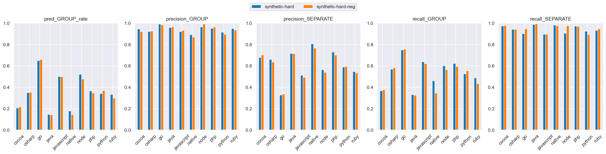
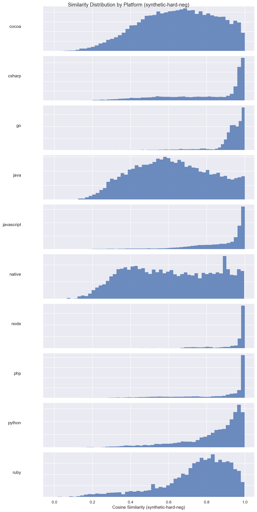
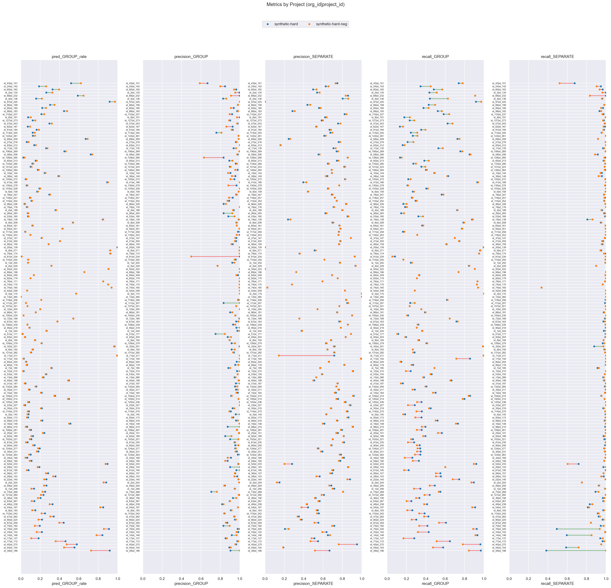

# synthetic-hard (dim=768) vs synthetic-hard-neg (dim=768), dataset: test_full3

Command to repro:

```bash
python -m eval.compare \
    --gcs_model1 gs://$GROUPING_TRAINER_BUCKET/runs/2026-05-31-19-56-46-synthetic-hard/similarities/test_full3 \
    --threshold_model1 0.90 \
    --gcs_model2 gs://$GROUPING_TRAINER_BUCKET/runs/2026-06-05-01-33-00-synthetic-hard-neg/similarities/test_full3 \
    --threshold_model2 0.90 \
    --overwrite
```

### Column definitions

- **model**: The name of the model being evaluated.
- **pred_GROUP_rate**: The fraction of pairs this model groups together—lower means more separate issues are created. It's smaller than prod b/c the test dataset contains far more borderline cases; it's missing pairs that are very close.  This bias also means precision_GROUP is lower than what it'd be in prod.
- **precision_GROUP**: When the model groups a pair, how often is it correct? Higher = less over-grouping.
- **precision_SEPARATE**: When the model separates a pair, how often is it correct?
- **recall_GROUP**: Of all pairs that should be grouped, what fraction does the model correctly group? Higher = less under-grouping.
- **recall_SEPARATE**: Of all pairs that should be separate, what fraction does the model correctly separate?

## Aggregate results


### Overall metrics

| model              | pred_GROUP_rate | precision_GROUP | precision_SEPARATE | recall_GROUP | recall_SEPARATE |
|--------------------|-----------------|-----------------|--------------------|--------------|-----------------|
| synthetic-hard     | 0.41            | 0.96            | 0.67               | 0.67         | 0.96            |
| synthetic-hard-neg | 0.41            | 0.96            | 0.67               | 0.66         | 0.96            |

### Project-averaged metrics (152 projects)

| model              | pred_GROUP_rate | precision_GROUP | precision_SEPARATE | recall_GROUP | recall_SEPARATE |
|--------------------|-----------------|-----------------|--------------------|--------------|-----------------|
| synthetic-hard     | 0.29            | 0.94            | 0.65               | 0.48         | 0.95            |
| synthetic-hard-neg | 0.29            | 0.94            | 0.64               | 0.48         | 0.96            |

### Conditional probabilities

P(synthetic-hard-neg GROUP | synthetic-hard GROUP)    = 0.9322

P(synthetic-hard-neg GROUP | synthetic-hard SEPARATE) = 0.0460

P(synthetic-hard-neg GROUP | synthetic-hard GROUP, distance < 0.005) = 0.9804  (n=8484)

### Thresholds

```json
{
  "synthetic-hard": 0.9,
  "synthetic-hard-neg": 0.9
}
```

### Distance distribution

| statistic  | value    |
|------------|----------|
| count      | 150303.0 |
| null_count | 0.0      |
| mean       | 0.042189 |
| std        | 0.032109 |
| min        | 0.000514 |
| 25%        | 0.016303 |
| 50%        | 0.035027 |
| 75%        | 0.063571 |
| max        | 0.245969 |

GROUP rate: 58.75%

### Platform stats

| platform   | n_pairs | n_projects | label_GROUP_rate | proportion |
|------------|---------|------------|------------------|------------|
| cocoa      | 30321   | 58         | 0.38             | 0.2        |
| csharp     | 21936   | 21         | 0.62             | 0.15       |
| go         | 17160   | 8          | 0.95             | 0.11       |
| java       | 17043   | 58         | 0.32             | 0.11       |
| javascript | 24492   | 53         | 0.73             | 0.16       |
| native     | 6560    | 41         | 0.31             | 0.04       |
| node       | 3242    | 12         | 0.88             | 0.02       |
| php        | 9592    | 8          | 0.75             | 0.06       |
| python     | 13428   | 8          | 0.57             | 0.09       |
| ruby       | 6529    | 8          | 0.59             | 0.04       |

### Short stacktraces (query_tokens <= p10 = 32 tokens, 15296 pairs)

label GROUP rate: 83.18%
| model              | pred_GROUP_rate | precision_GROUP | precision_SEPARATE | recall_GROUP | recall_SEPARATE |
|--------------------|-----------------|-----------------|--------------------|--------------|-----------------|
| synthetic-hard     | 0.72            | 0.99            | 0.58               | 0.86         | 0.97            |
| synthetic-hard-neg | 0.72            | 0.99            | 0.58               | 0.86         | 0.97            |

### Long stacktraces (query_tokens >= p90 = 764 tokens, 15036 pairs)

label GROUP rate: 59.37%
| model              | pred_GROUP_rate | precision_GROUP | precision_SEPARATE | recall_GROUP | recall_SEPARATE |
|--------------------|-----------------|-----------------|--------------------|--------------|-----------------|
| synthetic-hard     | 0.39            | 0.96            | 0.64               | 0.62         | 0.96            |
| synthetic-hard-neg | 0.37            | 0.96            | 0.63               | 0.6          | 0.96            |

## Threshold sweep


### Threshold sweep for synthetic-hard

| threshold | pred_GROUP_rate | precision_GROUP | precision_SEPARATE | recall_GROUP | recall_SEPARATE |
|-----------|-----------------|-----------------|--------------------|--------------|-----------------|
| 0.8       | 0.54            | 0.9             | 0.78               | 0.83         | 0.86            |
| 0.85      | 0.48            | 0.93            | 0.73               | 0.76         | 0.92            |
| 0.87      | 0.46            | 0.94            | 0.71               | 0.73         | 0.94            |
| 0.9       | 0.41            | 0.96            | 0.67               | 0.67         | 0.96            |

### Threshold sweep for synthetic-hard-neg

| threshold | pred_GROUP_rate | precision_GROUP | precision_SEPARATE | recall_GROUP | recall_SEPARATE |
|-----------|-----------------|-----------------|--------------------|--------------|-----------------|
| 0.8       | 0.54            | 0.89            | 0.77               | 0.83         | 0.85            |
| 0.85      | 0.48            | 0.93            | 0.73               | 0.76         | 0.91            |
| 0.87      | 0.45            | 0.94            | 0.71               | 0.73         | 0.93            |
| 0.9       | 0.41            | 0.96            | 0.67               | 0.66         | 0.96            |

## Platform-level results


### Metrics by platform, avg over projects (synthetic-hard, threshold=0.9)

| platform   | n_pairs | n_projects | label_GROUP_rate | min_threshold | pred_GROUP_rate | precision_GROUP | precision_SEPARATE | recall_GROUP | recall_SEPARATE |
|------------|---------|------------|------------------|---------------|-----------------|-----------------|--------------------|--------------|-----------------|
| cocoa      | 30321   | 58         | 0.38             | 0.9           | 0.207           | 0.945           | 0.678              | 0.368        | 0.974           |
| csharp     | 21936   | 21         | 0.617            | 0.9           | 0.35            | 0.922           | 0.66               | 0.57         | 0.941           |
| go         | 17160   | 8          | 0.953            | 0.9           | 0.65            | 0.991           | 0.327              | 0.749        | 0.902           |
| java       | 17043   | 58         | 0.322            | 0.9           | 0.145           | 0.958           | 0.716              | 0.33         | 0.987           |
| javascript | 24492   | 53         | 0.729            | 0.9           | 0.501           | 0.921           | 0.513              | 0.639        | 0.896           |
| native     | 6560    | 41         | 0.31             | 0.9           | 0.179           | 0.891           | 0.805              | 0.461        | 0.981           |
| node       | 3242    | 12         | 0.884            | 0.9           | 0.521           | 0.964           | 0.564              | 0.599        | 0.904           |
| php        | 9592    | 8          | 0.75             | 0.9           | 0.364           | 0.951           | 0.729              | 0.623        | 0.972           |
| python     | 13428   | 8          | 0.568            | 0.9           | 0.34            | 0.914           | 0.589              | 0.525        | 0.924           |
| ruby       | 6529    | 8          | 0.59             | 0.9           | 0.333           | 0.949           | 0.547              | 0.487        | 0.932           |

### Metrics by platform, avg over projects (synthetic-hard-neg, threshold=0.9)

| platform   | n_pairs | n_projects | label_GROUP_rate | min_threshold | pred_GROUP_rate | precision_GROUP | precision_SEPARATE | recall_GROUP | recall_SEPARATE |
|------------|---------|------------|------------------|---------------|-----------------|-----------------|--------------------|--------------|-----------------|
| cocoa      | 30321   | 58         | 0.38             | 0.9           | 0.217           | 0.92            | 0.702              | 0.376        | 0.977           |
| csharp     | 21936   | 21         | 0.617            | 0.9           | 0.355           | 0.925           | 0.637              | 0.582        | 0.941           |
| go         | 17160   | 8          | 0.953            | 0.9           | 0.661           | 0.983           | 0.336              | 0.759        | 0.947           |
| java       | 17043   | 58         | 0.322            | 0.9           | 0.143           | 0.964           | 0.715              | 0.326        | 0.993           |
| javascript | 24492   | 53         | 0.729            | 0.9           | 0.499           | 0.932           | 0.494              | 0.621        | 0.895           |
| native     | 6560    | 41         | 0.31             | 0.9           | 0.144           | 0.869           | 0.765              | 0.345        | 0.974           |
| node       | 3242    | 12         | 0.884            | 0.9           | 0.478           | 0.992           | 0.539              | 0.565        | 0.976           |
| php        | 9592    | 8          | 0.75             | 0.9           | 0.346           | 0.964           | 0.702              | 0.595        | 0.97            |
| python     | 13428   | 8          | 0.568            | 0.9           | 0.37            | 0.895           | 0.593              | 0.554        | 0.893           |
| ruby       | 6529    | 8          | 0.59             | 0.9           | 0.299           | 0.936           | 0.532              | 0.433        | 0.948           |

### Min threshold for >= 95% avg project precision_GROUP by platform (synthetic-hard)

| platform   | n_pairs | n_projects | label_GROUP_rate | min_threshold | pred_GROUP_rate | precision_GROUP | precision_SEPARATE | recall_GROUP | recall_SEPARATE |
|------------|---------|------------|------------------|---------------|-----------------|-----------------|--------------------|--------------|-----------------|
| cocoa      | 30321   | 58         | 0.38             | 0.91          | 0.195           | 0.957           | 0.67               | 0.344        | 0.978           |
| csharp     | 21936   | 21         | 0.617            | 0.93          | 0.311           | 0.952           | 0.632              | 0.501        | 0.956           |
| go         | 17160   | 8          | 0.953            | 0.8           | 0.753           | 0.952           | 0.441              | 0.849        | 0.743           |
| java       | 17043   | 58         | 0.322            | 0.89          | 0.156           | 0.954           | 0.723              | 0.358        | 0.986           |
| javascript | 24492   | 53         | 0.729            | 0.95          | 0.363           | 0.952           | 0.428              | 0.447        | 0.961           |
| native     | 6560    | 41         | 0.31             | 0.95          | 0.141           | 0.954           | 0.777              | 0.332        | 0.992           |
| node       | 3242    | 12         | 0.884            | 0.89          | 0.527           | 0.959           | 0.569              | 0.604        | 0.895           |
| php        | 9592    | 8          | 0.75             | 0.9           | 0.364           | 0.951           | 0.729              | 0.623        | 0.972           |
| python     | 13428   | 8          | 0.568            | 0.94          | 0.223           | 0.957           | 0.529              | 0.365        | 0.978           |
| ruby       | 6529    | 8          | 0.59             | 0.91          | 0.311           | 0.954           | 0.54               | 0.457        | 0.944           |

### Min threshold for >= 95% avg project precision_GROUP by platform (synthetic-hard-neg)

| platform   | n_pairs | n_projects | label_GROUP_rate | min_threshold | pred_GROUP_rate | precision_GROUP | precision_SEPARATE | recall_GROUP | recall_SEPARATE |
|------------|---------|------------|------------------|---------------|-----------------|-----------------|--------------------|--------------|-----------------|
| cocoa      | 30321   | 58         | 0.38             | 0.92          | 0.178           | 0.954           | 0.652              | 0.298        | 0.983           |
| csharp     | 21936   | 21         | 0.617            | 0.94          | 0.297           | 0.955           | 0.594              | 0.477        | 0.956           |
| go         | 17160   | 8          | 0.953            | 0.82          | 0.764           | 0.951           | 0.515              | 0.858        | 0.736           |
| java       | 17043   | 58         | 0.322            | 0.89          | 0.151           | 0.957           | 0.72               | 0.347        | 0.99            |
| javascript | 24492   | 53         | 0.729            | 0.97          | 0.264           | 0.985           | 0.386              | 0.333        | 0.99            |
| native     | 6560    | 41         | 0.31             | 0.97          | 0.052           | 1.0             | 0.7                | 0.127        | 1.0             |
| node       | 3242    | 12         | 0.884            | 0.84          | 0.562           | 0.95            | 0.59               | 0.653        | 0.893           |
| php        | 9592    | 8          | 0.75             | 0.88          | 0.375           | 0.956           | 0.734              | 0.648        | 0.962           |
| python     | 13428   | 8          | 0.568            | 0.95          | 0.209           | 0.963           | 0.519              | 0.338        | 0.976           |
| ruby       | 6529    | 8          | 0.59             | 0.92          | 0.258           | 0.957           | 0.503              | 0.379        | 0.97            |

<details>
<summary>Metrics by platform</summary>


</details>


<details>
<summary>Similarity distribution (synthetic-hard)</summary>


</details>


<details>
<summary>Similarity distribution (synthetic-hard-neg)</summary>


</details>


## Project-level results

**Project win rate for synthetic-hard-neg**: 28/152 (18%) projects where both precision_GROUP and recall_GROUP are higher


<details>
<summary>Dumbbell by project</summary>


</details>


### >= 10% group rate decrease

| org_id | project_id | platform   | n_pairs | label_GROUP_rate | synthetic-hard_GROUP_rate | synthetic-hard_prec | synthetic-hard_rec | synthetic-hard-neg_GROUP_rate | synthetic-hard-neg_prec | synthetic-hard-neg_rec | group_rate_decrease |
|--------|------------|------------|---------|------------------|---------------------------|---------------------|--------------------|-------------------------------|-------------------------|------------------------|---------------------|
| id_39  | id_186     | node       | 629     | 0.86             | 0.92                      | 0.9                 | 0.97               | 0.72                          | 1.0                     | 0.84                   | 0.19                |
| id_44  | id_154     | ruby       | 1026    | 0.86             | 0.55                      | 0.89                | 0.58               | 0.45                          | 0.91                    | 0.47                   | 0.11                |
| id_45  | id_275     | php        | 95      | 0.58             | 0.58                      | 0.96                | 0.96               | 0.47                          | 0.96                    | 0.78                   | 0.11                |
| id_77  | id_172     | javascript | 533     | 0.69             | 0.46                      | 0.98                | 0.65               | 0.36                          | 0.98                    | 0.51                   | 0.1                 |


---

_Real report with original org/project IDs at_ `gs://$GROUPING_TRAINER_BUCKET/eval/comparisons/test_full3/synthetic-hard_dim768_vs_synthetic-hard-neg_dim768/`
