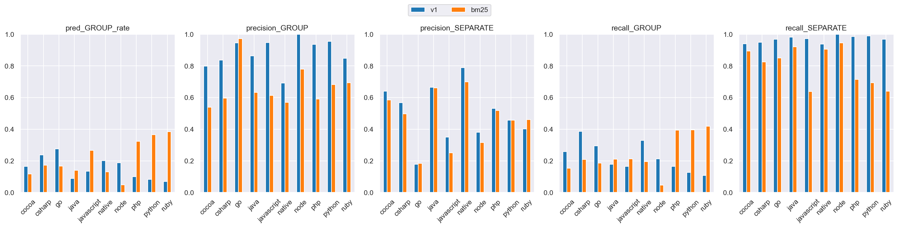
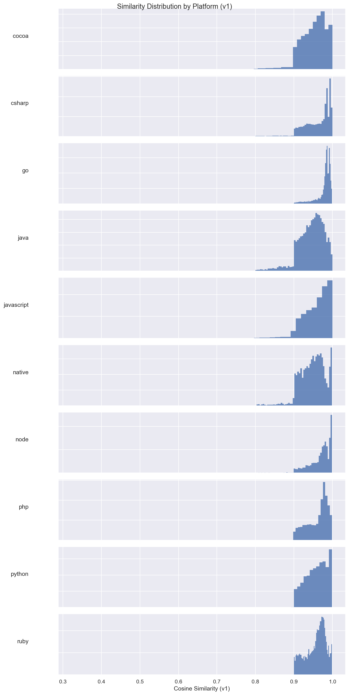
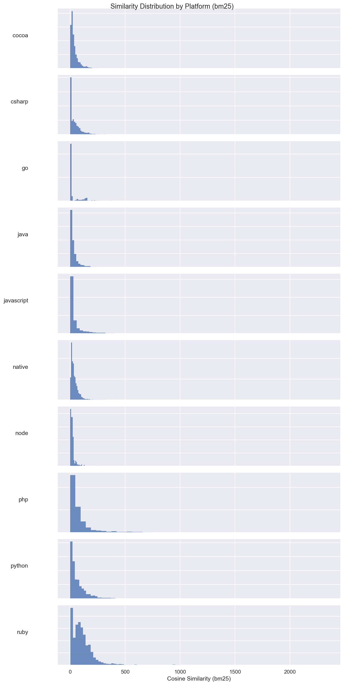
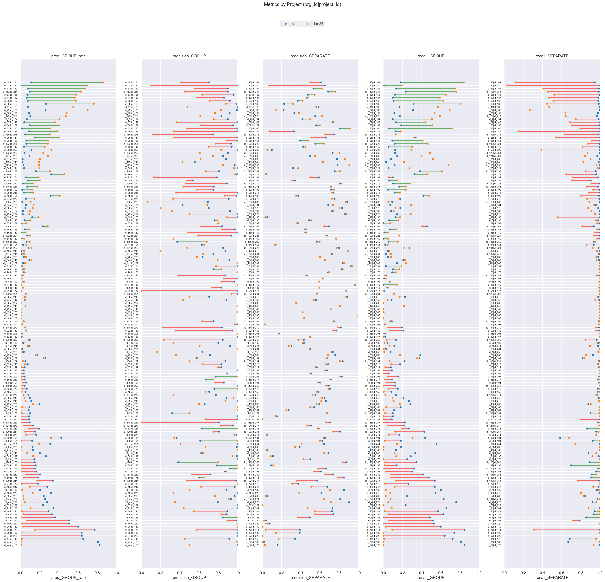

# v1 (dim=768) vs bm25 (dim=1), dataset: test_full3

Command to repro:

```bash
python -m eval.compare \
    --gcs_model1 gs://$GROUPING_TRAINER_BUCKET/runs/v1/similarities/test_full3 \
    --gcs_model2 gs://$GROUPING_TRAINER_BUCKET/runs/bm25/similarities/test_full3 \
    --threshold_model1 0.99 \
    --threshold_model2 100 \
    --dim_model2 1 \
    --sweep_thresholds_model1 0.95,0.97,0.98,0.99,0.995 \
    --sweep_thresholds_model2 30,50,80,100,150,200,300 \
    --overwrite
```

### Column definitions

- **model**: The name of the model being evaluated.
- **pred_GROUP_rate**: The fraction of pairs this model groups together—lower means more separate issues are created. It's smaller than prod b/c the test dataset contains far more borderline cases; it's missing pairs that are very close.  This bias also means precision_GROUP is lower than what it'd be in prod.
- **precision_GROUP**: When the model groups a pair, how often is it correct? Higher = less over-grouping.
- **precision_SEPARATE**: When the model separates a pair, how often is it correct?
- **recall_GROUP**: Of all pairs that should be grouped, what fraction does the model correctly group? Higher = less under-grouping.
- **recall_SEPARATE**: Of all pairs that should be separate, what fraction does the model correctly separate?

## Aggregate results


### Overall metrics

| model | pred_GROUP_rate | precision_GROUP | precision_SEPARATE | recall_GROUP | recall_SEPARATE |
|-------|-----------------|-----------------|--------------------|--------------|-----------------|
| v1    | 0.16            | 0.91            | 0.47               | 0.25         | 0.97            |
| bm25  | 0.14            | 0.65            | 0.42               | 0.15         | 0.88            |

### Project-averaged metrics (152 projects)

| model | pred_GROUP_rate | precision_GROUP | precision_SEPARATE | recall_GROUP | recall_SEPARATE |
|-------|-----------------|-----------------|--------------------|--------------|-----------------|
| v1    | 0.13            | 0.87            | 0.55               | 0.21         | 0.97            |
| bm25  | 0.13            | 0.65            | 0.52               | 0.17         | 0.87            |

### Conditional probabilities

P(bm25 GROUP | v1 GROUP)    = 0.1686

P(bm25 GROUP | v1 SEPARATE) = 0.1323

P(bm25 GROUP | v1 GROUP, distance < 0.005) = 0.1710  (n=9712)

### Thresholds

```json
{
  "v1": 0.99,
  "bm25": 100.0
}
```

### Distance distribution

| statistic  | value    |
|------------|----------|
| count      | 150303.0 |
| null_count | 0.0      |
| mean       | 0.042189 |
| std        | 0.032109 |
| min        | 0.000514 |
| 25%        | 0.016303 |
| 50%        | 0.035027 |
| 75%        | 0.063571 |
| max        | 0.245969 |

GROUP rate: 58.75%

### Platform stats

| platform   | n_pairs | n_projects | label_GROUP_rate | proportion |
|------------|---------|------------|------------------|------------|
| cocoa      | 30321   | 58         | 0.38             | 0.2        |
| csharp     | 21936   | 21         | 0.62             | 0.15       |
| go         | 17160   | 8          | 0.95             | 0.11       |
| java       | 17043   | 58         | 0.32             | 0.11       |
| javascript | 24492   | 53         | 0.73             | 0.16       |
| native     | 6560    | 41         | 0.31             | 0.04       |
| node       | 3242    | 12         | 0.88             | 0.02       |
| php        | 9592    | 8          | 0.75             | 0.06       |
| python     | 13428   | 8          | 0.57             | 0.09       |
| ruby       | 6529    | 8          | 0.59             | 0.04       |

### Short stacktraces (query_tokens <= p10 = 32 tokens, 15296 pairs)

label GROUP rate: 83.18%
| model | pred_GROUP_rate | precision_GROUP | precision_SEPARATE | recall_GROUP | recall_SEPARATE |
|-------|-----------------|-----------------|--------------------|--------------|-----------------|
| v1    | 0.22            | 0.98            | 0.21               | 0.26         | 0.98            |
| bm25  | 0.0             | NaN             | 0.17               | 0.0          | 1.0             |

### Long stacktraces (query_tokens >= p90 = 764 tokens, 15036 pairs)

label GROUP rate: 59.37%
| model | pred_GROUP_rate | precision_GROUP | precision_SEPARATE | recall_GROUP | recall_SEPARATE |
|-------|-----------------|-----------------|--------------------|--------------|-----------------|
| v1    | 0.24            | 0.95            | 0.52               | 0.38         | 0.97            |
| bm25  | 0.59            | 0.62            | 0.45               | 0.62         | 0.45            |

## Threshold sweep


### Threshold sweep for v1

| threshold | pred_GROUP_rate | precision_GROUP | precision_SEPARATE | recall_GROUP | recall_SEPARATE |
|-----------|-----------------|-----------------|--------------------|--------------|-----------------|
| 0.95      | 0.64            | 0.72            | 0.65               | 0.79         | 0.57            |
| 0.97      | 0.45            | 0.81            | 0.6                | 0.62         | 0.8             |
| 0.98      | 0.31            | 0.88            | 0.54               | 0.47         | 0.91            |
| 0.99      | 0.16            | 0.91            | 0.47               | 0.25         | 0.97            |
| 1.0       | 0.07            | 0.94            | 0.44               | 0.1          | 0.99            |

### Threshold sweep for bm25

| threshold | pred_GROUP_rate | precision_GROUP | precision_SEPARATE | recall_GROUP | recall_SEPARATE |
|-----------|-----------------|-----------------|--------------------|--------------|-----------------|
| 30.0      | 0.43            | 0.56            | 0.39               | 0.41         | 0.55            |
| 50.0      | 0.3             | 0.59            | 0.41               | 0.3          | 0.71            |
| 80.0      | 0.18            | 0.64            | 0.42               | 0.2          | 0.84            |
| 100.0     | 0.14            | 0.65            | 0.42               | 0.15         | 0.88            |
| 150.0     | 0.07            | 0.66            | 0.42               | 0.08         | 0.94            |
| 200.0     | 0.04            | 0.68            | 0.42               | 0.04         | 0.97            |
| 300.0     | 0.01            | 0.62            | 0.41               | 0.01         | 0.99            |

## Platform-level results


### Metrics by platform, avg over projects (v1, threshold=0.99)

| platform   | n_pairs | n_projects | label_GROUP_rate | min_threshold | pred_GROUP_rate | precision_GROUP | precision_SEPARATE | recall_GROUP | recall_SEPARATE |
|------------|---------|------------|------------------|---------------|-----------------|-----------------|--------------------|--------------|-----------------|
| cocoa      | 30321   | 58         | 0.38             | 0.99          | 0.165           | 0.799           | 0.641              | 0.259        | 0.939           |
| csharp     | 21936   | 21         | 0.617            | 0.99          | 0.238           | 0.837           | 0.568              | 0.387        | 0.95            |
| go         | 17160   | 8          | 0.953            | 0.99          | 0.275           | 0.945           | 0.178              | 0.296        | 0.968           |
| java       | 17043   | 58         | 0.322            | 0.99          | 0.089           | 0.864           | 0.664              | 0.178        | 0.982           |
| javascript | 24492   | 53         | 0.729            | 0.99          | 0.134           | 0.947           | 0.35               | 0.165        | 0.971           |
| native     | 6560    | 41         | 0.31             | 0.99          | 0.202           | 0.691           | 0.789              | 0.328        | 0.938           |
| node       | 3242    | 12         | 0.884            | 0.99          | 0.188           | 1.0             | 0.381              | 0.212        | 1.0             |
| php        | 9592    | 8          | 0.75             | 0.99          | 0.1             | 0.936           | 0.531              | 0.164        | 0.986           |
| python     | 13428   | 8          | 0.568            | 0.99          | 0.082           | 0.954           | 0.456              | 0.127        | 0.989           |
| ruby       | 6529    | 8          | 0.59             | 0.99          | 0.07            | 0.848           | 0.402              | 0.108        | 0.969           |

### Metrics by platform, avg over projects (bm25, threshold=100.0)

| platform   | n_pairs | n_projects | label_GROUP_rate | min_threshold | pred_GROUP_rate | precision_GROUP | precision_SEPARATE | recall_GROUP | recall_SEPARATE |
|------------|---------|------------|------------------|---------------|-----------------|-----------------|--------------------|--------------|-----------------|
| cocoa      | 30321   | 58         | 0.38             | 100.0         | 0.118           | 0.538           | 0.585              | 0.154        | 0.894           |
| csharp     | 21936   | 21         | 0.617            | 100.0         | 0.172           | 0.596           | 0.497              | 0.209        | 0.824           |
| go         | 17160   | 8          | 0.953            | 100.0         | 0.167           | 0.971           | 0.184              | 0.186        | 0.849           |
| java       | 17043   | 58         | 0.322            | 100.0         | 0.141           | 0.632           | 0.661              | 0.211        | 0.92            |
| javascript | 24492   | 53         | 0.729            | 100.0         | 0.267           | 0.614           | 0.25               | 0.212        | 0.638           |
| native     | 6560    | 41         | 0.31             | 100.0         | 0.13            | 0.57            | 0.7                | 0.195        | 0.906           |
| node       | 3242    | 12         | 0.884            | 100.0         | 0.049           | 0.779           | 0.316              | 0.046        | 0.946           |
| php        | 9592    | 8          | 0.75             | 100.0         | 0.323           | 0.591           | 0.519              | 0.393        | 0.714           |
| python     | 13428   | 8          | 0.568            | 100.0         | 0.366           | 0.682           | 0.457              | 0.396        | 0.693           |
| ruby       | 6529    | 8          | 0.59             | 100.0         | 0.384           | 0.693           | 0.461              | 0.418        | 0.64            |

### Min threshold for >= 95% avg project precision_GROUP by platform (v1)

| platform   | n_pairs | n_projects | label_GROUP_rate | min_threshold | pred_GROUP_rate | precision_GROUP | precision_SEPARATE | recall_GROUP | recall_SEPARATE |
|------------|---------|------------|------------------|---------------|-----------------|-----------------|--------------------|--------------|-----------------|
| cocoa      | 30321   | 58         | 0.38             | null          | null            | null            | null               | null         | null            |
| csharp     | 21936   | 21         | 0.617            | null          | null            | null            | null               | null         | null            |
| go         | 17160   | 8          | 0.953            | 0.98          | 0.507           | 0.954           | 0.211              | 0.557        | 0.953           |
| java       | 17043   | 58         | 0.322            | 0.995         | 0.039           | 0.952           | 0.633              | 0.082        | 0.995           |
| javascript | 24492   | 53         | 0.729            | 0.995         | 0.073           | 0.956           | 0.334              | 0.094        | 0.99            |
| native     | 6560    | 41         | 0.31             | 0.995         | 0.049           | 0.971           | 0.707              | 0.142        | 0.998           |
| node       | 3242    | 12         | 0.884            | 0.98          | 0.256           | 0.984           | 0.414              | 0.38         | 0.995           |
| php        | 9592    | 8          | 0.75             | null          | null            | null            | null               | null         | null            |
| python     | 13428   | 8          | 0.568            | 0.99          | 0.082           | 0.954           | 0.456              | 0.127        | 0.989           |
| ruby       | 6529    | 8          | 0.59             | null          | null            | null            | null               | null         | null            |

### Min threshold for >= 95% avg project precision_GROUP by platform (bm25)

| platform   | n_pairs | n_projects | label_GROUP_rate | min_threshold | pred_GROUP_rate | precision_GROUP | precision_SEPARATE | recall_GROUP | recall_SEPARATE |
|------------|---------|------------|------------------|---------------|-----------------|-----------------|--------------------|--------------|-----------------|
| cocoa      | 30321   | 58         | 0.38             | null          | null            | null            | null               | null         | null            |
| csharp     | 21936   | 21         | 0.617            | null          | null            | null            | null               | null         | null            |
| go         | 17160   | 8          | 0.953            | 80.0          | 0.193           | 0.955           | 0.189              | 0.22         | 0.809           |
| java       | 17043   | 58         | 0.322            | null          | null            | null            | null               | null         | null            |
| javascript | 24492   | 53         | 0.729            | null          | null            | null            | null               | null         | null            |
| native     | 6560    | 41         | 0.31             | null          | null            | null            | null               | null         | null            |
| node       | 3242    | 12         | 0.884            | 300.0         | 0.003           | 1.0             | 0.322              | 0.008        | 1.0             |
| php        | 9592    | 8          | 0.75             | null          | null            | null            | null               | null         | null            |
| python     | 13428   | 8          | 0.568            | null          | null            | null            | null               | null         | null            |
| ruby       | 6529    | 8          | 0.59             | null          | null            | null            | null               | null         | null            |

<details>
<summary>Metrics by platform</summary>


</details>


<details>
<summary>Similarity distribution (v1)</summary>


</details>


<details>
<summary>Similarity distribution (bm25)</summary>


</details>


## Project-level results

**Project win rate for bm25**: 5/152 (3%) projects where both precision_GROUP and recall_GROUP are higher


<details>
<summary>Dumbbell by project</summary>


</details>


### >= 15% group rate increase (stratified by platform)

| org_id | project_id | platform   | n_pairs | label_GROUP_rate | v1_GROUP_rate | v1_prec | v1_rec | bm25_GROUP_rate | bm25_prec | bm25_rec | group_rate_increase |
|--------|------------|------------|---------|------------------|---------------|---------|--------|-----------------|-----------|----------|---------------------|
| id_15  | id_164     | php        | 702     | 0.42             | 0.11          | 0.71    | 0.18   | 0.86            | 0.41      | 0.84     | 0.76                |
| id_22  | id_140     | javascript | 290     | 0.35             | 0.0           | 1.0     | 0.01   | 0.7             | 0.1       | 0.2      | 0.69                |
| id_33  | id_152     | ruby       | 941     | 0.5              | 0.07          | 0.9     | 0.13   | 0.67            | 0.56      | 0.75     | 0.6                 |
| id_132 | id_284     | csharp     | 1792    | 0.37             | 0.1           | 0.9     | 0.24   | 0.63            | 0.45      | 0.76     | 0.53                |
| id_53  | id_155     | php        | 720     | 0.56             | 0.07          | 0.96    | 0.12   | 0.58            | 0.63      | 0.65     | 0.51                |
| id_17  | id_137     | ruby       | 3276    | 0.56             | 0.06          | 0.86    | 0.1    | 0.57            | 0.58      | 0.59     | 0.5                 |
| id_60  | id_162     | python     | 1990    | 0.65             | 0.08          | 0.92    | 0.11   | 0.58            | 0.71      | 0.62     | 0.5                 |
| id_88  | id_183     | go         | 2481    | 0.83             | 0.26          | 0.99    | 0.31   | 0.76            | 0.88      | 0.81     | 0.5                 |
| id_11  | id_135     | python     | 475     | 0.46             | 0.08          | 1.0     | 0.17   | 0.55            | 0.48      | 0.57     | 0.47                |
| id_72  | id_168     | javascript | 1924    | 0.84             | 0.26          | 1.0     | 0.31   | 0.7             | 0.83      | 0.69     | 0.44                |
| id_66  | id_199     | csharp     | 998     | 0.69             | 0.09          | 0.92    | 0.11   | 0.48            | 0.77      | 0.53     | 0.39                |
| id_129 | id_279     | java       | 776     | 0.49             | 0.1           | 0.83    | 0.17   | 0.47            | 0.61      | 0.59     | 0.37                |
| id_2   | id_134     | python     | 1372    | 0.6              | 0.07          | 0.9     | 0.1    | 0.41            | 0.75      | 0.51     | 0.34                |
| id_37  | id_147     | ruby       | 391     | 0.3              | 0.04          | 1.0     | 0.13   | 0.36            | 0.37      | 0.44     | 0.32                |
| id_56  | id_157     | php        | 450     | 0.49             | 0.1           | 0.95    | 0.19   | 0.4             | 0.62      | 0.51     | 0.3                 |
| id_53  | id_160     | php        | 916     | 0.2              | 0.01          | 1.0     | 0.06   | 0.31            | 0.47      | 0.72     | 0.3                 |
| id_16  | id_148     | javascript | 1365    | 0.7              | 0.09          | 1.0     | 0.13   | 0.38            | 0.33      | 0.18     | 0.29                |
| id_130 | id_278     | cocoa      | 500     | 0.28             | 0.05          | 0.75    | 0.13   | 0.3             | 0.12      | 0.13     | 0.26                |
| id_25  | id_141     | javascript | 469     | 0.43             | 0.14          | 1.0     | 0.34   | 0.4             | 0.34      | 0.32     | 0.26                |
| id_28  | id_153     | ruby       | 218     | 0.63             | 0.06          | 1.0     | 0.09   | 0.29            | 0.89      | 0.41     | 0.23                |
| id_103 | id_228     | cocoa      | 250     | 0.48             | 0.06          | 0.93    | 0.12   | 0.28            | 0.77      | 0.46     | 0.22                |
| id_38  | id_149     | php        | 971     | 0.59             | 0.03          | 0.94    | 0.05   | 0.25            | 0.7       | 0.3      | 0.22                |
| id_69  | id_209     | javascript | 409     | 0.91             | 0.11          | 1.0     | 0.12   | 0.32            | 0.83      | 0.29     | 0.21                |
| id_123 | id_263     | java       | 497     | 0.29             | 0.04          | 0.9     | 0.12   | 0.24            | 0.61      | 0.49     | 0.2                 |
| id_121 | id_260     | java       | 438     | 0.53             | 0.09          | 0.85    | 0.15   | 0.29            | 0.74      | 0.4      | 0.19                |
| id_81  | id_235     | cocoa      | 1598    | 0.24             | 0.02          | 0.88    | 0.08   | 0.2             | 0.61      | 0.52     | 0.18                |
| id_113 | id_245     | csharp     | 476     | 0.38             | 0.02          | 0.56    | 0.03   | 0.19            | 0.43      | 0.22     | 0.17                |
| id_125 | id_236     | cocoa      | 1207    | 0.24             | 0.03          | 0.97    | 0.12   | 0.19            | 0.85      | 0.68     | 0.16                |
| id_80  | id_224     | cocoa      | 274     | 0.69             | 0.04          | 1.0     | 0.05   | 0.2             | 0.96      | 0.27     | 0.16                |

### >= 10% group rate decrease

| org_id | project_id | platform   | n_pairs | label_GROUP_rate | v1_GROUP_rate | v1_prec | v1_rec | bm25_GROUP_rate | bm25_prec | bm25_rec | group_rate_decrease |
|--------|------------|------------|---------|------------------|---------------|---------|--------|-----------------|-----------|----------|---------------------|
| id_74  | id_170     | csharp     | 1034    | 0.97             | 0.82          | 1.0     | 0.85   | 0.0             | 0.5       | 0.0      | 0.82                |
| id_74  | id_165     | csharp     | 686     | 1.0              | 0.81          | 1.0     | 0.81   | 0.0             | 1.0       | 0.0      | 0.8                 |
| id_14  | id_146     | javascript | 1513    | 0.83             | 0.65          | 0.92    | 0.72   | 0.01            | 0.45      | 0.01     | 0.64                |
| id_97  | id_225     | javascript | 36      | 1.0              | 0.64          | 1.0     | 0.64   | 0.0             | NaN       | 0.0      | 0.64                |
| id_39  | id_186     | node       | 629     | 0.86             | 0.64          | 1.0     | 0.74   | 0.0             | NaN       | 0.0      | 0.64                |
| id_76  | id_171     | javascript | 1038    | 0.91             | 0.77          | 1.0     | 0.85   | 0.15            | 0.58      | 0.09     | 0.63                |
| id_20  | id_139     | go         | 1248    | 1.0              | 0.6           | 1.0     | 0.6    | 0.02            | 1.0       | 0.02     | 0.57                |
| id_70  | id_220     | go         | 1633    | 0.96             | 0.51          | 1.0     | 0.53   | 0.0             | 1.0       | 0.0      | 0.51                |
| id_2   | id_254     | javascript | 1182    | 0.98             | 0.51          | 0.99    | 0.52   | 0.07            | 0.9       | 0.06     | 0.44                |
| id_6   | id_158     | ruby       | 533     | 0.63             | 0.36          | 0.85    | 0.49   | 0.0             | 1.0       | 0.0      | 0.36                |
| id_4   | id_188     | csharp     | 814     | 0.47             | 0.33          | 0.89    | 0.63   | 0.03            | 0.83      | 0.05     | 0.3                 |
| id_10  | id_144     | native     | 1739    | 0.46             | 0.29          | 0.9     | 0.57   | 0.01            | 0.55      | 0.02     | 0.28                |
| id_21  | id_202     | csharp     | 2044    | 0.52             | 0.34          | 1.0     | 0.66   | 0.1             | 0.44      | 0.09     | 0.24                |
| id_55  | id_222     | go         | 9407    | 1.0              | 0.23          | 1.0     | 0.23   | 0.0             | NaN       | 0.0      | 0.23                |
| id_4   | id_229     | csharp     | 1337    | 0.29             | 0.28          | 0.8     | 0.76   | 0.04            | 0.35      | 0.05     | 0.23                |
| id_104 | id_274     | csharp     | 350     | 0.38             | 0.25          | 0.93    | 0.63   | 0.03            | 0.91      | 0.08     | 0.22                |
| id_52  | id_233     | javascript | 2125    | 0.96             | 0.24          | 0.97    | 0.24   | 0.03            | 0.77      | 0.02     | 0.21                |
| id_45  | id_275     | php        | 95      | 0.58             | 0.32          | 1.0     | 0.55   | 0.13            | 0.33      | 0.07     | 0.19                |
| id_4   | id_136     | csharp     | 991     | 0.3              | 0.2           | 0.88    | 0.6    | 0.02            | 0.5       | 0.03     | 0.19                |
| id_18  | id_247     | csharp     | 1135    | 0.5              | 0.28          | 0.97    | 0.54   | 0.1             | 0.62      | 0.12     | 0.18                |
| id_77  | id_172     | javascript | 533     | 0.69             | 0.18          | 1.0     | 0.26   | 0.01            | 1.0       | 0.02     | 0.17                |
| id_100 | id_214     | native     | 467     | 0.61             | 0.33          | 0.99    | 0.54   | 0.17            | 0.48      | 0.13     | 0.16                |
| id_80  | id_178     | cocoa      | 2608    | 0.23             | 0.18          | 0.6     | 0.48   | 0.03            | 0.65      | 0.08     | 0.15                |
| id_131 | id_282     | cocoa      | 3409    | 0.35             | 0.2           | 0.72    | 0.42   | 0.05            | 0.53      | 0.08     | 0.15                |
| id_43  | id_151     | python     | 5426    | 0.47             | 0.16          | 0.87    | 0.3    | 0.01            | 0.89      | 0.02     | 0.15                |
| id_133 | id_285     | cocoa      | 1813    | 0.42             | 0.15          | 0.92    | 0.32   | 0.0             | 1.0       | 0.01     | 0.14                |
| id_89  | id_196     | javascript | 90      | 0.89             | 0.16          | 0.79    | 0.14   | 0.01            | 1.0       | 0.01     | 0.14                |
| id_128 | id_280     | cocoa      | 1378    | 0.16             | 0.15          | 0.38    | 0.35   | 0.0             | 0.8       | 0.02     | 0.14                |
| id_3   | id_175     | java       | 7       | 0.57             | 0.14          | 1.0     | 0.25   | 0.0             | NaN       | 0.0      | 0.14                |
| id_54  | id_197     | javascript | 902     | 0.92             | 0.26          | 1.0     | 0.29   | 0.13            | 0.95      | 0.13     | 0.13                |
| id_1   | id_246     | java       | 568     | 0.38             | 0.2           | 0.62    | 0.33   | 0.07            | 0.64      | 0.12     | 0.13                |
| id_41  | id_166     | node       | 1494    | 0.96             | 0.13          | 1.0     | 0.13   | 0.0             | 1.0       | 0.0      | 0.13                |
| id_8   | id_208     | javascript | 1270    | 0.66             | 0.12          | 0.99    | 0.19   | 0.0             | 0.67      | 0.0      | 0.12                |
| id_94  | id_251     | csharp     | 522     | 0.56             | 0.31          | 1.0     | 0.56   | 0.19            | 0.41      | 0.14     | 0.11                |
| id_8   | id_194     | java       | 518     | 0.4              | 0.12          | 0.61    | 0.18   | 0.01            | 1.0       | 0.01     | 0.11                |
| id_86  | id_181     | cocoa      | 843     | 0.36             | 0.42          | 0.37    | 0.44   | 0.32            | 0.34      | 0.3      | 0.11                |
| id_9   | id_271     | php        | 5687    | 0.96             | 0.16          | 0.99    | 0.17   | 0.06            | 0.97      | 0.06     | 0.11                |
| id_109 | id_281     | java       | 343     | 0.29             | 0.15          | 0.81    | 0.43   | 0.05            | 0.75      | 0.12     | 0.1                 |
| id_57  | id_243     | go         | 472     | 0.46             | 0.19          | 0.63    | 0.27   | 0.09            | 1.0       | 0.2      | 0.1                 |


---

_Real report with original org/project IDs at_ `gs://$GROUPING_TRAINER_BUCKET/eval/comparisons/test_full3/v1_dim768_vs_bm25_dim1/`
